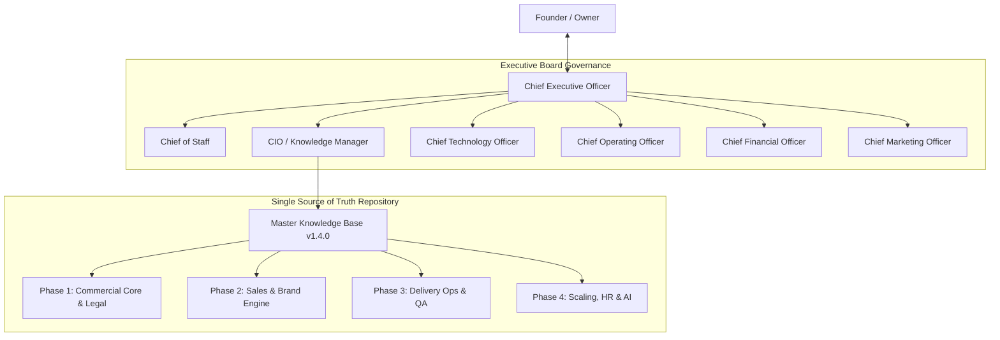
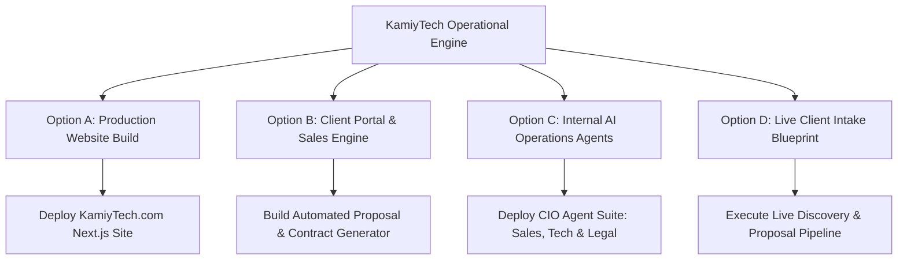

# KAMIYTECH EXECUTIVE OPERATING SYSTEM (EOS)
## CEO Master Report & Strategic Implementation Roadmap
> **PREPARED FOR:** Founder & Owner  
> **PREPARED BY:** Chief Executive Officer (CEO) & Executive Board  
> **DATE:** July 26, 2026  
> **DOCUMENT VERSION:** 1.0.0  
> **STATUS:** COMPLETE / FOR FOUNDER REVIEW  

---

## 1. EXECUTIVE SUMMARY & SYSTEM OVERVIEW

As Chief Executive Officer, I am pleased to submit the complete **Executive Master Report** on the initiation, structuring, and codification of the **KamiyTech Executive Operating System (EOS)**.

Through a rigorous multi-phase execution strategy, we have built a **100% codified, commercially bulletproof, enterprise-ready technology consultancy engine**. The entire operational architecture is backed by an automated Single Source of Truth (SSOT) Master Knowledge Base (`v1.4.0`) comprising **15 comprehensive executive governance documents**.

---

## 2. BIRD'S-EYE VIEW OF EVERYTHING ACCOMPLISHED TILL NOW

### 📋 Phase 1: Commercial Core & Risk Governance (100% COMPLETE)
Establishes our market identity, baseline rate cards, legal protections, client onboarding SOPs, and technical stack standards.

- **📄 [P1.1 Positioning & Value Proposition](file:///c:/Users/abhis/OneDrive/Desktop/kamiytechAI/knowledge_base/P1.1_positioning_and_value_prop.md):** Defines KamiyTech as a premium full-service technology agency. Identifies 5 Ideal Customer Personas (Startups, SMBs, Manufacturing, Education, Professional Services) and defines our competitive USP matrix.
- **📄 [P1.2 Rate Card & Pricing Framework](file:///c:/Users/abhis/OneDrive/Desktop/kamiytechAI/knowledge_base/P1.2_rate_card_and_pricing_framework.md):** Establishes $95–$175/hr role rate card, standard tier packages ($5k–$45k+), maintenance retainers, and strict 50% gross margin controls.
- **📄 [P1.3 Master Legal Framework](file:///c:/Users/abhis/OneDrive/Desktop/kamiytechAI/knowledge_base/P1.3_master_legal_framework.md):** Complete legal suite featuring standard Master Services Agreement (MSA), Statement of Work (SOW), NDA, and Subcontractor Partner Agreements with 24-month non-solicit and mandatory IP assignment.
- **📄 [P1.4 Client Onboarding & Delivery SOP](file:///c:/Users/abhis/OneDrive/Desktop/kamiytechAI/knowledge_base/P1.4_client_onboarding_and_delivery_sop.md):** Standardized sales-to-ops handoff, 60-minute client kickoff agenda, bi-weekly demo cadences, and launch gates.
- **📄 [P1.5 Engineering Architecture Guidelines](file:///c:/Users/abhis/OneDrive/Desktop/kamiytechAI/knowledge_base/P1.5_engineering_architecture_guidelines.md):** CTO-mandated tech stack (Next.js, FastAPI, PostgreSQL, Supabase, React Native, Tailwind, Vercel/AWS), strict TypeScript rules, and CI/CD security standards.

---

### 🎨 Phase 2: Sales & Marketing Engine (100% COMPLETE)
Empowers our sales and marketing teams to attract, qualify, present, and close high-margin client engagements.

- **📄 [P2.1 Sales Playbook & Discovery SOP](file:///c:/Users/abhis/OneDrive/Desktop/kamiytechAI/knowledge_base/P2.1_sales_playbook_and_discovery_sop.md):** Adapted BANT/MEDDIC lead qualification, 45-minute diagnostic discovery script, objection handling matrix, and Mutual Action Plan (MAP) closing workflow.
- **📄 [P2.2 Proposal & Pitch Deck Templates](file:///c:/Users/abhis/OneDrive/Desktop/kamiytechAI/knowledge_base/P2.2_proposal_and_pitch_templates.md):** Production-ready markdown proposal template and 10-slide executive pitch deck structure.
- **📄 [P2.3 Brand Identity & Design System](file:///c:/Users/abhis/OneDrive/Desktop/kamiytechAI/knowledge_base/P2.3_brand_identity_and_design_system.md):** Creative Director’s design tokens (Obsidian `#0B0F19`, Electric Cyan `#00F0FF`, Deep Indigo `#4F46E5`), Outfit/Inter typography, and glassmorphic UI specs.
- **📄 [P2.4 Website Copy & Content Strategy](file:///c:/Users/abhis/OneDrive/Desktop/kamiytechAI/knowledge_base/P2.4_website_copy_and_content_strategy.md):** Page-by-page production copy for `KamiyTech.com` (Home, Services, Case Studies, Contact) and complete SEO keyword engine.

---

### 🛠️ Phase 3: Delivery Operations & Quality Assurance (100% COMPLETE)
Guarantees flawless software delivery, post-launch SLA compliance, and scalable partner resource augmentation.

- **📄 [P3.1 Maintenance Retainer & SLA SOP](file:///c:/Users/abhis/OneDrive/Desktop/kamiytechAI/knowledge_base/P3.1_maintenance_retainer_and_sla_sop.md):** Post-launch support tiers ($650/mo, $1,500/mo, $3,200/mo), 2-hour emergency SEV-1 response SLA, server uptime monitoring, and RCA protocols.
- **📄 [P3.2 QA Code Review & Testing SOP](file:///c:/Users/abhis/OneDrive/Desktop/kamiytechAI/knowledge_base/P3.2_qa_code_review_and_testing_sop.md):** Automated testing guidelines (Vitest/Playwright >80% coverage), PR code review criteria, and 10-point OWASP pre-release security checklist.
- **📄 [P3.3 Partner Onboarding & Vetting SOP](file:///c:/Users/abhis/OneDrive/Desktop/kamiytechAI/knowledge_base/P3.3_partner_onboarding_and_vetting_sop.md):** Core + Specialist Pod model, 4-step technical vetting rubric (85/100 pass requirement), white-label `@kamiytech.com` setup, and rate-capping rules.

---

### 📈 Phase 4: Scaling, HR & Knowledge Infrastructure (100% COMPLETE)
Codifies internal team growth, financial governance, and AI-driven automated knowledge management.

- **📄 [P4.1 HR & People Operations Handbook](file:///c:/Users/abhis/OneDrive/Desktop/kamiytechAI/knowledge_base/P4.1_hr_and_people_ops_handbook.md):** Recruitment pipelines, contractor-to-employee conversion pathways (6mo/500hr criteria), quarterly OKR evaluation framework, remote work etiquette, and onboarding/offboarding SOPs.
- **📄 [P4.2 Financial Planning & Invoicing SOP](file:///c:/Users/abhis/OneDrive/Desktop/kamiytechAI/knowledge_base/P4.2_financial_planning_and_invoicing_sop.md):** CFO financial controls (50% gross margin minimum), 50/30/20 fixed-price milestone billing (50% deposit upfront), Net-14 payment terms, Net-15 contractor payouts, and 3-month operating reserve sweeping.
- **📄 [P4.3 AI Automation & Knowledge Base SOP](file:///c:/Users/abhis/OneDrive/Desktop/kamiytechAI/knowledge_base/P4.3_ai_automation_and_knowledge_base_sop.md):** Automated SSOT vector re-indexing, AI knowledge drift detection matrix, executive AI agent library (Sales, Tech Auditor, Legal Verifier), and zero-training enterprise data privacy rules.

---

## 3. CORE FINANCIAL & OPERATIONAL GUARDRAILS

To protect company solvency and profitability, all operations are governed by these non-negotiable thresholds:

| Governance Domain | Standard Metric / Rule | Executive Owner |
| :--- | :--- | :---: |
| **Gross Profit Margin** | Minimum **50.0%** across all contracts | CFO / CEO |
| **Net Profit Margin** | Target **30.0%** (Floor: 20.0%) | CFO |
| **Payment Schedule** | **50% Upfront Deposit** / 30% Midpoint / 20% Pre-Launch | CFO / Sales |
| **Contractor Payout Alignment** | Net-15 Days **after client payment clears** | CFO / COO |
| **Cash Reserve Mandate** | 15% sweep until **3-Month OpEx Reserve** satisfied | CFO |
| **Code Coverage Floor** | Minimum **> 80% Unit & E2E Test Coverage** | CTO |
| **SLA Guarantee** | **2-Hour Response Time** for SEV-1 Emergency Outages | Customer Success |

---

## 4. CEO STRATEGIC RECOMMENDATIONS FOR FUTURE IMPLEMENTATION

Now that our organizational charter, commercial foundation, legal suite, and operational SOPs are 100% complete, I recommend selecting one or more of the following **4 Strategic Implementation Initiatives** to transition KamiyTech into active market operations:

---

### Option A: Build & Deploy Production Website (`KamiyTech.com`)
* **Objective:** Translate our Brand Identity ([P2.3](file:///c:/Users/abhis/OneDrive/Desktop/kamiytechAI/knowledge_base/P2.3_brand_identity_and_design_system.md)) and Website Copy ([P2.4](file:///c:/Users/abhis/OneDrive/Desktop/kamiytechAI/knowledge_base/P2.4_website_copy_and_content_strategy.md)) into a live, world-class Next.js + Tailwind web application.
* **Key Features:** Dark-mode obsidian aesthetics, glassmorphic UI components, dynamic service showcase (AI, Web, Mobile, Custom Software), interactive project cost estimator, dynamic lead contact forms.
* **Impact:** Establishes instant market authority and inbound lead capture capability.

---

### Option B: Build Sales Engine & Automated Proposal Generator
* **Objective:** Develop an internal tool / CLI script that automates proposal, SOW, and NDA generation in seconds.
* **Key Features:** Reads client project details, applies the $95–$175/hr rate card ([P1.2](file:///c:/Users/abhis/OneDrive/Desktop/kamiytechAI/knowledge_base/P1.2_rate_card_and_pricing_framework.md)), formats output into production markdown/PDF templates ([P2.2](file:///c:/Users/abhis/OneDrive/Desktop/kamiytechAI/knowledge_base/P2.2_proposal_and_pitch_templates.md)), and attaches MSA clauses ([P1.3](file:///c:/Users/abhis/OneDrive/Desktop/kamiytechAI/knowledge_base/P1.3_master_legal_framework.md)).
* **Impact:** Reduces proposal creation time from 4 hours to under 3 minutes with 0% margin error.

---

### Option C: Deploy Internal AI Agent Suite (CIO / CTO / Legal Agents)
* **Objective:** Operationalize the AI Agent prompts codified in [P4.3 AI SOP](file:///c:/Users/abhis/OneDrive/Desktop/kamiytechAI/knowledge_base/P4.3_ai_automation_and_knowledge_base_sop.md).
* **Key Features:**
  - **Sales Agent:** Auto-generates discovery questions & proposals.
  - **CTO PR Auditor:** Automatically scans code PRs against P1.5 architecture & security rules.
  - **Legal Verification Agent:** Audits custom contract clauses against our Master Legal Framework.
* **Impact:** Automates executive reviews and maintains 0% documentation drift across all projects.

---

### Option D: Execute Live Client Intake & Delivery Simulation / Kickoff
* **Objective:** Test our end-to-end client lifecycle with a real or simulated prospective client project.
* **Key Features:** Conduct 45-min diagnostic discovery call ([P2.1](file:///c:/Users/abhis/OneDrive/Desktop/kamiytechAI/knowledge_base/P2.1_sales_playbook_and_discovery_sop.md)), generate proposal & contract, simulate onboarding kickoff ([P1.4](file:///c:/Users/abhis/OneDrive/Desktop/kamiytechAI/knowledge_base/P1.4_client_onboarding_and_delivery_sop.md)), and initialize repository architecture ([P1.5](file:///c:/Users/abhis/OneDrive/Desktop/kamiytechAI/knowledge_base/P1.5_engineering_architecture_guidelines.md)).
* **Impact:** Validates operational readiness under simulated market conditions.

---

## 5. FOUNDER DIRECTIVE REQUESTED

Please review the bird's-eye view and recommendations above. Which direction would you like the Executive Board to execute next?

1. **Option A:** Build the `KamiyTech.com` production website.
2. **Option B:** Build the Sales Proposal & Contract Generator tool.
3. **Option C:** Deploy the Internal AI Agent Suite (Sales, CTO, Legal).
4. **Option D:** Run a Live Client Intake & Delivery Blueprint.
5. **Custom Directive:** Provide custom instructions for immediate execution.
