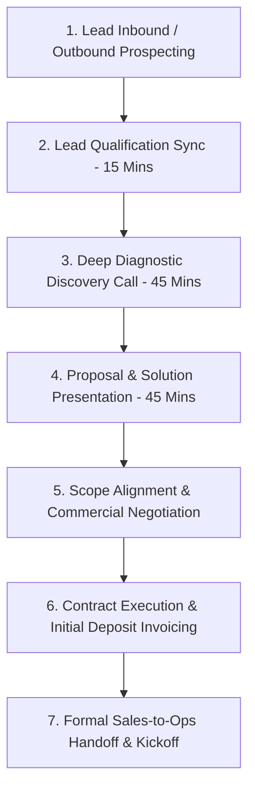

# KAMIYTECH EXECUTIVE SALES PLAYBOOK & DISCOVERY SOP
> **COMMERCIAL CORE DOCUMENT 01**

> **DOCUMENT METADATA**
> - **Purpose:** Standardize KamiyTech's B2B sales engine, lead qualification framework, discovery diagnostic scripts, objection handling matrix, closing strategies, and sales-to-operations handoff SOP for the Indian domestic market.
> - **Owner:** Head of Sales & Chief Marketing Officer (CMO)
> - **Version:** 2.0.0
> - **Status:** APPROVED / LIVE (DISTRIBUTABLE SALES PACKAGE)
> - **Effective Date:** July 2026
> - **Target Audience:** Sales Representatives, BD Managers, Solutions Architects, Account Executives
> - **Related Documents:** [02_Rate_Card_and_Pricing_Framework_INR.md](file:///c:/Users/abhis/OneDrive/Desktop/kamiytechAI/distributable_docs/1_Sales_and_BD/02_Rate_Card_and_Pricing_Framework_INR.md), [03_Detailed_Service_Catalog.md](file:///c:/Users/abhis/OneDrive/Desktop/kamiytechAI/distributable_docs/1_Sales_and_BD/03_Detailed_Service_Catalog.md), [04_Strategic_Positioning_and_ICP_Guide.md](file:///c:/Users/abhis/OneDrive/Desktop/kamiytechAI/distributable_docs/1_Sales_and_BD/04_Strategic_Positioning_and_ICP_Guide.md), [05_Client_Proposal_and_Pitch_Deck_Templates.md](file:///c:/Users/abhis/OneDrive/Desktop/kamiytechAI/distributable_docs/1_Sales_and_BD/05_Client_Proposal_and_Pitch_Deck_Templates.md)

---

## 1. B2B Sales Funnel Architecture

KamiyTech operates a consultative, 7-stage B2B sales pipeline. Every prospect moves through structured validation gates to protect gross profit margins and ensure delivery success.



### Stage SLA & Pipeline Rules
| Pipeline Stage | Max Time in Stage | Primary Goal | Required Output / Deliverable |
| :--- | :---: | :--- | :--- |
| **1. Lead Inbound** | 4 Hours Response SLA | Initial contact & meeting booking | Qualification Call scheduled |
| **2. Lead Qualification** | 15 Minutes Sync | Filter out low-budget / unfit leads | BANT Score & Discovery booked |
| **3. Deep Discovery** | 45 Minutes Sync | Uncover technical & business pain points | Discovery Diagnostic Sheet |
| **4. Solution Presentation**| Within 72 Hours | Walkthrough custom proposal deck | Interactive proposal review completed |
| **5. Scope Alignment** | 5 Business Days | Resolve objections & finalize scope | Approved Statement of Work (SOW) |
| **6. Contract Execution** | 48 Hours | Execute MSA/SOW & receive deposit | Executed contract + 40-50% payment |
| **7. Sales-to-Ops Handoff**| 24 Hours post-payment | Transfer client context to TPM/Ops | Kickoff call booked & briefing doc |

---

## 2. Lead Qualification Framework (Adapted BANT / MEDDIC)

Sales Representatives must qualify all leads during the initial 15-minute sync against **5 Core Filters** before dedicating technical architecture resources to a 45-minute discovery session.

### Qualification Matrix
1. **Budget Alignment:** 
   - Does the client have a budget matching our baseline pricing tiers?
   - Single-Page Landing Pages: ₹12,000 – ₹15,000
   - Multi-Page Web Solutions: ₹35,000 – ₹2,20,000
   - Mobile Apps & Custom SaaS: ₹1,20,000 – ₹10,00,000+
   - AI Automations: ₹45,000 – ₹4,50,000
2. **Authority & Decision Making:**
   - Are we speaking directly to the C-suite (Founder, CEO, Managing Director, COO, VP Operations)?
   - If speaking to a mid-level Manager, can they introduce the ultimate economic decision-maker for the proposal walkthrough?
3. **Need & Business Urgency:**
   - Is there an explicit operational bottleneck, revenue leak, or product launch deadline driving action within 30 to 90 days?
4. **Technical Compatibility:**
   - Does the required solution fit KamiyTech’s modern core stack (Next.js, React, Node.js, FastAPI, PostgreSQL, Supabase, React Native, OpenAI/Gemini APIs)?
5. **Cultural & Operational Fit:**
   - Is the client collaborative, clear on deliverables, and appreciative of high quality over bargain-basement pricing?

> [!IMPORTANT]
> **Disqualification Protocol:** If a prospect insists on sub-market pricing (e.g., ₹3,000 websites), refuses to execute standard contracts, or requires unvalidated legacy tech stacks (e.g., PHP 5.4, custom Flash), politely decline the engagement using standard referral scripts to protect engineering bandwidth.

---

## 3. Discovery Call Script & Diagnostic SOP (45 Minutes)

The 45-minute Discovery Call is designed as an interactive diagnostic interview, not a hard pitch.

```
   [00-05m: AGENDA & RAPPORT] ──► [05-25m: DIAGNOSTIC INTERVIEW] ──► [25-35m: CAPABILITY SHOWCASE] ──► [35-45m: NEXT STEPS & PROPOSAL AGREEMENT]
```

### Stage 1: Agenda Setup & Rapport (00–05 Mins)
> *"Thank you for joining today, [Client Name]. The purpose of our call is to dive into [Company Name]'s current operational bottlenecks, review your technical goals for [Project Name], and determine if KamiyTech is the right long-term technology partner for your growth. I have allocated 45 minutes. By the end of our call, if there is mutual alignment, we will agree on the exact scope parameters for a tailored proposal walkthrough. How does that agenda sound to you?"*

### Stage 2: Diagnostic Interview Questions (05–25 Mins)

#### Operational & Process Diagnostics
- *"Can you walk me through your current workflow for [specific process, e.g., lead intake, inventory dispatch, client onboarding]? Where do manual data entries or delays happen today?"*
- *"What is this manual friction costing your company each month in lost revenue, wasted employee hours, or delayed client turnarounds?"*
- *"What tools or software systems are you currently using, and why have they stopped serving your growth requirements?"*

#### Technical & Product Scope
- *"If we build the exact custom web application / mobile app / AI automation system we are discussing, what specific metric or outcome will define success for your executive board?"*
- *"Are there existing legacy databases, APIs, or payment gateways (e.g., Razorpay, Tally, Zoho) that this new platform must sync with?"*

#### Commercial & Decision Criteria
- *"What is your target launch deadline, and is there an upcoming marketing campaign, investor milestone, or industry trade show driving that timeline?"*
- *"Have you allocated a target capital expenditure budget range for this modernization initiative (e.g., ₹50k–₹1.5L, ₹1.5L–₹5L, or ₹5L+)?"*
- *"Who else on your leadership team will join our proposal walkthrough sync next week to evaluate the final technical architecture?"*

### Stage 3: Capability Showcase & Framing (25–35 Mins)
Briefly demonstrate relevant case studies and technical design patterns:
> *"Based on what you've shared about your inventory lag, we recently built a custom Next.js web application for a growing regional manufacturer that automated real-time dispatch tracking, cutting manual data entry by 35% within the first 30 days. We can apply that exact validated architecture to your workflow."*

### Stage 4: Next Steps & Mutual Action Plan (35–45 Mins)
Never end a call without locking in the exact date and time for the Proposal Walkthrough:
> *"I have everything needed to architect your solution. Our team will prepare a high-fidelity proposal covering technical stack, milestone roadmap, and fixed-price investment. Let's schedule 45 minutes next Tuesday at 3 PM IST to review the complete deck together with your executive team."*

---

## 4. Objection Handling Matrix

Sales reps must use the **Acknowledge ➔ Reframe ➔ Evidence ➔ Value Call** framework to resolve client hesitation.

| Common Client Objection | Strategic Reframe | Recommended Script Response |
| :--- | :--- | :--- |
| **"Your pricing is higher than local freelancers or basic dev agencies."** | Reframe from cost to risk reduction, engineering standards, and long-term ROI. | *"We completely understand you can find low-cost template builders. However, KamiyTech operates as an enterprise technology consultancy. We deliver senior architecture, strict type safety, zero technical debt, and 100% IP ownership. Fixing a broken, unscalable template site down the road costs 2x to 3x more than building it right from day one."* |
| **"Can we start with a smaller test project before committing?"** | Validate risk-mitigation desire; offer modular Phase 1 scoping or Single-Page build. | *"We welcome starting small. We can begin with a single-page landing website (₹12,000–₹15,000) or a Phase 1 Architecture Blueprint (₹35,000). This allows your leadership team to test our engineering speed, communication, and design standards with zero long-term exposure before committing to Phase 2."* |
| **"We need to review this internally with our board / partners."** | Secure commitment for a joint proposal walkthrough; offer custom executive deck. | *"That makes total sense. To ensure your board receives all technical answers directly, let's set up a 30-minute joint Proposal Review. I will prepare an executive summary deck highlighting project ROI, security standards, and milestone delivery so your board can make an informed decision."* |
| **"We don't need AI or custom code; a basic WordPress template is fine."** | Highlight performance speed, security vulnerabilities, and operational growth limits. | *"WordPress templates work for simple blogs. But for scaling businesses, heavy plugin bloat slows page loads beyond 3 seconds, killing search rankings and ad conversion. Our Next.js custom architecture loads in under 1.5 seconds and protects your business from plugin vulnerability hacks."* |
| **"Your timeline (4–6 weeks) is too long; we need it in 7 days."** | Separate realistic engineering sprints from rushed low-quality builds; offer phased releases. | *"To guarantee enterprise quality, security, and thorough testing, our complete engineering cycle requires 4 weeks. However, we can execute a phased launch: releasing your core landing presence in Week 1 while building out advanced backend modules for Week 4 release."* |

---

## 5. Closing Techniques & Pipeline Governance

### The 3 Core Closing Rules
1. **The Mutual Action Plan (MAP) Close:** Proposals are **never** emailed as passive PDFs without a scheduled live walkthrough meeting. Always walk the decision-maker through the deck in real time.
2. **The 48-Hour SLA Follow-Up Rule:** Every open opportunity in the CRM must have an active follow-up task scheduled within 48 hours. Opportunities with no activity for 7 days are automatically flagged for manager review.
3. **The Executive Signoff Protocol:** No work commences, and no developer bandwidth is assigned, until:
   - [x] SOW and MSA are executed via electronic signature platform.
   - [x] Milestone 1 initial deposit invoice (40% or 50%) is fully cleared by the CFO.

### Pre-Closing Checklist for Sales Reps
- [ ] Qualified against BANT/MEDDIC criteria.
- [ ] Completed 45-Minute Diagnostic Discovery Call.
- [ ] Technical architecture reviewed and approved by Solutions Architect.
- [ ] Commercial pricing verified against `02_Rate_Card_and_Pricing_Framework_INR.md`.
- [ ] Live Proposal Walkthrough conducted with primary decision-maker.
- [ ] Contract sent for digital signature.

---

## 6. Sales-to-Ops Handoff Protocol

To guarantee smooth project execution, Sales reps must execute a formal handoff to the Operations and Engineering team within 24 hours of receiving the initial deposit.

```
   [SALES DEEP BRIEFING DOC] ──► [OPS HANDOFF SYNC (15 MINS)] ──► [CLIENT KICKOFF SCHEDULED] ──► [SLACK/REPOS CREATED]
```

### Handoff Packet Checklist
1. **Sales Briefing Summary:** Diagnostic notes, key business drivers, and non-negotiable launch dates.
2. **Executed Contract:** Signed SOW, MSA, and confirmed tax invoice payment receipt.
3. **Technical Specs:** Target third-party APIs, domain login credentials, brand assets, and content drives.
4. **Client Communication Channel:** Client added to dedicated project communication channel (WhatsApp/Slack) and introduced to their Technical Project Manager (TPM).

---
*End of Executive Sales Playbook & Discovery SOP (Doc 01 v2.0.0). Maintained by Head of Sales & CMO.*
