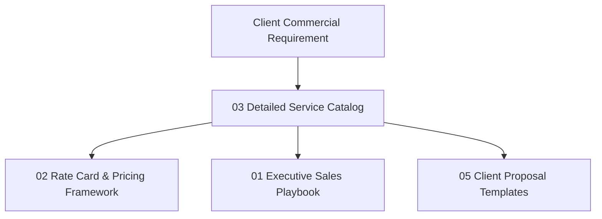

# KAMIYTECH DETAILED SERVICE CATALOG
> **COMMERCIAL CORE DOCUMENT 03**

> **DOCUMENT METADATA**
> - **Purpose:** Codify every official KamiyTech technical and operational service offering, establishing technical scope, business problems solved, exact deliverables, client responsibilities, executive ownership, technical dependencies, exclusions, and commercial pricing cross-references.
> - **Owner:** Chief Executive Officer (CEO), Chief Technology Officer (CTO), & Chief Operating Officer (COO)
> - **Version:** 2.0.0
> - **Status:** APPROVED / LIVE (DISTRIBUTABLE SALES PACKAGE)
> - **Effective Date:** July 2026
> - **Dependencies:** `02_Rate_Card_and_Pricing_Framework_INR.md`, `04_Strategic_Positioning_and_ICP_Guide.md`
> - **Related Documents:** [01_Executive_Sales_Playbook_and_Discovery_SOP.md](file:///c:/Users/abhis/OneDrive/Desktop/kamiytechAI/distributable_docs/1_Sales_and_BD/01_Executive_Sales_Playbook_and_Discovery_SOP.md), [02_Rate_Card_and_Pricing_Framework_INR.md](file:///c:/Users/abhis/OneDrive/Desktop/kamiytechAI/distributable_docs/1_Sales_and_BD/02_Rate_Card_and_Pricing_Framework_INR.md), [05_Client_Proposal_and_Pitch_Deck_Templates.md](file:///c:/Users/abhis/OneDrive/Desktop/kamiytechAI/distributable_docs/1_Sales_and_BD/05_Client_Proposal_and_Pitch_Deck_Templates.md)

---

## 1. Governance & Catalog Architecture

Every client proposal, Statement of Work (SOW), and delivery milestone executed by KamiyTech must strictly conform to the service boundaries, deliverables, and out-of-scope exclusions defined in this catalog.

> [!NOTE]
> All commercial rates, deal sizes, retainer tiers, and payment milestones are governed by **[02 Rate Card and Pricing Framework (INR)](file:///c:/Users/abhis/OneDrive/Desktop/kamiytechAI/distributable_docs/1_Sales_and_BD/02_Rate_Card_and_Pricing_Framework_INR.md)**.

---

## 2. Web Solutions & Digital Platforms

### 2.1 Single-Page Landing Website
- **Service Description:** High-converting single-page digital landing destination designed to capture leads, showcase product offerings, or drive instant customer WhatsApp actions.
- **Business Problems Solved:** Eliminates high visitor bounce rates, outdated visual presences, slow load times, and broken mobile layouts for product launches or lead gen ad campaigns.
- **Detailed Scope:**
  - 1 long-scroll responsive landing page (Hero, Key Features/Services, Social Proof/Testimonials, CTA, Lead Form, Contact Section).
  - Built with Next.js/React or WordPress + Tailwind CSS.
  - Direct WhatsApp Click-to-Chat button widget integration.
  - Lead capture form routing to client email or Google Sheets.
  - On-page SEO meta tags, mobile responsiveness, and page load speed optimization (<1.5s load target).
- **Tangible Deliverables:** Production deployment on client Vercel/hosting account, source code repository access, configured lead form, and 1-hour CMS editor training.
- **Client Responsibilities:** Provide high-resolution brand logo, approved text copy, imagery assets, domain name access, and DNS authorization.
- **Internal Executive Ownership:** Creative Director (UI/UX) & Senior Full-Stack Engineer.
- **Technical Dependencies:** Approved domain name, Vercel/hosting account.
- **Out-of-Scope Exclusions:** Multi-page expansion, payment gateway integration, custom backend database architecture, multi-language toggles.
- **Pricing Cross-Reference:** Governed by **[02 Rate Card §3.1](file:///c:/Users/abhis/OneDrive/Desktop/kamiytechAI/distributable_docs/1_Sales_and_BD/02_Rate_Card_and_Pricing_Framework_INR.md)** *(Single-Page Landing Website: ₹12,000 – ₹15,000 + GST)*.

---

### 2.2 Starter Multi-Page Web Solution
- **Service Description:** Structured 5–7 page corporate or SMB web platform establishing market credibility, detailing services, and capturing search traffic.
- **Business Problems Solved:** Replaces fragmented information and outdated static sites with a modern, fast, SEO-optimized business web platform.
- **Detailed Scope:**
  - Custom 5–7 page layout (Home, About Us, Services, Portfolio/Case Studies, Blog, Contact).
  - Built on Next.js/React + Tailwind CSS with Headless CMS or WordPress integration.
  - Contact form routing, lead capturing database integration, and Google Analytics / Tag Manager setup.
  - Full mobile responsiveness and cross-browser testing.
- **Tangible Deliverables:** Deployed web application, CMS admin credentials, GitHub repository access, analytics integration, and editor documentation.
- **Client Responsibilities:** Timely content provision (page copy, images, case studies), domain/DNS access, milestone signoffs within 5 business days.
- **Internal Executive Ownership:** Lead Full-Stack Engineer & Technical Project Manager (TPM).
- **Technical Dependencies:** Signed SOW, clearance of 40% initial deposit, domain name ownership.
- **Out-of-Scope Exclusions:** E-commerce shopping cart, user login/registration portals, third-party ERP integration.
- **Pricing Cross-Reference:** Governed by **[02 Rate Card §3.1](file:///c:/Users/abhis/OneDrive/Desktop/kamiytechAI/distributable_docs/1_Sales_and_BD/02_Rate_Card_and_Pricing_Framework_INR.md)** *(Starter Web Solution: ₹35,000 – ₹75,000 + GST)*.

---

### 2.3 Business Web Platform & Headless E-commerce
- **Service Description:** Dynamic corporate platform integrated with custom client portals, headless e-commerce storefronts, or automated booking engines.
- **Business Problems Solved:** Resolves slow checkout flows, high cart abandonment rates, rigid off-the-shelf template restrictions, and manual booking tracking.
- **Detailed Scope:**
  - Custom 10–15 page Next.js platform or Headless Storefront (Shopify Headless / WooCommerce API).
  - Razorpay / PhonePe / Paytm / Stripe payment gateway integration with automated PDF invoicing.
  - Custom Client Lead Portal / Booking Engine / WhatsApp automated alert triggers.
  - High-speed performance tuning (<1.5s load target) and technical SEO engine setup.
- **Tangible Deliverables:** Production Next.js web build, payment webhook integrations, database setup, admin management console, and deployment pipeline.
- **Client Responsibilities:** Product catalog data (SKUs, pricing, images), payment gateway merchant account setup, shipping partner API keys.
- **Internal Executive Ownership:** Enterprise Solutions Architect & Senior Full-Stack Engineer.
- **Technical Dependencies:** Merchant API credentials (Razorpay/Stripe), product catalog database, domain/hosting configuration.
- **Out-of-Scope Exclusions:** Native mobile apps, warehouse hardware scanner integrations, custom legacy ERP builds.
- **Pricing Cross-Reference:** Governed by **[02 Rate Card §3.1](file:///c:/Users/abhis/OneDrive/Desktop/kamiytechAI/distributable_docs/1_Sales_and_BD/02_Rate_Card_and_Pricing_Framework_INR.md)** *(Business Web Platform: ₹85,000 – ₹2,20,000 + GST)*.

---

### 2.4 Enterprise Web Application & SaaS MVP
- **Service Description:** High-scalability custom web software, multi-tenant SaaS MVPs, and proprietary internal operational software engines.
- **Business Problems Solved:** Eliminates off-the-shelf software limits, licensing fees, and inefficient manual workflows by building proprietary digital IP.
- **Detailed Scope:**
  - End-to-end custom web app / SaaS MVP (Next.js frontend, Node.js / Python FastAPI backend).
  - Multi-tenant PostgreSQL / Supabase database architecture with secure encryption.
  - Role-Based Access Control (RBAC) for Admin, Staff, and Customer user tiers.
  - Custom REST/GraphQL API suite, third-party software sync, automated subscription billing.
- **Tangible Deliverables:** Full source code repository, ERD database schema documentation, CI/CD deployment pipeline, production deployment on AWS/Vercel, API documentation.
- **Client Responsibilities:** Product requirement specifications, user workflow approval, third-party API subscription ownership, UAT signoff.
- **Internal Executive Ownership:** Enterprise Solutions Architect & Chief Technology Officer (CTO).
- **Technical Dependencies:** Architecture clearance, AWS/Vercel cloud account access.
- **Out-of-Scope Exclusions:** Mainframe physical hardware migration, 24/7 incident monitoring (unless covered under retainer).
- **Pricing Cross-Reference:** Governed by **[02 Rate Card §3.1](file:///c:/Users/abhis/OneDrive/Desktop/kamiytechAI/distributable_docs/1_Sales_and_BD/02_Rate_Card_and_Pricing_Framework_INR.md)** *(Enterprise Web App: ₹2,50,000 – ₹10,00,000+ + GST)*.

---

## 3. AI Solutions & Business Automation

### 3.1 Starter Business Workflow Automation
- **Service Description:** Automated workflow integration connecting disparate business software to eliminate manual data entry and speed up response times.
- **Business Problems Solved:** Stops human data transfer errors, delayed lead follow-ups, and repetitive manual administrative operations.
- **Detailed Scope:**
  - 2–3 core business workflow automations built via Make, n8n, or custom Python scripts.
  - Cross-platform syncing across CRM (HubSpot/Zoho), Google Workspace, Email, and payment webhooks.
  - AI lead qualification bot using OpenAI / Gemini APIs.
  - WhatsApp Business API alert triggers (e.g., instant sales rep notification on new high-value lead).
- **Tangible Deliverables:** Configured automation scenarios/scripts, API webhook triggers, workflow documentation, operational monitoring dashboard.
- **Client Responsibilities:** API keys / access tokens for target accounts, business rule definition.
- **Internal Executive Ownership:** Senior AI & Automation Specialist.
- **Technical Dependencies:** Active third-party software accounts (Make/n8n/OpenAI API).
- **Out-of-Scope Exclusions:** Custom LLM fine-tuning, complex on-premise hardware server setup.
- **Pricing Cross-Reference:** Governed by **[02 Rate Card §3.2](file:///c:/Users/abhis/OneDrive/Desktop/kamiytechAI/distributable_docs/1_Sales_and_BD/02_Rate_Card_and_Pricing_Framework_INR.md)** *(Starter Automation: ₹45,000 – ₹95,000 + GST)*.

---

### 3.2 Enterprise AI & RAG Knowledge Suite
- **Service Description:** Custom Retrieval-Augmented Generation (RAG) knowledge systems, intelligent document parsing engines, and AI search suites.
- **Business Problems Solved:** Solves internal documentation silos, slow support response times, and manual analysis of long PDF contract repositories.
- **Detailed Scope:**
  - Custom RAG architecture connecting enterprise documents (PDFs, docs, DBs) to LLMs.
  - Vector database implementation (Supabase Vector / Pinecone) with LangChain pipelines.
  - Web & WhatsApp AI chatbot interface with human fallback admin controls.
  - Automated multi-system data extraction, document indexing, and automated PDF report generation.
- **Tangible Deliverables:** Deployed AI RAG system, vector database setup, custom admin dashboard, system prompt architecture, enterprise privacy configuration.
- **Client Responsibilities:** Provide clean documentation repositories, define query permission rules, cover direct LLM API token consumption costs.
- **Internal Executive Ownership:** Senior AI & Automation Specialist & CTO.
- **Technical Dependencies:** OpenAI / Gemini API credentials, vector storage provisioning.
- **Out-of-Scope Exclusions:** Local GPU hardware model pre-training.
- **Pricing Cross-Reference:** Governed by **[02 Rate Card §3.2](file:///c:/Users/abhis/OneDrive/Desktop/kamiytechAI/distributable_docs/1_Sales_and_BD/02_Rate_Card_and_Pricing_Framework_INR.md)** *(Enterprise AI Suite: ₹1,50,000 – ₹4,50,000+ + GST)*.

---

## 4. Mobile Application Development

### 4.1 Starter Cross-Platform Mobile App
- **Service Description:** High-performance cross-platform mobile application for iOS and Android built from a single unified codebase.
- **Business Problems Solved:** Cuts mobile app development costs by 40–50% while ensuring simultaneous launch on Apple App Store and Google Play Store.
- **Detailed Scope:**
  - Cross-platform mobile app built with React Native or Flutter.
  - 5–10 core screens with responsive mobile UI/UX design.
  - Mobile OTP authentication (Firebase / Msg91 / Fast2SMS) and push notification engine.
  - REST API synchronization with backend web platform.
- **Tangible Deliverables:** Compiled iOS (.ipa) and Android (.apk/.aab) binaries, source code repository, App Store / Play Store submission guidance.
- **Client Responsibilities:** Apple Developer ($99/yr) and Google Play ($25) developer accounts, store listing assets.
- **Internal Executive Ownership:** Mobile Application Engineer & Creative Director.
- **Technical Dependencies:** Client developer store accounts, backend REST APIs.
- **Out-of-Scope Exclusions:** Bluetooth Low Energy (BLE) custom firmware, complex 3D gaming engines.
- **Pricing Cross-Reference:** Governed by **[02 Rate Card §3.3](file:///c:/Users/abhis/OneDrive/Desktop/kamiytechAI/distributable_docs/1_Sales_and_BD/02_Rate_Card_and_Pricing_Framework_INR.md)** *(Starter Mobile App: ₹1,20,000 – ₹2,50,000 + GST)*.

---

### 4.2 Enterprise Mobile Suite & Multi-App Ecosystem
- **Service Description:** Dual-app mobile ecosystems (e.g., Customer App + Delivery/Partner App + Admin Web Console).
- **Business Problems Solved:** Powers complex logistics, field dispatch, marketplace operations, and live tracking requiring real-time mobile sync.
- **Detailed Scope:**
  - Dual mobile applications (Customer App + Partner/Driver Field App).
  - Razorpay / PhonePe / Paytm / Cashfree UPI Payment Gateways.
  - Real-time location tracking, live WebSocket notifications, offline data caching.
  - Custom Admin Web Dashboard for central operations monitoring and analytics.
- **Tangible Deliverables:** Dual mobile app builds (iOS & Android), admin web dashboard, WebSocket server architecture, source code, app store deployment.
- **Client Responsibilities:** Merchant payment accounts, SMS gateway funding, mapping API keys (Google Maps / MapmyIndia).
- **Internal Executive Ownership:** Enterprise Solutions Architect & Mobile Application Engineer.
- **Technical Dependencies:** Google Maps API credentials, payment gateway keys.
- **Out-of-Scope Exclusions:** Hardware GPS tracker manufacturing or physical installation.
- **Pricing Cross-Reference:** Governed by **[02 Rate Card §3.3](file:///c:/Users/abhis/OneDrive/Desktop/kamiytechAI/distributable_docs/1_Sales_and_BD/02_Rate_Card_and_Pricing_Framework_INR.md)** *(Enterprise Mobile Suite: ₹2,80,000 – ₹7,00,000+ + GST)*.

---

## 5. Custom Enterprise Systems & UI/UX Design

### 5.1 Custom ERP / CRM Systems
- **Service Description:** Bespoke Enterprise Resource Planning (ERP) or CRM platforms designed around a company's specific operational workflows.
- **Business Problems Solved:** Replaces costly off-the-shelf SaaS fees and rigid software limitations with a tailored platform owned 100% by the business.
- **Detailed Scope:**
  - Custom modules: Sales CRM, Inventory Management, HR & Attendance, Invoicing & GST compliance, Supplier Management.
  - Role-based permissions, automated PDF invoice generation, exportable financial reports.
- **Tangible Deliverables:** Deployed ERP/CRM platform, database schema documentation, user setup, staff training documentation.
- **Client Responsibilities:** Provide workflow specifications, sample forms/invoices, legacy Excel data exports.
- **Internal Executive Ownership:** CTO & Enterprise Solutions Architect.
- **Pricing Cross-Reference:** Governed by **[02 Rate Card §1 & §2](file:///c:/Users/abhis/OneDrive/Desktop/kamiytechAI/distributable_docs/1_Sales_and_BD/02_Rate_Card_and_Pricing_Framework_INR.md)** *(Custom Software Engagements)*.

---

### 5.2 UI/UX Design & Brand System
- **Service Description:** High-fidelity Figma design systems, visual identity tokens, interactive UI prototypes, and modern design components.
- **Business Problems Solved:** Resolves poor user conversion, inconsistent branding across touchpoints, and developer handoff friction.
- **Detailed Scope:**
  - User journey mapping, wireframing, and interactive Figma prototyping.
  - Visual brand design tokens (color palettes, typography scales, glassmorphism UI components).
  - Design asset library export for web and mobile.
- **Tangible Deliverables:** Master Figma file with interactive prototypes, visual style guide, exported SVG/PNG asset packages, design token documentation.
- **Client Responsibilities:** Provide brand history, design preferences, and prompt milestone feedback.
- **Internal Executive Ownership:** Creative Director & Senior UI/UX Designer.
- **Pricing Cross-Reference:** Governed by **[02 Rate Card §2](file:///c:/Users/abhis/OneDrive/Desktop/kamiytechAI/distributable_docs/1_Sales_and_BD/02_Rate_Card_and_Pricing_Framework_INR.md)** *(Design Role Rates & Packages)*.

---

## 6. Maintenance Retainers & Dedicated Pods

### 6.1 Monthly Maintenance & Support Retainers
- **Service Description:** Proactive technical maintenance, security updates, uptime monitoring, and SLA-backed bug fixes.
- **Tiers:**
  - **Essential Care (₹12,000/mo):** SSL & domain monitoring, daily DB backups, minor content tweaks, 24-Hr SLA (5 hrs/mo included).
  - **Growth Care (₹35,000/mo):** Essential Care + speed optimization, feature tweaks, Payment & WhatsApp API maintenance, 8-Hr SLA (15 hrs/mo included).
  - **Enterprise Managed (₹85,000/mo):** Dedicated TPM, 2-Hr SEV-1 Emergency Response SLA, security audits, dev sprints (35 hrs/mo included).
- **Pricing Cross-Reference:** Governed by **[02 Rate Card §4](file:///c:/Users/abhis/OneDrive/Desktop/kamiytechAI/distributable_docs/1_Sales_and_BD/02_Rate_Card_and_Pricing_Framework_INR.md)**.

---

### 6.2 Dedicated Developer / Engineering Pod
- **Service Description:** Full-time dedicated engineering squad (Full-Stack, Mobile, AI, DevOps, TPM) operating as an extension of the client's internal team.
- **Pricing Cross-Reference:** Governed by **[02 Rate Card §1](file:///c:/Users/abhis/OneDrive/Desktop/kamiytechAI/distributable_docs/1_Sales_and_BD/02_Rate_Card_and_Pricing_Framework_INR.md)** *(₹1,20,000 – ₹4,50,000 / month)*.

---
*End of Detailed Service Catalog (Doc 03 v2.0.0). Maintained by CEO, CTO & COO.*
