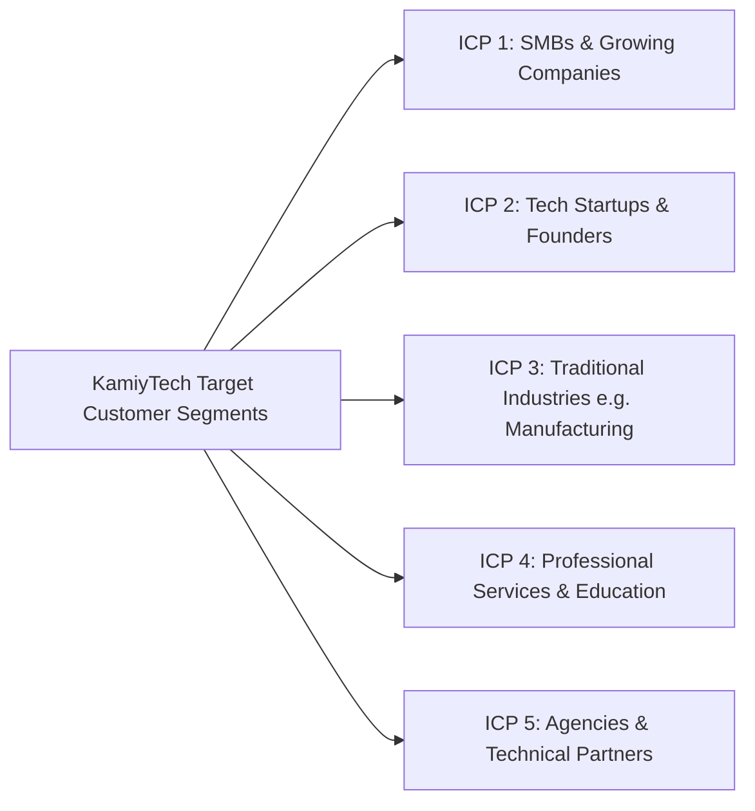

# KAMIYTECH STRATEGIC POSITIONING & ICP GUIDE
> **COMMERCIAL CORE DOCUMENT 04**

> **DOCUMENT METADATA**
> - **Purpose:** Establish KamiyTech's official market positioning, Ideal Customer Profiles (ICPs), target decision-maker personas, Unique Selling Proposition (USP) matrix, competitor differentiation strategies, and sales messaging frameworks.
> - **Owner:** Chief Marketing Officer (CMO) & Chief Executive Officer (CEO)
> - **Version:** 2.0.0
> - **Status:** APPROVED / LIVE (DISTRIBUTABLE SALES PACKAGE)
> - **Effective Date:** July 2026
> - **Dependencies:** Executive Strategic Directives, `01_Executive_Sales_Playbook_and_Discovery_SOP.md`, `02_Rate_Card_and_Pricing_Framework_INR.md`
> - **Related Documents:** [01_Executive_Sales_Playbook_and_Discovery_SOP.md](file:///c:/Users/abhis/OneDrive/Desktop/kamiytechAI/distributable_docs/1_Sales_and_BD/01_Executive_Sales_Playbook_and_Discovery_SOP.md), [02_Rate_Card_and_Pricing_Framework_INR.md](file:///c:/Users/abhis/OneDrive/Desktop/kamiytechAI/distributable_docs/1_Sales_and_BD/02_Rate_Card_and_Pricing_Framework_INR.md), [03_Detailed_Service_Catalog.md](file:///c:/Users/abhis/OneDrive/Desktop/kamiytechAI/distributable_docs/1_Sales_and_BD/03_Detailed_Service_Catalog.md)

---

## 1. Executive Positioning Statement

> **"KamiyTech is a full-service technology consultancy that designs, builds, and automates high-performance digital products for growth-focused businesses, modernizing operations through custom software, web platforms, mobile applications, and enterprise AI."**

### Strategic Market Positioning
KamiyTech bridges the structural market gap between **budget-constrained freelancers** and **overpriced legacy enterprise agencies**. We deliver enterprise-grade engineering, modern aesthetic design, and AI automation with the speed, transparency, and cost-efficiency required by growing SMBs, mid-market enterprises, and ambitious startups.

```
       [LOW-COST FREELANCERS] ◄───► [KAMIYTECH HYBRID AGILITY] ◄───► [LEGACY BIG-4 AGENCIES]
       - Unreliable SLA              - Enterprise Code Standards      - Bloated Retainers (₹25L+)
       - Spaghetti Code Debt         - Transparent Fixed Packages     - Bureaucratic Delay
       - Poor Design Polish          - Rapid 3-6 Week Delivery        - Rigid Legacy Stack
```

---

## 2. Ideal Customer Profiles (ICPs) & Target Personas



### ICP 1: Small & Medium Businesses (SMBs) & Growing Companies
- **Profile:** Growing annual revenue (₹1 Cr – ₹25 Cr); 10–100 employees; operating with legacy manual processes or outdated websites.
- **Key Decision Maker:** Founder, Managing Director, COO, VP Operations.
- **Core Pain Points:** Disjointed software tools, manual data entry, client drop-offs due to poor web experience, high operational overhead.
- **KamiyTech Solution:** End-to-end digital modernization: custom web portals, automated business workflows, mobile field apps, integrated backend systems.

### ICP 2: Tech Startups & Product Founders
- **Profile:** Seed to Series A funded; fast-moving product roadmaps; tight release deadlines; lean internal tech team.
- **Key Decision Maker:** Founder, CEO, CTO, Head of Product.
- **Core Pain Points:** Lack of senior engineering bandwidth, slow MVP release velocity, unscalable codebase, high in-house developer hiring costs.
- **KamiyTech Solution:** Dedicated engineering pods (Next.js, FastAPI, PostgreSQL), AI feature integration, rapid MVP builds.

### ICP 3: Traditional Industries (Manufacturing, Logistics, Real Estate)
- **Profile:** Operations-heavy businesses with legacy ERP/CRM reliance, paper-based tracking, and fragmented logistics data.
- **Key Decision Maker:** General Manager, VP Supply Chain, Operations Lead.
- **Core Pain Points:** Lack of real-time operational visibility, inventory tracking errors, manual reporting, siloed legacy software.
- **KamiyTech Solution:** Custom web/mobile dashboards, API integrations, automated inventory tracking, bespoke internal management tools.

### ICP 4: Professional Service Firms & Educational Institutions
- **Profile:** Consultancies, law firms, accounting practices, schools, and online training platforms.
- **Key Decision Maker:** Managing Partner, Executive Director, IT Director.
- **Core Pain Points:** Outdated web presence, manual client/student onboarding, inefficient scheduling, lack of secure client portals.
- **KamiyTech Solution:** Modern corporate web platforms, custom client portals, automated billing & booking workflows.

### ICP 5: Agencies & Technical Partners
- **Profile:** Creative, design, or marketing agencies lacking deep full-stack engineering or AI capabilities.
- **Key Decision Maker:** Agency Principal, Creative Director, CTO.
- **Core Pain Points:** Turning complex client UI designs into pixel-perfect code, meeting tight build deadlines, lack of AI developers.
- **KamiyTech Solution:** White-label engineering development, dedicated developer pods, backend API architecture.

---

## 3. Industry Value Proposition & Outcomes Matrix

| Target Industry | Customer Business Goal | Key Technical Deliverable | Measurable Business Outcome |
| :--- | :--- | :--- | :--- |
| **Manufacturing** | Real-time inventory & supply visibility | Next.js Web Dashboard + Mobile App | 35% reduction in inventory tracking errors |
| **Education** | Automated student onboarding & portal | Next.js Student Portal + Supabase | 50% faster enrollment processing |
| **Healthcare** | Secure patient scheduling & record sync | HIPAA-compliant Web App + WhatsApp Bot | 40% reduction in missed appointment slots |
| **Retail / E-commerce** | High-converting headless storefront | Next.js Headless Store + Razorpay | 2.5x website load speed & higher conversion |
| **Logistics** | Fleet tracking & automated dispatch | Mobile Driver App + Web Dispatch Console | 20% reduction in route dispatch latency |
| **Professional Services** | Elevated web prestige & client portal | Custom Client Portal + Automated Invoicing | Saved 15+ admin hours per week |

---

## 4. Competitive Differentiators (Why KamiyTech?)

1. **Enterprise Standards at Agency Speed:** We enforce strict code reviews, CI/CD automated deployments, and modular architecture (Next.js, FastAPI) without bureaucratic overhead.
2. **AI-First Automation Mindset:** We don't just build static websites or apps; we embed AI workflows (OpenAI, Gemini, LangChain) into client processes to reduce recurring manual labor.
3. **Agile Partner-Backed Capacity:** Supported by a network of domain specialists in full-stack engineering, UI/UX design, and AI automation, allowing us to scale team capacity dynamically.
4. **Transparent Hybrid Pricing:** Clear fixed-price scopes for predictable budgets, combined with value-driven retainer models for continuous enhancement—no hidden fee surprises.

---

## 5. Sales Elevator Pitches & Messaging Framework

### 30-Second Elevator Pitch
> *"At KamiyTech, we build high-impact custom software, web platforms, and AI automation systems that turn operational complexity into business growth. Whether you need an enterprise web app, a mobile application, or a fully automated workflow, we combine modern engineering with strategic design to help your company scale seamlessly."*

### 60-Second Executive Pitch
> *"Most growing companies face a tough choice: hire cheap freelancers who leave you with broken, unscalable code, or pay millions to legacy agencies that take six months to deliver basic features. KamiyTech provides a better way. We combine senior full-stack engineering in Next.js and Python with custom AI automation to deliver enterprise-grade web platforms and mobile apps in weeks, not months—backed by transparent fixed pricing and guaranteed SLAs."*

---
*End of Strategic Positioning & ICP Guide (Doc 04 v2.0.0). Maintained by CMO & CEO.*
