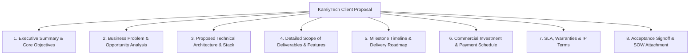

# KAMIYTECH CLIENT PROPOSAL & PITCH DECK TEMPLATES
> **COMMERCIAL CORE DOCUMENT 05**

> **DOCUMENT METADATA**
> - **Purpose:** Standardize client proposal formats, executive pitch deck layouts, commercial quotation templates, Statement of Work (SOW) scope attachments, and change order templates for KamiyTech sales operations.
> - **Owner:** Creative Director, Head of Sales, & Chief Financial Officer (CFO)
> - **Version:** 2.0.0
> - **Status:** APPROVED / LIVE (DISTRIBUTABLE SALES PACKAGE)
> - **Effective Date:** July 2026
> - **Dependencies:** `01_Executive_Sales_Playbook_and_Discovery_SOP.md`, `02_Rate_Card_and_Pricing_Framework_INR.md`, `03_Detailed_Service_Catalog.md`
> - **Related Documents:** [01_Executive_Sales_Playbook_and_Discovery_SOP.md](file:///c:/Users/abhis/OneDrive/Desktop/kamiytechAI/distributable_docs/1_Sales_and_BD/01_Executive_Sales_Playbook_and_Discovery_SOP.md), [02_Rate_Card_and_Pricing_Framework_INR.md](file:///c:/Users/abhis/OneDrive/Desktop/kamiytechAI/distributable_docs/1_Sales_and_BD/02_Rate_Card_and_Pricing_Framework_INR.md), [03_Detailed_Service_Catalog.md](file:///c:/Users/abhis/OneDrive/Desktop/kamiytechAI/distributable_docs/1_Sales_and_BD/03_Detailed_Service_Catalog.md)

---

## 1. Proposal Document Layout Architecture

Every formal technology proposal issued by KamiyTech must follow this 8-part executive structure:



---

## 2. Production Proposal Boilerplate Markdown Template

```markdown
# TECHNOLOGY SOLUTION PROPOSAL
**Prepared For:** [Client Company Name]  
**Project Title:** [e.g., Next.js Business Web Platform & AI Workflow Suite]  
**Date:** [Date e.g., July 27, 2026]  
**Document ID:** PRO-2026-[CLIENT-CODE]  
**Prepared By:** KamiyTech Executive Team (contact@kamiytech.com)  

---

## 1. Executive Summary
KamiyTech is pleased to present this custom technology proposal to [Client Company Name]. Following our diagnostic discovery sessions with [Client Key Contact Name], our team has architected a tailored technical solution to modernize your digital infrastructure, automate manual business workflows, and drive customer conversion.

### Core Project Objectives
- Architect and launch a high-performance Next.js web application tailored for [Client Industry].
- Integrate an AI automation engine to streamline lead qualification and client onboarding.
- Reduce manual administrative operational processing time by an estimated 35%–50%.

---

## 2. Technical Architecture & Technology Stack
To ensure high speed, security, type safety, and seamless scalability, KamiyTech will build your platform using our validated enterprise technology stack:

- **Frontend Interface:** Next.js (App Router), React, TypeScript, Tailwind CSS.
- **Backend API & Logic:** Node.js / Python (FastAPI) serverless microservices.
- **Database & Storage:** PostgreSQL (Supabase) + AWS S3 secure cloud storage.
- **AI Automation Engine:** OpenAI API (`gpt-4o`) / Gemini API via serverless webhooks.
- **Hosting & Infrastructure:** Vercel Global Edge Network with automated SSL & DDoS protection.

---

## 3. Scope of Deliverables & Milestones

### Phase 1: UX/UI Design & System Architecture (Weeks 1–2)
- High-fidelity Figma visual prototypes for all web pages and admin modules.
- Entity-Relationship Diagram (ERD) database schema & API specification.

### Phase 2: Core Engineering & AI Integration (Weeks 3–5)
- Custom Next.js frontend build with full mobile responsiveness.
- Multi-role user authentication and admin dashboard integration.
- Custom AI workflow automation scenario setup and testing.

### Phase 3: QA Testing, Staging & Handover (Week 6)
- Cross-browser testing, mobile UI verification, and security audits.
- Production deployment on client cloud infrastructure, DNS transfer, and 60-minute admin training.

---

## 4. Commercial Investment & Payment Terms

| Milestone | Deliverable / Stage | Investment (INR ₹) | Payment Trigger |
| :--- | :--- | :---: | :--- |
| **Milestone 1** | Initial Deposit & Project Kickoff | ₹X,XX,XXX (40%) | Contract Signing |
| **Milestone 2** | Staging Build Demo Signoff | ₹X,XX,XXX (30%) | Staging UAT Signoff |
| **Milestone 3** | Pre-Launch Production Handover | ₹X,XX,XXX (30%) | Prior to Live Launch |
| **TOTAL** | **Fixed-Price Investment** | **₹X,XX,XXX (+ 18% GST)** | **Guaranteed Scope** |

*(Note: Single-Page Landing Website engagements use 50% Deposit / 50% Handover milestone billing)*

---

## 5. Acceptance & Execution Signoff

By signing below, both parties agree to the scope, timeline, and commercial investment detailed herein, governed by the KamiyTech Master Services Agreement (MSA).

**For [Client Company Name]:**  
Signature: _______________________  Date: ____________  
Name & Title: _____________________________________  

**For KamiyTech:**  
Signature: _______________________  Date: ____________  
Name & Title: _____________________________________  
```

---

## 3. Executive Pitch Deck Structure (10-Slide Master Standard)

Sales Reps must follow the Creative Director's **10-Slide Presentation Format** for live executive meetings:

1. **Slide 1: Title Slide** (KamiyTech logo, Client name, Project title, Date).
2. **Slide 2: Executive Summary & Context** (Acknowledging client growth goals and current context).
3. **Slide 3: The Core Business Problem** (Highlighting operational friction, technical debt, or manual delays).
4. **Slide 4: The KamiyTech Solution** (Overview of custom web app, mobile suite, or AI automation).
5. **Slide 5: Technical Architecture** (Visual stack diagram: Next.js, FastAPI, PostgreSQL, Vercel/AWS).
6. **Slide 6: Scope Breakdown & Deliverables** (3-phase execution roadmap as per [03 Detailed Service Catalog](file:///c:/Users/abhis/OneDrive/Desktop/kamiytechAI/distributable_docs/1_Sales_and_BD/03_Detailed_Service_Catalog.md)).
7. **Slide 7: Case Studies & Proven ROI** (Metrics: 35% time saved, 2.5x load speed, 50% faster onboarding).
8. **Slide 8: Delivery Pod & Team Expertise** (Senior engineering oversight + agile partner network).
9. **Slide 9: Investment & Milestone Schedule** (Transparent fixed pricing as per [02 Rate Card](file:///c:/Users/abhis/OneDrive/Desktop/kamiytechAI/distributable_docs/1_Sales_and_BD/02_Rate_Card_and_Pricing_Framework_INR.md)).
10. **Slide 10: Call to Action & Kickoff Plan** (Immediate next steps to lock sprint capacity).

---

## 4. Change Order & Scope Amendment Template

```markdown
# SCOPE CHANGE ORDER (CO-01)
**Project Title:** [Project Name] | **Original Contract Date:** [Date]  
**Client Name:** [Client Company] | **Change Order ID:** CO-2026-[ID]  

### 1. Requested Scope Modification
[Detailed description of requested feature addition or modification outside the original SOW]

### 2. Impact Analysis
- **Timeline Impact:** Adds [X] business days to original project launch date.
- **Cost Impact:** Additional fixed fee of **₹XX,XXX (+ 18% GST)**.

**Client Approval:** ___________________________ Date: ____________
```

---
*End of Client Proposal & Pitch Deck Templates (Doc 05 v2.0.0). Maintained by Creative Director & Head of Sales.*
