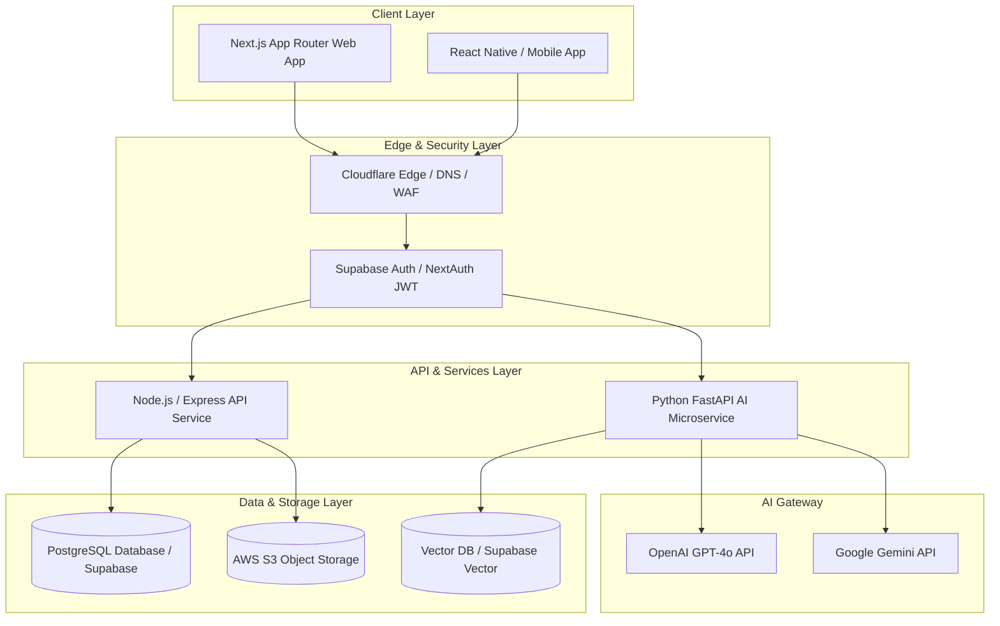
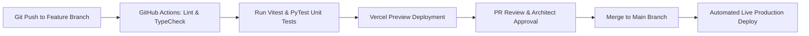

# KAMIYTECH ENGINEERING ARCHITECTURE & TECHNOLOGY STACK GUIDELINES
> **DISTRIBUTABLE ENGINEERING & DEV PACKAGE • DOCUMENT ID: ENG-01**

```
====================================================================================================
DOCUMENT CONTROL & METADATA
====================================================================================================
Title:                  Engineering Architecture & Technology Stack Guidelines
Document Reference:     KMT-ENG-01-v1.1
Version:                1.1.0
Status:                 APPROVED / PRODUCTION-READY
Effective Date:         July 2026
Document Owner:         Chief Technology Officer (CTO) & Enterprise Architect
Target Audience:        Senior Full-Stack Engineers, Software Architects, Lead Developers,
                        Technical PMs, Specialist Partner Engineers
Classification:         Internal Operational & Specialist Partner Distributable
Related Governance:     [QA & OWASP SOP](file:///c:/Users/abhis/OneDrive/Desktop/kamiytechAI/distributable_docs/2_Engineering_and_Dev/02_QA_Code_Review_and_OWASP_Security_SOP.md)
                        [Master Knowledge Base](file:///c:/Users/abhis/OneDrive/Desktop/kamiytechAI/knowledge_base/index.md)
====================================================================================================
```

---

## TABLE OF CONTENTS
1. [Executive Summary & Core Principles](#1-executive-summary--core-principles)
2. [Mandatory Technology Stack Matrix](#2-mandatory-technology-stack-matrix)
3. [System & Data Architecture Blueprint](#3-system--data-architecture-blueprint)
4. [Standard Repository & Directory Layout](#4-standard-repository--directory-layout)
5. [Code Quality, Type Safety & Version Control SOP](#5-code-quality-type-safety--version-control-sop)
6. [AI API Integration Standards & Safeguards](#6-ai-api-integration-standards--safeguards)
7. [Database Architecture & Migration SOP](#7-database-architecture--migration-sop)
8. [Security & CI/CD Deployment Pipelines](#8-security--cicd-deployment-pipelines)
9. [Engineering Compliance Checklist](#9-engineering-compliance-checklist)

---

## 1. EXECUTIVE SUMMARY & CORE PRINCIPLES

This document establishes the official engineering architecture, technology stack configurations, repository structures, type-safety mandates, AI API integration standards, and security deployment pipelines for **KamiyTech**. 

Every line of code authored by internal developers, contract specialists, and partner engineering pods must adhere strictly to the rules outlined in this document.

```
+-----------------------------------------------------------------------------------+
|                            CORE ENGINEERING PRINCIPLES                            |
+-----------------------------------------------------------------------------------+
|  1. TYPE-SAFETY FIRST      | 100% strict TypeScript & Python type annotations.    |
|  2. MODULAR ARCHITECTURE   | Atomic UI components, custom hooks, isolated APIs.|
|  3. AUTOMATED CI/CD        | Zero manual FTP/SSH uploads; automated git pipelines.|
|  4. SECURITY BY DESIGN     | Zero plain-text secrets, server-side validation.   |
|  5. AI-NATIVE PERFORMANCE  | Server-side API execution, streaming, token caps. |
+-----------------------------------------------------------------------------------+
```

> [!IMPORTANT]
> **Zero Tolerance Policy:** Direct manual code deployment over SSH/FTP, committing environment secrets (`.env`) to git repositories, or using explicit `any` types in TypeScript is strictly prohibited across all KamiyTech client projects.

---

## 2. MANDATORY TECHNOLOGY STACK MATRIX

KamiyTech enforces a standardized technology stack to maximize code reusability, maintainability, and delivery speed across client projects.

| Architectural Layer | Core Standard Technology | Approved Alternatives / Extensions | Out-of-Scope / Prohibited |
| :--- | :--- | :--- | :--- |
| **Frontend Web** | Next.js (App Router), React 19, TypeScript | Vite + React (Single-page tools) | jQuery, Legacy Angular, PHP/HTML |
| **Styling & UI Design** | Tailwind CSS, Lucide Icons, Shadcn UI | Framer Motion (Animations) | Raw CSS, Bootstrap, Inline styles |
| **Backend Web APIs** | Node.js (TypeScript / Express) | Python (FastAPI / Pydantic) | Ruby on Rails, Java Spring, PHP |
| **Databases (Relational)** | PostgreSQL (Supabase / AWS RDS) | SQLite (Edge / Local testing) | MySQL 5.x, MS SQL Server |
| **Databases (NoSQL/Vector)**| MongoDB, Supabase Vector | Pinecone, Redis | Legacy file storage databases |
| **ORM / Query Engine** | Prisma ORM, Drizzle ORM | SQLAlchemy (Python) | Raw unparameterized SQL strings |
| **Mobile Stack** | React Native (Expo SDK) | Flutter (Cross-platform) | Native Objective-C, Java Android |
| **AI & LLM Services** | OpenAI API (`gpt-4o`), Google Gemini API | LangChain, LlamaIndex, Anthropic | Client-side LLM calls |
| **Hosting & Cloud** | Vercel (Web/Edge), AWS (S3, RDS, EC2) | Cloudflare Workers, Render | Unmanaged shared hosting (cPanel) |

---

## 3. SYSTEM & DATA ARCHITECTURE BLUEPRINT

The diagram below illustrates KamiyTech's standardized multi-tier application architecture across web, mobile, backend, database, and AI service layers.



---

## 4. STANDARD REPOSITORY & DIRECTORY LAYOUT

### 4.1 Next.js App Router Standard Layout
All Next.js web applications must follow this strict directory structure:

```
/my-kamiytech-project
├── /src
│   ├── /app                  # Next.js App Router Routes & Pages
│   │   ├── /api              # Server API Route Handlers
│   │   ├── (auth)            # Authentication Route Group (Login/Signup)
│   │   ├── (dashboard)       # Protected Dashboard Route Group
│   │   ├── layout.tsx        # Root Application Layout & Providers
│   │   ├── page.tsx          # Main Landing Page
│   │   └── global.css        # Tailwind Base & Custom Styles
│   ├── /components           # Modular UI Components
│   │   ├── /ui               # Atomic Components (Button, Input, Modal, Badge)
│   │   ├── /forms            # Form Components with Zod Schema Validation
│   │   ├── /layout           # Navigation Header, Sidebar, Footer
│   │   └── /sections         # Page Section Components (Hero, Features, Pricing)
│   ├── /lib                  # Utilities, SDKs, Database Connections
│   │   ├── prisma.ts         # Singleton Prisma ORM Client
│   │   ├── openai.ts         # Server-Side OpenAI Client Initialization
│   │   ├── supabase.ts       # Supabase Client Configuration
│   │   └── utils.ts          # Classname merger (cn) and formatting helpers
│   ├── /types                # Shared TypeScript Type Definitions & Interfaces
│   │   ├── index.ts          # Global Application Types
│   │   └── api.ts            # API Response & Request DTO Types
│   ├── /hooks                # Custom React Hooks (e.g., useDebounce, useAuth)
│   └── /services             # Data fetching & API integration abstraction layer
├── /public                   # Static Assets (Logos, SVGs, Favicons)
├── /prisma                   # Database Schema & Migration Scripts
│   └── schema.prisma         # Prisma Data Model
├── .env.example              # Template for Required Environment Variables
├── .eslintrc.json            # Strict ESLint Rules
├── .prettierrc               # Prettier Code Formatting Configuration
├── tsconfig.json             # Strict TypeScript Compiler Options
├── tailwind.config.js        # Tailwind Theme Tokens & Plugins
└── package.json              # Project Dependencies & Scripts
```

### 4.2 Python FastAPI AI Microservice Layout
For projects requiring complex AI processing, RAG, or data transformation, the backend microservice must follow this layout:

```
/kamiytech-ai-service
├── /app
│   ├── /api                  # FastAPI Router Controllers
│   │   ├── /v1               # API Version 1 Endpoints
│   │   │   ├── /chat.py      # AI RAG Chat Endpoints
│   │   │   └── /ingest.py    # Document Vectorization Endpoints
│   ├── /core                 # Core Configuration & Security
│   │   ├── config.py         # Pydantic BaseSettings Environment Loader
│   │   └── security.py       # API Key & JWT Verification
│   ├── /services             # Business Logic & LLM Pipelines
│   │   ├── rag_engine.py     # LangChain / LlamaIndex Vector Query Logic
│   │   └── vector_store.py   # Embeddings & Vector DB Operations
│   ├── /models               # Pydantic Schemas & Request/Response Models
│   └── main.py               # FastAPI App Entrypoint
├── Dockerfile                # Multi-stage Containerization Build File
├── requirements.txt          # Explicitly Versioned Python Dependencies
└── README.md
```

---

## 5. CODE QUALITY, TYPE SAFETY & VERSION CONTROL SOP

### 5.1 TypeScript Strictness Rules
1. **Mandatory Configuration:** `tsconfig.json` MUST contain the following compiler settings:
   ```json
   {
     "compilerOptions": {
       "strict": true,
       "noImplicitAny": true,
       "strictNullChecks": true,
       "noUnusedLocals": true,
       "noUnusedParameters": true
     }
   }
   ```
2. **Zero `any` Mandate:** Using `any` as a type annotation is strictly forbidden. Developers must declare explicit `interface` or `type` contracts. When handling dynamic inputs, use `unknown` combined with **Zod** schema runtime validation:
   ```typescript
   // BAD (Prohibited)
   function processUserData(data: any) {
     return data.name;
   }

   // GOOD (Mandatory)
   import { z } from 'zod';

   const UserSchema = z.object({
     id: z.string().uuid(),
     name: z.string().min(2),
     email: z.string().email(),
   });

   type User = z.infer<typeof UserSchema>;

   function processUserData(input: unknown): User {
     return UserSchema.parse(input);
   }
   ```

### 5.2 Git Branching & Conventional Commit Standards
All engineering staff and partner developers must follow **Conventional Commits**:

- `feat: [description]` – New feature addition.
- `fix: [description]` – Bug fix or patch.
- `docs: [description]` – Documentation changes only.
- `style: [description]` – Formatting, linting, or missing semi-colons.
- `refactor: [description]` – Code changes that neither fix a bug nor add a feature.
- `test: [description]` – Adding missing tests or refactoring existing tests.
- `chore: [description]` – Updating build tasks, packages, or config files.

#### Git Branch Naming Convention:
- Feature Branches: `feat/client-portal-auth`
- Bugfix Branches: `fix/checkout-razorpay-webhook`
- Integration Branch: `staging`
- Production Branch: `main` (Protected; strictly requires Pull Request signoff).

---

## 6. AI API INTEGRATION STANDARDS & SAFEGUARDS

When building AI workflows, LLM integrations, or RAG engines, developers must implement the following safeguards:

```
[CLIENT BROWSER] --- (Server Action / HTTPS) ---> [NEXT.JS SERVER / FASTAPI] ---> [OPENAI / GEMINI API]
  (Zero API Keys Exposed)                       (Validates Session & Rate Caps)     (Server-to-Server Execution)
```

1. **Server-Side Execution ONLY:** API keys for OpenAI, Gemini, or Anthropic must NEVER be placed in client-side components (`"use client"`) or exposed in browser bundles. All AI calls must execute in server components, Next.js Server Actions, or FastAPI endpoints.
2. **Streaming Response Standard:** For LLM responses requiring >1 second generation time, developers must implement streaming responses using Server-Sent Events (SSE) or the **Vercel AI SDK** (`useChat` / `useCompletion`) to ensure immediate user feedback (<500ms TTFT - Time To First Token).
3. **Budget & Rate Limit Safeguards:**
   - Always set `max_tokens` limits on all OpenAI/Gemini API calls.
   - Enforce server-side rate limits (e.g., maximum 20 AI queries per user/minute using Redis or Cloudflare).
   - Implement graceful error fallbacks when upstream LLM APIs fail or return 429 status codes.

---

## 7. DATABASE ARCHITECTURE & MIGRATION SOP

1. **Relational Database Standard:** PostgreSQL is the mandatory relational database for all transactional applications.
2. **ORM Usage:** All database interactions must pass through Prisma ORM or Drizzle ORM. Raw string-concatenated SQL queries are strictly prohibited to prevent SQL injection vulnerabilities.
3. **Migration SOP:**
   - Schema changes must NEVER be manually edited directly on production database instances.
   - All migrations must be scripted via Prisma CLI (`npx prisma migrate dev --name schema_update`).
   - Database migrations must be run and tested against the staging database before applying to production.
4. **Indexing Rule:** All foreign key fields, high-frequency filter columns (e.g., `status`, `created_at`), and unique identifier lookups must be indexed in the schema.

---

## 8. SECURITY & CI/CD DEPLOYMENT PIPELINES

KamiyTech enforces an automated CI/CD pipeline using **GitHub Actions** and **Vercel/AWS**. Manual SSH uploads or direct server editing are strictly banned.



### Security Pipeline Enforcement:
1. **GitHub Secret Scanning:** Automatically blocks commits containing hardcoded credentials or `.env` files.
2. **Dependency Auditing:** Automated `npm audit` or `pip-audit` runs on every pull request. PRs with critical/high security vulnerabilities will be automatically rejected.
3. **Environment Isolation:** Maintain isolated environment variables for `Development`, `Staging`, and `Production`. Production credentials must be stored securely in Vercel Environment Variables or AWS Secrets Manager.

---

## 9. ENGINEERING COMPLIANCE CHECKLIST

Before submitting any code for senior code review or client staging release, verify compliance against this checklist:

- [ ] **TypeScript Strict Mode Pass:** `npx tsc --noEmit` returns zero errors.
- [ ] **Zero `any` Types:** All variables, parameters, and returns use explicit interfaces or Zod types.
- [ ] **ESLint & Prettier Pass:** `npm run lint` executes cleanly without warnings or errors.
- [ ] **Environment Isolation:** Zero plain-text API keys or DB URLs in repository files. `.env.example` updated.
- [ ] **API Error Handling:** All server endpoints wrap async operations in try/catch blocks and return standardized JSON error schemas.
- [ ] **Database Migration Versioned:** Prisma schema migration files generated and checked into git.
- [ ] **Mobile Responsiveness:** All UI components tested across mobile (375px), tablet (768px), and desktop (1440px) breakpoints.

---
*KamiyTech Engineering Architecture & Technology Stack Guidelines (ENG-01 v1.1.0). Maintained by Chief Technology Officer & Enterprise Architect.*
