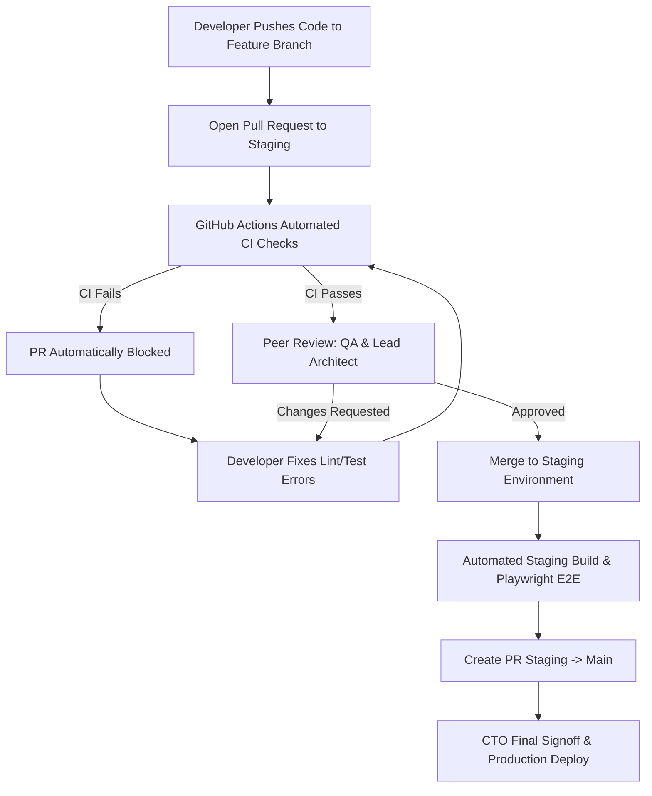

# KAMIYTECH QA, CODE REVIEW & OWASP SECURITY SOP
> **DISTRIBUTABLE ENGINEERING & DEV PACKAGE • DOCUMENT ID: ENG-02**

```
====================================================================================================
DOCUMENT CONTROL & METADATA
====================================================================================================
Title:                  QA, Code Review & OWASP Security SOP
Document Reference:     KMT-ENG-02-v1.1
Version:                1.1.0
Status:                 APPROVED / PRODUCTION-READY
Effective Date:         July 2026
Document Owner:         Chief Technology Officer (CTO), QA Lead & Enterprise Architect
Target Audience:        QA Engineers, Software Engineers, Lead Architects, Technical PMs,
                        Specialist Partner Engineers, Security Auditors
Classification:         Internal Operational & Specialist Partner Distributable
Related Governance:     [Engineering Architecture Guidelines](file:///c:/Users/abhis/OneDrive/Desktop/kamiytechAI/distributable_docs/2_Engineering_and_Dev/01_Engineering_Architecture_and_Tech_Stack_Guidelines.md)
                        [Master Knowledge Base](file:///c:/Users/abhis/OneDrive/Desktop/kamiytechAI/knowledge_base/index.md)
====================================================================================================
```

---

## TABLE OF CONTENTS
1. [Executive Summary & Quality Philosophy](#1-executive-summary--quality-philosophy)
2. [Code Review & Pull Request (PR) Protocol](#2-code-review--pull-request-pr-protocol)
3. [Automated Testing Standard Hierarchy](#3-automated-testing-standard-hierarchy)
4. [Pre-Release 10-Point OWASP Security Gate Checklist](#4-pre-release-10-point-owasp-security-gate-checklist)
5. [Staging & Production Release Gates](#5-staging--production-release-gates)
6. [Security Incident Severity & Emergency Patching](#6-security-incident-severity--emergency-patching)
7. [QA & Security Compliance Verification](#7-qa--security-compliance-verification)

---

## 1. EXECUTIVE SUMMARY & QUALITY PHILOSOPHY

At **KamiyTech**, Quality Assurance (QA) and Information Security are integrated directly into our continuous delivery pipeline rather than treated as afterthoughts. 

This document defines mandatory protocols for peer code reviews, automated unit and end-to-end testing, pre-release security audits, and production release gates across all client deliverables.

```
+-----------------------------------------------------------------------------------+
|                           FIVE QUALITY & SECURITY PILLARS                         |
+-----------------------------------------------------------------------------------+
|  1. MANDATORY REVIEW   | 100% of code must be reviewed by a Senior Engineer.      |
|  2. AUTOMATED CI GATES | Automated linting, type checks, and unit tests must pass. |
|  3. >80% UNIT COVERAGE | Core business logic protected by automated Vitest/PyTest.|
|  4. OWASP 10 AUDIT     | Zero critical/high vulnerabilities permitted at launch.  |
|  5. E2E VALIDATION     | Critical user flows automated via Playwright E2E suites. |
+-----------------------------------------------------------------------------------+
```

---

## 2. CODE REVIEW & PULL REQUEST (PR) PROTOCOL

Every code modification submitted by internal developers or partner engineering pods must pass through a strict Pull Request (PR) review process before entering the `staging` or `main` branches.



### 2.1 Branch Protection Rules
1. **Direct Commit Prohibition:** Direct pushes to `main` (production) and `staging` branches are strictly disabled via GitHub repository settings.
2. **Review Threshold:** Merging into `staging` requires **at least one Senior Engineer signoff**. Merging into `main` requires **CTO or Enterprise Architect approval**.
3. **PR Template Compliance:** All PRs must use the mandatory KamiyTech PR template:

```markdown
## Pull Request Summary
- **Ticket / Feature:** [Link to Jira / Notion issue]
- **Type of Change:** [ ] Feature  [ ] Bugfix  [ ] Refactor  [ ] Security Patch

## Description of Changes
Concise explanation of modifications made and architectural impact.

## Verification & Testing Proof
- [ ] Local Unit Tests Passing (`npm run test`)
- [ ] TypeScript Compilation Passing (`npx tsc --noEmit`)
- [ ] Verified locally in Chrome / Safari / Mobile viewport.
- **Proof:** [Attach Screenshot or Terminal Output Log]

## Breaking Changes & Environment Variable Updates
- [ ] Database Migration Required (`prisma migrate`)
- [ ] Environment Variables Added/Updated (`.env.example` modified)
```

---

## 3. AUTOMATED TESTING STANDARD HIERARCHY

KamiyTech mandates a three-tier automated testing strategy to eliminate regressions and guarantee business logic stability.

```
       / \
      /   \      [E2E TESTS] Playwright Critical User Flow Automation (10-15%)
     /     \
    /       \    [API CONTRACT TESTS] Postman / Supertest Backend Endpoint Audits (25-30%)
   /_________\   [UNIT & INTEGRATION] Vitest / Jest / PyTest Pure Functions (>80% Coverage)
```

### 3.1 Unit & Integration Testing Standard
* **Frontend (React / Next.js):** Uses **Vitest** and **React Testing Library**. All utility functions, formatting logic, custom hooks, and state reducers must maintain **>80% line coverage**.
* **Backend (Node.js / FastAPI):** Uses **PyTest** (Python) or **Jest/Supertest** (Node.js) to test API controllers, database query models, calculation engines, and LLM prompt processing.

```typescript
// Example Vitest Unit Test for Price Calculation (Mandatory Standard)
import { describe, it, expect } from 'vitest';
import { calculateMilestoneBilling } from '@/lib/finance';

describe('calculateMilestoneBilling', () => {
  it('should accurately split standard 40/30/30 project milestones', () => {
    const totalAmount = 100000; // INR ₹1,00,000
    const milestones = calculateMilestoneBilling(totalAmount);
    
    expect(milestones.deposit).toBe(40000);
    expect(milestones.staging).toBe(30000);
    expect(milestones.finalLaunch).toBe(30000);
  });
});
```

### 3.2 End-to-End (E2E) Testing with Playwright
Playwright test suites must execute automatically against the staging server prior to production deployment. E2E tests cover critical revenue and operational paths:

1. User Registration, Login, and Password Reset.
2. E-Commerce Product Selection, Cart Operations, and Checkout.
3. Payment Gateway Webhook Handshake (Razorpay / Stripe sandbox).
4. Contact Form Submissions, File Uploads, and Lead Routing.
5. Admin Dashboard Navigation and Data Table Filtering.

---

## 4. PRE-RELEASE 10-POINT OWASP SECURITY GATE CHECKLIST

Prior to issuing client User Acceptance Testing (UAT) access or triggering a production deployment, the QA Lead must execute and sign off on the **10-Point OWASP Security Audit Checklist**:

| # | Security Audit Gate | Execution Standard & Operational Rule | Status |
| :-: | :--- | :--- | :-: |
| **1** | **Secret & API Key Isolation** | Zero plain-text credentials, database URIs, or API keys in source code. All secrets loaded via server environment variables (`.env.production`). | PASS |
| **2** | **SQL Injection Defense** | All database queries must use ORM parameterized queries (Prisma/Drizzle/SQLAlchemy). Zero string concatenation in database lookups. | PASS |
| **3** | **XSS & Input Sanitization** | All incoming HTTP request payloads validated using **Zod** schemas. User HTML content sanitized via `DOMPurify` before rendering. | PASS |
| **4** | **Auth & Session Security** | User session JWT tokens stored in `HttpOnly`, `Secure`, `SameSite=Strict` cookies. Passwords hashed using Argon2id or bcrypt (cost factor >= 12). | PASS |
| **5** | **CORS & Hardened Security Headers** | Explicit CORS origin whitelist configured. Security headers (`HSTS`, `X-Frame-Options: DENY`, `Content-Security-Policy`) active via Cloudflare/Next.js. | PASS |
| **6** | **Dependency Audit** | `npm audit` or `pip-audit` returns zero Critical or High severity vulnerabilities in package dependencies. | PASS |
| **7** | **Rate Limiting & Anti-DDoS** | High-risk endpoints (Login, Password Reset, Lead Forms, AI APIs) protected by Redis rate limiters or Cloudflare WAF (max 10 req/min). | PASS |
| **8** | **Console Hygiene & Obfuscation** | All `console.log` and debug print statements stripped from client JavaScript production bundles via Terser/SWC configuration. | PASS |
| **9** | **Asset & Performance Optimization**| Images formatted in Next-Gen WebP/AVIF via `next/image`. Google Lighthouse Performance Score > **85** on Desktop and Mobile. | PASS |
| **10**| **Production Error Masking** | Production errors return sanitized public error codes (`INTERNAL_SERVER_ERROR`). Detailed stack traces strictly hidden from response payloads. | PASS |

---

## 5. STAGING & PRODUCTION RELEASE GATES

To deploy code to live production environments, all four release gates must be fully satisfied:

```
[GATE 1: CI Pipeline Pass] ---> [GATE 2: QA & OWASP Pass] ---> [GATE 3: Client UAT Signoff] ---> [GATE 4: CTO Release Authorization]
```

### Staging Verification Gate:
- Code successfully builds and passes all automated GitHub Actions checks.
- Staging environment (`https://[client]-staging.kamiytech.app`) updated automatically.
- Playwright E2E test suite executes without failures.

### Production Release Gate:
- Client formally signs off on staging UAT (written signoff via email or Notion).
- Database backup snapshot taken immediately prior to running production migrations.
- Production environment variables verified in Vercel / AWS Secrets Manager.
- Post-deployment smoke test executed within 15 minutes of launch (verifying SSL, Auth, Forms, and Payments).

---

## 6. SECURITY INCIDENT SEVERITY & EMERGENCY PATCHING

In the event of a security vulnerability or production outage post-launch, KamiyTech enforces strict SLA resolution times:

| Severity Level | Definition / Impact | Target Response SLA | Resolution & Patch SLA |
| :--- | :--- | :---: | :---: |
| **SEV-1 (CRITICAL)** | Security breach, data leak, live site down, or payment system failure. | **< 15 Minutes** | **< 2 Hours** |
| **SEV-2 (HIGH)** | Core feature degraded, broken user flow, or high dependency security vulnerability. | **< 1 Hour** | **< 6 Hours** |
| **SEV-3 (MEDIUM)** | Minor feature bug, UI layout issue, non-blocking bug with workaround. | **< 4 Hours** | **< 24 Hours** |
| **SEV-4 (LOW)** | Cosmetic tweak, typo, non-urgent enhancement request. | **< 24 Hours** | Next Sprint Cycle |

### Emergency Patching SOP (SEV-1 / SEV-2):
1. Developer creates a hotfix branch directly from `main` (`hotfix/[issue-description]`).
2. Implement minimum required patch and run targeted unit test.
3. Conduct expedited peer review with CTO or Senior Architect.
4. Deploy hotfix directly to production via manual override GitHub release tag.
5. Publish Root Cause Analysis (RCA) report to client within 24 hours of resolution.

---

## 7. QA & SECURITY COMPLIANCE VERIFICATION

By signing or committing code to KamiyTech client repositories, engineering personnel certify compliance with this QA & Security SOP. Non-compliance, bypassing review gates, or introducing intentional backdoors will result in immediate termination of partner contracts.

---
*KamiyTech Quality Assurance, Code Review & OWASP Security SOP (ENG-02 v1.1.0). Maintained by Chief Technology Officer, QA Lead & Enterprise Architect.*
