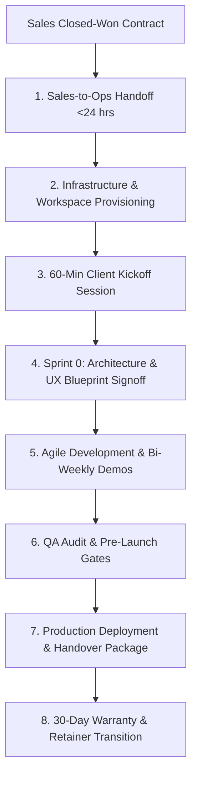
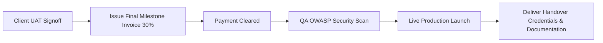

# KAMIYTECH CLIENT ONBOARDING & PROJECT DELIVERY SOP
> **DISTRIBUTABLE OPERATIONS & PM PACKAGE • DOCUMENT ID: OPS-01**

```
====================================================================================================
DOCUMENT CONTROL & METADATA
====================================================================================================
Title:                  Client Onboarding & Project Delivery SOP
Document Reference:     KMT-OPS-01-v1.1
Version:                1.1.0
Status:                 APPROVED / PRODUCTION-READY
Effective Date:         July 2026
Document Owner:         Chief Operating Officer (COO), Technical PM (TPM) & Customer Success Lead
Target Audience:        COOs, Technical Project Managers, Account Managers, Engineering Leads,
                        Client Success Representatives, Operations Staff
Classification:         Internal Operational & Client Operations Distributable
Related Governance:     [Detailed Service Catalog](file:///c:/Users/abhis/OneDrive/Desktop/kamiytechAI/distributable_docs/3_Operations_and_PM/02_Detailed_Service_Catalog.md)
                        [Partner Vetting SOP](file:///c:/Users/abhis/OneDrive/Desktop/kamiytechAI/distributable_docs/3_Operations_and_PM/03_Specialist_Partner_Vetting_and_White_Label_SOP.md)
                        [Master Knowledge Base](file:///c:/Users/abhis/OneDrive/Desktop/kamiytechAI/knowledge_base/index.md)
====================================================================================================
```

---

## TABLE OF CONTENTS
1. [Executive Summary & Operational Lifecycle](#1-executive-summary--operational-lifecycle)
2. [Phase 1: Sales-to-Ops Handoff & Environment Provisioning (Days 1–2)](#2-phase-1-sales-to-ops-handoff--environment-provisioning-days-12)
3. [Phase 2: Client Kickoff & Technical Discovery (Days 3–5)](#3-phase-2-client-kickoff--technical-discovery-days-35)
4. [Phase 3: Architecture Blueprint & UX Signoff (Sprint 0)](#4-phase-3-architecture-blueprint--ux-signoff-sprint-0)
5. [Phase 4: Sprint Execution & Communication Cadence](#5-phase-4-sprint-execution--communication-cadence)
6. [Phase 5: Production Deployment & Handover Package](#6-phase-5-production-deployment--handover-package)
7. [Phase 6: Warranty Period & Retainer Transition](#7-phase-6-warranty-period--retainer-transition)
8. [Delivery Operations Compliance Checklist](#8-delivery-operations-compliance-checklist)

---

## 1. EXECUTIVE SUMMARY & OPERATIONAL LIFECYCLE

The **KamiyTech Client Onboarding & Project Delivery SOP** establishes the mandatory operational standard governing client engagements from closed-won sales handoff to live deployment and post-launch maintenance.

Our primary objective is to guarantee seamless communication, eliminate project scope creep, ensure high technical quality, and deliver exceptional client satisfaction on every engagement.



---

## 2. PHASE 1: SALES-TO-OPS HANDOFF & ENVIRONMENT PROVISIONING (DAYS 1–2)

### 2.1 Sales-to-Ops Handoff Package (SLA: Within 24 Hours of Deal Closure)
Upon contract signature, the Sales Lead transfers the following mandatory assets to the assigned Technical Project Manager (TPM) and COO:

1. **Executed Legal Documents:** Fully signed Master Services Agreement (MSA) and Statement of Work (SOW).
2. **Financial Verification:** Bank confirmation of initial deposit invoice (40% for multi-week projects; 50% for Landing Pages).
3. **Client Profile:** Primary executive contacts, technical contacts, billing details, and communication preferences.
4. **Initial Discovery Notes:** Sales discovery interview notes, competitor references, and client-provided brand assets.

### 2.2 Client Environment Provisioning (Day 2)
The TPM provisions the isolated project infrastructure before inviting the client:

- **GitHub Repository:** Private organization repository created (`kamiytech/[client-name]-[project]`).
- **Client Communication Channel:** Dedicated Slack workspace or private WhatsApp group created (`#ext-[client]-kamiytech`).
- **Notion Client Portal:** Client dashboard initialized containing SOW summary, milestone roadmap, asset upload locker, and weekly updates.
- **Figma Design Workspace:** Project canvas set up under KamiyTech Figma Team workspace.
- **1Password Secure Vault:** Shared vault provisioned for storing client API keys, domain DNS credentials, and database passwords.

---

## 3. PHASE 2: CLIENT KICKOFF & TECHNICAL DISCOVERY (DAYS 3–5)

### 3.1 Client Welcome Package Transmission
The TPM sends the formal **KamiyTech Client Welcome Email** containing:
- Introduction of TPM, Lead Architect, and Customer Success Lead.
- Access links to the Notion Client Dashboard and Slack/WhatsApp channel.
- Link to the **Client Discovery Questionnaire** (collecting brand guidelines, domain registrar access, third-party API keys, and target user personas).

### 3.2 Official Kickoff Meeting Agenda (60 Minutes - Conducted on Day 4)
The TPM facilitates the Kickoff Meeting with the client's executive sponsors according to this strict agenda:

```
+-----------------------------------------------------------------------------------+
|                         60-MINUTE KICKOFF MEETING AGENDA                          |
+-----------------------------------------------------------------------------------+
| 00 - 10 min | Introductions & Operational Roles (TPM, Architect, Client Leads).  |
| 10 - 25 min | SOW Scope Review: Objectives, Deliverables & Acceptance Criteria.   |
| 25 - 40 min | Technical Discovery: API Credentials, Domain Access & Integrations.|
| 40 - 55 min | Communication Etiquette, Demo Schedule & Milestone Approval Protocol|
| 55 - 60 min | Q&A, Next Steps Signoff & Sprint 1 Schedule Confirmation.           |
+-----------------------------------------------------------------------------------+
```

---

## 4. PHASE 3: ARCHITECTURE BLUEPRINT & UX SIGNOFF (SPRINT 0)

Before engineering staff write functional application code, the team executes **Sprint 0 (Design & Architecture Validation)**:

1. **UX/UI Wireframing:** Creative Director delivers interactive Figma prototypes for core user journeys.
2. **Technical Architecture Blueprint:** Enterprise Architect selects final tech stack, database schema, and third-party integrations as per [Engineering Guidelines](file:///c:/Users/abhis/OneDrive/Desktop/kamiytechAI/distributable_docs/2_Engineering_and_Dev/01_Engineering_Architecture_and_Tech_Stack_Guidelines.md).
3. **Formal Client Signoff Gate:** Client executes written signoff on Figma UI designs and technical specification document before Sprint 1 engineering begins.

> [!WARNING]
> **Scope Creep Rule:** Any requested changes to page layouts, feature workflows, or API requirements made after Sprint 0 signoff will require a formal **Change Request Form** and may adjust project timeline and commercial fees.

---

## 5. PHASE 4: SPRINT EXECUTION & COMMUNICATION CADENCE

Projects are executed in 2-week Agile development sprints managed by the TPM.

```
+-----------------------------------------------------------------------------------+
|                           WEEKLY CLIENT COMMUNICATION CADENCE                     |
+-----------------------------------------------------------------------------------+
|  MONDAYS (10:00 AM)  | Asynchronous Async Status Report posted to Notion & Slack.|
|                      | (Summary of completed items, current targets, blockers).   |
|  BI-WEEKLY (FRIDAYS) | Live Staging Walkthrough & Video Demo Sync (30 Mins).      |
|                      | (Live demonstration on staging server: `[client]-staging`).|
+-----------------------------------------------------------------------------------+
```

### 5.1 Pre-Release Staging QA Gate
Before any staging URL (`https://[client]-staging.kamiytech.app`) is presented to the client during bi-weekly demos, the QA Lead must verify compliance with [QA SOP](file:///c:/Users/abhis/OneDrive/Desktop/kamiytechAI/distributable_docs/2_Engineering_and_Dev/02_QA_Code_Review_and_OWASP_Security_SOP.md):
- [ ] Google Lighthouse performance score > **85** on desktop and mobile.
- [ ] Responsive layout verified across Chrome, Safari, iOS, and Android.
- [ ] All forms, checkout flows, and API webhooks operating cleanly without errors.
- [ ] Zero browser developer console JavaScript errors.

### 5.2 Scope Creep & Change Request SOP
If a client requests a feature outside the original SOW:
1. TPM assesses request impact (hours, cost, timeline shift).
2. TPM issues formal **Change Request Notice (CRN)** detailing additional scope cost based on standard hourly rate card ([P1.2 Rate Card](file:///c:/Users/abhis/OneDrive/Desktop/kamiytechAI/knowledge_base/P1.2_rate_card_and_pricing_framework.md)).
3. Development on new feature commences ONLY after client signs CRN and pays associated deposit.

---

## 6. PHASE 5: PRODUCTION DEPLOYMENT & HANDOVER PACKAGE



### 6.1 Pre-Launch Readiness Checklist (48 Hours Prior to Production Deployment)
- [ ] Final milestone invoice cleared by client (30% remaining balance or 50% for Landing Pages).
- [ ] Production domain DNS configured (A/CNAME records routed through Cloudflare or Vercel).
- [ ] SSL/TLS Certificate provisioned and HTTPS redirection enforced.
- [ ] Production environment variables (`.env.production`) populated with live API keys.
- [ ] Complete database backup snapshot created prior to applying production migrations.

### 6.2 Master Client Handover Package
Upon live production deployment, the TPM delivers the official **Handover Package**:
1. **Master Admin Credentials:** Transferred securely via 1Password shared vault (CMS access, Cloud Console, Payment Gateways, API portals).
2. **Video & PDF Documentation Guide:** Custom video walkthrough recording and written PDF admin manual detailing content updates and platform management.
3. **Source Code Access:** Git repository ownership transferred or source zip bundle delivered as per contract terms.
4. **Certificate of Final Acceptance:** Formal written document signed by client acknowledging completion of SOW deliverables and triggering the 30-day warranty period.

---

## 7. PHASE 6: WARRANTY PERIOD & RETAINER TRANSITION

### 7.1 30-Day Post-Launch Warranty Period
KamiyTech provides a mandatory **30-day bug-fix warranty** starting immediately upon live production launch:
- Covers resolution of any functional bugs, broken links, or performance defects deviating from SOW specifications at zero additional cost.
- Warranty does NOT cover new feature requests, client-inflicted code modifications, or third-party service outages.

### 7.2 Maintenance Retainer Presentation (Week 3 of Warranty)
During Week 3 of the warranty period, the Customer Success Lead conducts the **Project Wrap-Up & Maintenance Review**:

```
+-----------------------------------------------------------------------------------+
|                        KAMIYTECH MAINTENANCE RETAINER TIERS                      |
+-----------------------------------------------------------------------------------+
| 1. ESSENTIAL CARE (₹12,000 / mo)  | SSL/Domain checks, daily DB backups, 24h SLA. |
| 2. GROWTH CARE    (₹35,000 / mo)  | Essential + speed optimization, APIs, 8h SLA. |
| 3. ENTERPRISE     (₹85,000 / mo)  | Dedicated TPM, security audits, 2h SEV-1 SLA.  |
+-----------------------------------------------------------------------------------+
```

- Transition client from active project communication channel to the permanent **KamiyTech Support Portal** (`support@kamiytech.com`).
- Collect executive testimonial and request client authorization for KamiyTech portfolio case study publication.

---

## 8. DELIVERY OPERATIONS COMPLIANCE CHECKLIST

Before marking any project as officially completed, the TPM must verify compliance against this checklist:

- [ ] Executed MSA, SOW, and initial deposit invoice on file.
- [ ] Kickoff meeting held and Notion dashboard shared within 5 business days of contract execution.
- [ ] Sprint 0 Figma wireframes and architecture blueprint signed off by client.
- [ ] Weekly async status updates posted every Monday morning without exception.
- [ ] QA OWASP 10-Point Security Gate passed prior to production deployment.
- [ ] Final milestone invoice paid in full prior to live production DNS cutover.
- [ ] Master credentials transferred via 1Password and Certificate of Acceptance executed.
- [ ] Retainer presentation completed and case study intake initiated.

---
*KamiyTech Client Onboarding & Project Delivery SOP (OPS-01 v1.1.0). Maintained by Chief Operating Officer, TPM & Customer Success Lead.*
