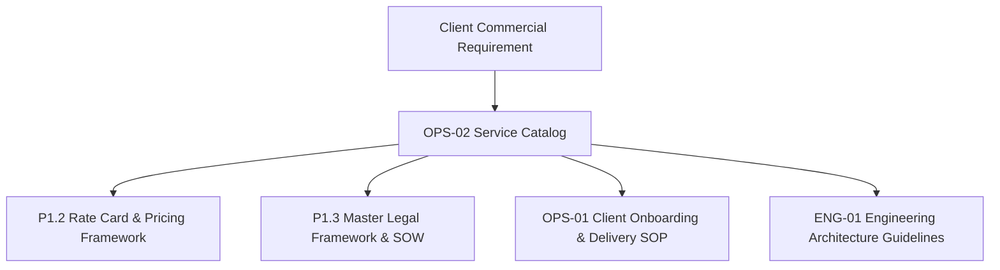

# KAMIYTECH DETAILED SERVICE CATALOG
> **DISTRIBUTABLE OPERATIONS & PM PACKAGE • DOCUMENT ID: OPS-02**

```
====================================================================================================
DOCUMENT CONTROL & METADATA
====================================================================================================
Title:                  Detailed Service Catalog
Document Reference:     KMT-OPS-02-v1.0
Version:                1.0.0
Status:                 APPROVED / PRODUCTION-READY
Effective Date:         July 2026
Document Owner:         Chief Executive Officer (CEO), Chief Technology Officer (CTO), & COO
Target Audience:        Executive Leadership, Account Executives, Sales Leads, Technical PMs,
                        Client Partners, Operations Managers
Classification:         Internal Operational & External Client Distributable
Related Governance:     [Client Onboarding SOP](file:///c:/Users/abhis/OneDrive/Desktop/kamiytechAI/distributable_docs/3_Operations_and_PM/01_Client_Onboarding_and_Project_Delivery_SOP.md)
                        [Master Rate Card](file:///c:/Users/abhis/OneDrive/Desktop/kamiytechAI/knowledge_base/P1.2_rate_card_and_pricing_framework.md)
                        [Master Knowledge Base](file:///c:/Users/abhis/OneDrive/Desktop/kamiytechAI/knowledge_base/index.md)
====================================================================================================
```

---

## TABLE OF CONTENTS
1. [Executive Summary & Catalog Governance](#1-executive-summary--catalog-governance)
2. [Category 1: Web Solutions & Digital Platforms](#2-category-1-web-solutions--digital-platforms)
   - [2.1 Single-Page Landing Website](#21-single-page-landing-website)
   - [2.2 Starter Multi-Page Web Solution](#22-starter-multi-page-web-solution)
   - [2.3 Business Web Platform & Headless E-commerce](#23-business-web-platform--headless-e-commerce)
   - [2.4 Enterprise Web Application & SaaS MVP](#24-enterprise-web-application--saas-mvp)
3. [Category 2: AI Solutions & Business Automation](#3-category-2-ai-solutions--business-automation)
   - [3.1 Starter Business Workflow Automation](#31-starter-business-workflow-automation)
   - [3.2 Enterprise AI & RAG Knowledge Suite](#32-enterprise-ai--rag-knowledge-suite)
4. [Category 3: Mobile Application Development](#4-category-3-mobile-application-development)
   - [4.1 Starter Cross-Platform Mobile App](#41-starter-cross-platform-mobile-app)
   - [4.2 Enterprise Mobile Suite & Multi-App Ecosystem](#42-enterprise-mobile-suite--multi-app-ecosystem)
5. [Category 4: Custom Enterprise Systems & UI/UX Design](#5-category-4-custom-enterprise-systems--uiux-design)
   - [5.1 Custom ERP / CRM Systems](#51-custom-erp--crm-systems)
   - [5.2 UI/UX Design & Brand System](#52-uiux-design--brand-system)
6. [Category 5: Maintenance Retainers & Dedicated Pods](#6-category-5-maintenance-retainers--dedicated-pods)
   - [6.1 Monthly Maintenance & Support Retainers](#61-monthly-maintenance--support-retainers)
   - [6.2 Dedicated Developer / Engineering Pod](#62-dedicated-developer--engineering-pod)
7. [Service Scope & Commercial Governance Summary](#7-service-scope--commercial-governance-summary)

---

## 1. EXECUTIVE SUMMARY & CATALOG GOVERNANCE

This document establishes the official **Service Catalog for KamiyTech**. It provides a technical, operational, and commercial definition for all 12 core services delivered by KamiyTech. 

Every client proposal, Statement of Work (SOW), project charter, and delivery milestone must align strictly with the technical boundaries, tangible deliverables, and scope definitions codified herein.



> [!NOTE]
> **Commercial Deferral Rule:** All commercial rates, fixed-price project tiers, retainers, and billing milestone percentages are explicitly governed by **[P1.2 Rate Card & Pricing Framework](file:///c:/Users/abhis/OneDrive/Desktop/kamiytechAI/knowledge_base/P1.2_rate_card_and_pricing_framework.md)**.

---

## 2. CATEGORY 1: WEB SOLUTIONS & DIGITAL PLATFORMS

### 2.1 Single-Page Landing Website
* **Purpose:** High-conversion, single-page digital front door designed to convert ad campaign traffic or inbound visitors into qualified leads.
* **Business Problem Solved:** Eliminates high bounce rates, outdated online presences, and fragmented navigation for single-product launches or local service businesses.
* **Technical Scope:**
  * 1 long-scroll responsive landing page built with Next.js/React or WordPress + Tailwind CSS.
  * Sections: Hero banner, Feature matrix, About/Value Prop, Social proof/Testimonials, CTA, Contact form.
  * Lead capture form routing with instant WhatsApp chat widget integration.
  * On-page SEO meta configuration, Google Analytics setup, and sub-1.5 second page speed optimization.
* **Tangible Deliverables:** Deployed web application on client Vercel/hosting account, source code repository, configured lead notification webhook, and 1-hour CMS video guide.
* **Client Responsibilities:** Provide logo, high-res images, approved text copy, domain registrar access, and DNS authorization.
* **Internal Ownership:** Creative Director (UI/UX) & Senior Full-Stack Engineer.
* **Dependencies:** Client domain name, hosting account, approved content assets.
* **Out-of-Scope Exclusions:** Multi-page expansion, payment gateway integration, database user accounts, custom backend APIs.
* **Pricing Reference:** Governed by **[P1.2 Rate Card §3.1](file:///c:/Users/abhis/OneDrive/Desktop/kamiytechAI/knowledge_base/P1.2_rate_card_and_pricing_framework.md)** *(Single-Page Landing Website Tier)*.

---

### 2.2 Starter Multi-Page Web Solution
* **Purpose:** Complete 5–7 page corporate web platform establishing brand authority, service clarity, and organic search visibility.
* **Business Problem Solved:** Replaces static, unoptimized legacy websites with a modern platform that captures search engine traffic and establishes commercial credibility.
* **Technical Scope:**
  * Custom 5–7 page layout (Home, About Us, Services, Portfolio/Case Studies, Blog, Contact).
  * Built on Next.js / React + Tailwind CSS with Headless CMS (Sanity/Strapi) or WordPress CMS.
  * On-page SEO optimization, contact form routing, lead capturing, and Google Analytics / Tag Manager.
* **Tangible Deliverables:** Production Next.js build, CMS administrative access, GitHub code repository, analytics dashboard integration, and CMS editor user manual.
* **Client Responsibilities:** Content submission (copy, images, case study details), domain/DNS access, and milestone signoffs within 5 business days.
* **Internal Ownership:** Technical Project Manager (TPM) & Lead Full-Stack Engineer.
* **Dependencies:** Signed SOW, clearance of 40% initial deposit invoice, active domain name.
* **Out-of-Scope Exclusions:** E-commerce shopping cart, user registration/portal login, custom ERP integrations.
* **Pricing Reference:** Governed by **[P1.2 Rate Card §3.1](file:///c:/Users/abhis/OneDrive/Desktop/kamiytechAI/knowledge_base/P1.2_rate_card_and_pricing_framework.md)** *(Starter Web Tier)*.

---

### 2.3 Business Web Platform & Headless E-commerce
* **Purpose:** High-performance web platform integrated with dynamic content engines, online payment processing, or headless e-commerce capabilities.
* **Business Problem Solved:** Overcomes slow page load speeds, checkout abandonments, and rigid legacy e-commerce platform constraints hindering revenue growth.
* **Technical Scope:**
  * Custom 10–15 page Next.js platform or Headless Storefront (Shopify Headless / WooCommerce API).
  * Razorpay / PhonePe / Paytm / Stripe payment gateway integration with automated GST tax invoicing.
  * Client portal / booking engine / lead capture workflows with WhatsApp automated SMS triggers.
  * Performance tuning targeting <1.5s load speeds and full SEO optimization.
* **Tangible Deliverables:** Production Next.js e-commerce build, integrated payment webhooks, PostgreSQL database setup, admin console, and CI/CD deployment pipeline.
* **Client Responsibilities:** Product catalog data (SKUs, pricing, images), merchant gateway accounts, shipping partner API keys.
* **Internal Ownership:** Enterprise Solutions Architect & Senior Full-Stack Engineer.
* **Dependencies:** Merchant API credentials, product catalog data, domain/hosting configuration.
* **Out-of-Scope Exclusions:** Native mobile application development, physical warehouse hardware sync, custom ERP creation.
* **Pricing Reference:** Governed by **[P1.2 Rate Card §3.1](file:///c:/Users/abhis/OneDrive/Desktop/kamiytechAI/knowledge_base/P1.2_rate_card_and_pricing_framework.md)** *(Business Platform Tier)*.

---

### 2.4 Enterprise Web Application & SaaS MVP
* **Purpose:** Architecture and construction of complex custom web applications, multi-tenant SaaS platforms, or proprietary business software engines.
* **Business Problem Solved:** Eliminates reliance on restrictive off-the-shelf SaaS subscriptions, enabling companies to build proprietary IP and automate complex business operations.
* **Technical Scope:**
  * Custom SaaS application (Next.js frontend, Node.js / FastAPI backend microservices).
  * Multi-tenant PostgreSQL / Supabase / MongoDB database architecture.
  * Role-Based Access Control (RBAC) for Admin, Manager, and Client roles.
  * REST/GraphQL API suite, third-party software sync, subscription billing engine, and security audit logging.
* **Tangible Deliverables:** Full source code repository, technical database ERD documentation, CI/CD pipeline setup on AWS/Vercel, and API documentation.
* **Client Responsibilities:** Product requirement specifications, user workflow approval, third-party API subscription accounts, UAT signoff.
* **Internal Ownership:** Chief Technology Officer (CTO) & Enterprise Architect.
* **Dependencies:** Architecture approval ([ENG-01 Guidelines](file:///c:/Users/abhis/OneDrive/Desktop/kamiytechAI/distributable_docs/2_Engineering_and_Dev/01_Engineering_Architecture_and_Tech_Stack_Guidelines.md)), AWS cloud account access.
* **Out-of-Scope Exclusions:** Legacy mainframe physical hardware data extraction, continuous 24/7 server monitoring (unless covered under retainer).
* **Pricing Reference:** Governed by **[P1.2 Rate Card §3.1](file:///c:/Users/abhis/OneDrive/Desktop/kamiytechAI/knowledge_base/P1.2_rate_card_and_pricing_framework.md)** *(Enterprise Web App Tier)*.

---

## 3. CATEGORY 2: AI SOLUTIONS & BUSINESS AUTOMATION

### 3.1 Starter Business Workflow Automation
* **Purpose:** Automate repetitive manual data entry, lead qualification, and cross-platform notifications using integration engines and AI models.
* **Business Problem Solved:** Eliminates human data entry errors, delayed customer response times, and manual copy-pasting across business software.
* **Technical Scope:**
  * 2–3 core business workflow automations using Make, n8n, or custom Python scripts.
  * Integrations across CRM (HubSpot/Zoho), Google Workspace, Email, and payment webhooks.
  * AI-assisted lead qualification or content parsing bot powered by OpenAI / Gemini APIs.
  * WhatsApp Business API instant lead notifications to sales reps.
* **Tangible Deliverables:** Configured automation scenarios/scripts, API webhook webhooks, operational monitoring dashboard, and SOP documentation.
* **Client Responsibilities:** Provide access tokens/API keys for target software accounts, define business routing rules.
* **Internal Ownership:** Senior AI & Automation Specialist.
* **Dependencies:** Active software subscriptions (Make/n8n/OpenAI API accounts).
* **Out-of-Scope Exclusions:** Custom LLM model fine-tuning, on-premise hardware server setup.
* **Pricing Reference:** Governed by **[P1.2 Rate Card §3.2](file:///c:/Users/abhis/OneDrive/Desktop/kamiytechAI/knowledge_base/P1.2_rate_card_and_pricing_framework.md)** *(Starter Automation Tier)*.

---

### 3.2 Enterprise AI & RAG Knowledge Suite
* **Purpose:** Proprietary Retrieval-Augmented Generation (RAG) knowledge bots, document search engines, and multi-system data processing AI pipelines.
* **Business Problem Solved:** Solves internal information silos, slow customer support resolution, and manual extraction from extensive PDF document repositories.
* **Technical Scope:**
  * Custom RAG architecture connecting enterprise documents (PDFs, docs, DBs) to LLMs.
  * Vector database implementation (Supabase Vector / Pinecone) with LangChain or LlamaIndex.
  * Web & WhatsApp chatbot widgets with human-in-the-loop fallback admin console.
  * Automated document indexing and PDF executive summary report generation pipelines.
* **Tangible Deliverables:** Deployed AI RAG application, vector database setup, admin management console, system prompt architecture, and enterprise privacy compliance setup.
* **Client Responsibilities:** Provide clean documentation repositories, define query permission rules, cover direct LLM API token consumption costs.
* **Internal Ownership:** Senior AI & Automation Specialist & CTO.
* **Dependencies:** OpenAI / Gemini API credentials, vector storage provisioning, security clearance.
* **Out-of-Scope Exclusions:** On-premise GPU cluster hardware installation.
* **Pricing Reference:** Governed by **[P1.2 Rate Card §3.2](file:///c:/Users/abhis/OneDrive/Desktop/kamiytechAI/knowledge_base/P1.2_rate_card_and_pricing_framework.md)** *(Enterprise AI Suite Tier)*.

---

## 4. CATEGORY 3: MOBILE APPLICATION DEVELOPMENT

### 4.1 Starter Cross-Platform Mobile App
* **Purpose:** Cost-effective, high-performance cross-platform mobile application for iOS and Android built from a single codebase.
* **Business Problem Solved:** Reduces mobile app development costs by 40–50% while ensuring simultaneous presence on Apple App Store and Google Play Store.
* **Technical Scope:**
  * Cross-platform mobile app built with React Native (Expo) or Flutter.
  * 5–10 core UI screens with responsive mobile interface design.
  * Mobile OTP authentication (Firebase / Msg91 / Fast2SMS) and push notification engine.
  * REST API synchronization with backend web server.
* **Tangible Deliverables:** Compiled iOS (`.ipa`) and Android (`.apk`/`.aab`) binaries, source code repository, App Store & Play Store submission support.
* **Client Responsibilities:** Apple Developer Account ($99/yr) and Google Play Console ($25) ownership, app store listing text and privacy policies.
* **Internal Ownership:** Mobile Application Lead & Creative Director.
* **Dependencies:** Client developer portal accounts, backend REST APIs.
* **Out-of-Scope Exclusions:** Bluetooth low-energy (BLE) hardware firmware development, 3D mobile gaming engines.
* **Pricing Reference:** Governed by **[P1.2 Rate Card §3.3](file:///c:/Users/abhis/OneDrive/Desktop/kamiytechAI/knowledge_base/P1.2_rate_card_and_pricing_framework.md)** *(Starter Mobile App Tier)*.

---

### 4.2 Enterprise Mobile Suite & Multi-App Ecosystem
* **Purpose:** Multi-app mobile ecosystem (Customer App + Partner/Driver App + Central Admin Web Dashboard).
* **Business Problem Solved:** Powers complex logistics, multi-vendor delivery, field service operations, and real-time service marketplaces requiring live tracking.
* **Technical Scope:**
  * Dual mobile applications (Customer App + Field Partner/Vendor App).
  * Integration of payment gateways (Razorpay, PhonePe, Cashfree, Paytm UPI).
  * Real-time location tracking, live WebSocket notifications, and offline data sync.
  * Custom Admin Web Dashboard for dispatching, monitoring, and financial analytics.
* **Tangible Deliverables:** Dual mobile app builds (iOS & Android), admin web portal, WebSocket server, source code repositories, and app store deployment.
* **Client Responsibilities:** Merchant gateway registration, SMS gateway funding, Google Maps API key provisioning.
* **Internal Ownership:** Enterprise Architect & Mobile Application Lead.
* **Dependencies:** Google Maps API keys, payment gateway merchant accounts, cloud server setup.
* **Out-of-Scope Exclusions:** Physical hardware GPS tracker device manufacturing.
* **Pricing Reference:** Governed by **[P1.2 Rate Card §3.3](file:///c:/Users/abhis/OneDrive/Desktop/kamiytechAI/knowledge_base/P1.2_rate_card_and_pricing_framework.md)** *(Enterprise Mobile Suite Tier)*.

---

## 5. CATEGORY 4: CUSTOM ENTERPRISE SYSTEMS & UI/UX DESIGN

### 5.1 Custom ERP / CRM Systems
* **Purpose:** Tailored Enterprise Resource Planning (ERP) or Customer Relationship Management (CRM) platforms aligned with specific business processes.
* **Business Problem Solved:** Replaces expensive, uncustomizable off-the-shelf software subscriptions with a tailored operational platform owned 100% by the client.
* **Technical Scope:**
  * Custom modules: Sales Pipeline CRM, Inventory Management, HR & Attendance, Invoicing & GST compliance, Supplier Management.
  * Role-based multi-user permissions (RBAC), automated PDF generation, and exportable financial reports.
  * Database architecture designed for high throughput and secure backups.
* **Tangible Deliverables:** Deployed custom ERP/CRM web application, database schema documentation, user role configuration, and staff training materials.
* **Client Responsibilities:** Workflow mapping specifications, sample business forms, legacy data export files (Excel/Tally).
* **Internal Ownership:** CTO & Enterprise Solutions Architect.
* **Dependencies:** Legacy data mapping clearance, cloud server hosting.
* **Out-of-Scope Exclusions:** Physical warehouse inventory counting, hardware barcode scanner supply.
* **Pricing Reference:** Governed by **[P1.2 Rate Card §3.4 / §1](file:///c:/Users/abhis/OneDrive/Desktop/kamiytechAI/knowledge_base/P1.2_rate_card_and_pricing_framework.md)** *(Custom Software Engagements)*.

---

### 5.2 UI/UX Design & Brand System
* **Purpose:** Modern, user-centric visual identities, Figma design systems, interactive UI prototypes, and cohesive brand design tokens.
* **Business Problem Solved:** Eliminates poor conversion rates, inconsistent brand assets, and developer handoff friction by delivering production-ready design tokens.
* **Technical Scope:**
  * User journey mapping, low-fidelity wireframing, and interactive Figma prototyping.
  * Visual brand design tokens (color palettes, typography scales, glassmorphism UI components).
  * Design asset library export for web and mobile platforms.
* **Tangible Deliverables:** Master Figma file with interactive prototypes, visual style guide, exported SVG/PNG asset packages, and design token documentation.
* **Client Responsibilities:** Brand background, target audience profiles, design references, prompt feedback on wireframe milestones.
* **Internal Ownership:** Creative Director & Senior UI/UX Designer.
* **Dependencies:** Kickoff design intake alignment.
* **Out-of-Scope Exclusions:** Physical print collateral manufacturing, video animation production.
* **Pricing Reference:** Governed by **[P1.2 Rate Card §2](file:///c:/Users/abhis/OneDrive/Desktop/kamiytechAI/knowledge_base/P1.2_rate_card_and_pricing_framework.md)** *(Design Role Rates & Custom Packages)*.

---

## 6. CATEGORY 5: MAINTENANCE RETAINERS & DEDICATED PODS

### 6.1 Monthly Maintenance & Support Retainers
* **Purpose:** Continuous technical support, infrastructure maintenance, security patching, and proactive performance optimization post-launch.
* **Business Problem Solved:** Prevents website downtime, unpatched security vulnerabilities, broken payment gateways, and unexpected technical failures.
* **Technical Scope & Service Tiers:**
  * **Essential Care:** SSL & domain check, daily database backups, core security updates, 5 hrs/mo support, 24hr SLA.
  * **Growth Care:** Essential + speed optimization, feature additions, Payment Gateway & WhatsApp API maintenance, 15 hrs/mo support, 8hr SLA.
  * **Enterprise Managed:** Dedicated TPM, 2hr SEV-1 emergency response SLA, security audits, feature development sprints, 35 hrs/mo support.
* **Tangible Deliverables:** Monthly maintenance logs, uptime performance reports, security audit summaries, and completed ticket logs.
* **Client Responsibilities:** Submit tickets via designated support portal, maintain active upfront retainer payments.
* **Internal Ownership:** Customer Success Lead & DevOps Engineer.
* **Dependencies:** Active Maintenance Retainer Agreement ([OPS-01 SOP](file:///c:/Users/abhis/OneDrive/Desktop/kamiytechAI/distributable_docs/3_Operations_and_PM/01_Client_Onboarding_and_Project_Delivery_SOP.md)).
* **Out-of-Scope Exclusions:** Major platform architectural rewrites under routine maintenance hours.
* **Pricing Reference:** Governed by **[P1.2 Rate Card §4](file:///c:/Users/abhis/OneDrive/Desktop/kamiytechAI/knowledge_base/P1.2_rate_card_and_pricing_framework.md)** *(Retainer Tiers)*.

---

### 6.2 Dedicated Developer / Engineering Pod
* **Purpose:** Supply a dedicated, full-time engineering squad (Full-Stack, Mobile, AI, DevOps, TPM) operating as an extension of the client's internal team.
* **Business Problem Solved:** Eliminates high in-house developer hiring costs, lengthy recruitment cycles, and team management overhead.
* **Technical Scope:**
  * Dedicated monthly allocation of specialized engineering bandwidth.
  * Direct integration into client's Slack, GitHub, Jira/Linear, and daily agile standups.
  * Sprint planning, continuous integration, and rapid feature deployment.
* **Tangible Deliverables:** Weekly sprint production releases, pull request code submissions, technical documentation, and weekly progress reports.
* **Client Responsibilities:** Product direction, sprint backlog priorities, daily developer sync participation.
* **Internal Ownership:** COO & CTO.
* **Dependencies:** Execution of Dedicated Pod SOW, monthly upfront retainer payment.
* **Out-of-Scope Exclusions:** Permanent employment transfer of developers without formal buyout agreement.
* **Pricing Reference:** Governed by **[P1.2 Rate Card §1](file:///c:/Users/abhis/OneDrive/Desktop/kamiytechAI/knowledge_base/P1.2_rate_card_and_pricing_framework.md)** *(Dedicated Developer Pod Model)*.

---

## 7. SERVICE SCOPE & COMMERCIAL GOVERNANCE SUMMARY

All service engagements delivered under this catalog are governed by KamiyTech's Master Legal Framework ([P1.3](file:///c:/Users/abhis/OneDrive/Desktop/kamiytechAI/knowledge_base/P1.3_master_legal_framework.md)) and Rate Card ([P1.2](file:///c:/Users/abhis/OneDrive/Desktop/kamiytechAI/knowledge_base/P1.2_rate_card_and_pricing_framework.md)). 

Any deviation from the defined deliverables or scope boundaries must be executed via formal Statement of Work (SOW) amendments approved by the Chief Executive Officer or Chief Operating Officer.

---
*KamiyTech Detailed Service Catalog (OPS-02 v1.0.0). Maintained by Chief Executive Officer, CTO & COO.*
