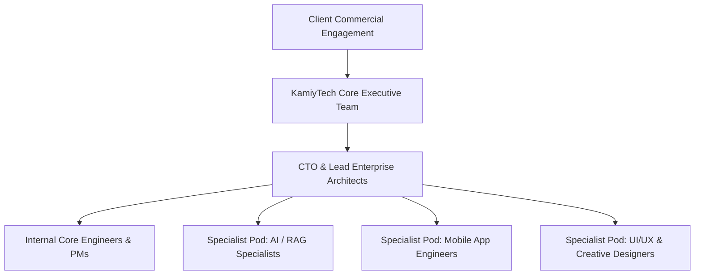

# KAMIYTECH SPECIALIST PARTNER VETTING & WHITE-LABEL SOP
> **DISTRIBUTABLE OPERATIONS & PM PACKAGE • DOCUMENT ID: OPS-03**

```
====================================================================================================
DOCUMENT CONTROL & METADATA
====================================================================================================
Title:                  Specialist Partner Vetting & White-Label SOP
Document Reference:     KMT-OPS-03-v1.1
Version:                1.1.0
Status:                 APPROVED / PRODUCTION-READY
Effective Date:         July 2026
Document Owner:         Chief Operating Officer (COO), HR & People Ops, & CTO
Target Audience:        COOs, HR Leads, Technical PMs, Subcontractor Agencies, Specialist Engineers,
                        Contract Partners
Classification:         Internal Operational & Specialist Partner Distributable
Related Governance:     [Client Delivery SOP](file:///c:/Users/abhis/OneDrive/Desktop/kamiytechAI/distributable_docs/3_Operations_and_PM/01_Client_Onboarding_and_Project_Delivery_SOP.md)
                        [Master Rate Card](file:///c:/Users/abhis/OneDrive/Desktop/kamiytechAI/knowledge_base/P1.2_rate_card_and_pricing_framework.md)
                        [Master Knowledge Base](file:///c:/Users/abhis/OneDrive/Desktop/kamiytechAI/knowledge_base/index.md)
====================================================================================================
```

---

## TABLE OF CONTENTS
1. [Executive Summary & Operating Strategy](#1-executive-summary--operating-strategy)
2. [The Core + Specialist Pod Delivery Model](#2-the-core--specialist-pod-delivery-model)
3. [4-Step Technical Vetting & Evaluation Rubric](#3-4-step-technical-vetting--evaluation-rubric)
4. [Legal Onboarding & White-Label Compliance SOP](#4-legal-onboarding--white-label-compliance-sop)
5. [Rate Negotiation & Financial Margin Safeguards](#5-rate-negotiation--financial-margin-safeguards)
6. [Partner Performance Tiering & Quarterly Scorecard](#6-partner-performance-tiering--quarterly-scorecard)
7. [Partner Offboarding & Access Revocation SOP](#7-partner-offboarding--access-revocation-sop)

---

## 1. EXECUTIVE SUMMARY & OPERATING STRATEGY

To achieve KamiyTech's strategic mandate of delivering elite enterprise software without maintaining heavy fixed operational overhead, KamiyTech utilizes a **Core + Specialist Pod Model**. 

This document defines the mandatory protocols for vetting, technical evaluation, legal onboarding, rate negotiation, white-label compliance, and ongoing performance management for all contractor engineers and specialist partner agencies operating within the KamiyTech ecosystem.

```
+-----------------------------------------------------------------------------------+
|                        PARTNER NETWORK MANAGEMENT PRINCIPLES                      |
+-----------------------------------------------------------------------------------+
|  1. RIGOROUS VETTING  | 4-step technical evaluation with 85/100 pass threshold.   |
|  2. WHITE-LABEL ONLY  | 100% white-label operations under `@kamiytech.com`.       |
|  3. LEGAL PROTECTION  | Mandatory IP assignment & 24-month client non-solicit.    |
|  4. MARGIN SAFETY     | Rate caps enforced to guarantee 45% - 55% gross margins.  |
|  5. SCORECARD AUDIT   | Quarterly audits tiering partners into Tiers 1, 2, or 3.  |
+-----------------------------------------------------------------------------------+
```

---

## 2. THE CORE + SPECIALIST POD DELIVERY MODEL

KamiyTech maintains an in-house Core Leadership Team (CEO, CTO, COO, Enterprise Architects, TPMs) who manage client relationships, overall system architecture, and quality assurance, while scaling execution bandwidth through vetted Specialist Partner Pods.



---

## 3. 4-STEP TECHNICAL VETTING & EVALUATION RUBRIC

Before any individual contractor or specialist partner agency is admitted to KamiyTech's active roster, they must complete our rigorous 4-step technical evaluation:

```
[STEP 1: Portfolio Audit] ---> [STEP 2: Paid Tech Challenge] ---> [STEP 3: Culture & Sync] ---> [STEP 4: Ref Check]
```

### 3.1 Vetting Step Breakdown
1. **Step 1: Portfolio & Code Audit (CTO Lead):** Inspection of public GitHub repositories for TypeScript strictness, Next.js App Router layout, clean FastAPI code, database migrations, and security hygiene.
2. **Step 2: Paid Technical Practical Challenge (2–4 Hours):** Candidate completes a scoped technical task (e.g., building a Next.js component + server action + Zod validation schema) to evaluate code quality, speed, and adherence to [Engineering Guidelines](file:///c:/Users/abhis/OneDrive/Desktop/kamiytechAI/distributable_docs/2_Engineering_and_Dev/01_Engineering_Architecture_and_Tech_Stack_Guidelines.md).
3. **Step 3: Communication & Operational Sync (COO Lead):** Evaluation of English fluency, asynchronous responsiveness, transparency, and attitude towards strict deadlines.
4. **Step 4: Background & Reference Verification:** Contacting 2 professional references to verify past project execution reliability.

### 3.2 Partner Evaluation Scoring Rubric (Minimum Passing Score: 85/100)

| Rubric Evaluation Category | Weight / Points | Evaluation Criteria |
| :--- | :---: | :--- |
| **Technical Architecture & Code Quality** | **40 Points** | TypeScript strictness, modular design, zero `any` usage, clean error handling. |
| **Communication & Async Responsiveness**| **30 Points** | Clear status updates, fast response on Slack (<2 hrs), transparent blocker reporting. |
| **Deadline Reliability & Speed** | **20 Points** | Ability to estimate accurately and deliver sprint commitments on schedule. |
| **Value & Rate Alignment** | **10 Points** | Rate willingness fitting within KamiyTech's margin rate caps. |

---

## 4. LEGAL ONBOARDING & WHITE-LABEL COMPLIANCE SOP

Once a partner scores >= 85/100, formal legal and identity onboarding must occur prior to granting access to any client repositories or channels.

### 4.1 Legal Contract Execution
- **KamiyTech Subcontractor Master Agreement:** Enforces 100% Work-For-Hire Intellectual Property (IP) assignment to KamiyTech upon payment.
- **Client Non-Solicitation Clause:** Strict 24-month non-solicitation prohibition banning partners from directly contacting or contracting with KamiyTech clients.
- **Mutual Non-Disclosure Agreement (NDA):** Comprehensive protection of KamiyTech trade secrets, pricing cards, and client data.

### 4.2 Identity & Access Management (IAM)
- Provision official white-label email address (`[first.name]@kamiytech.com`).
- Grant restricted access to private GitHub repositories (`kamiytech` org), project Slack workspace, and 1Password shared vault.

### 4.3 White-Label Operating Rules
> [!IMPORTANT]
> **Strict White-Label Mandate:** When communicating on client Slack channels (`#ext-[client]`), video calls, or Notion dashboards, partners MUST:
> 1. Introduce and present themselves exclusively as KamiyTech engineering team members.
> 2. Use their `@kamiytech.com` email address and official KamiyTech avatar/signature.
> 3. **NEVER** share personal agency branding, personal contact info, direct portfolio links, or private pricing with KamiyTech clients.

---

## 5. RATE NEGOTIATION & FINANCIAL MARGIN SAFEGUARDS

To guarantee KamiyTech's **45% – 55% gross profit margin target**, partner hourly and project rates are strictly capped against client billing rates ([P1.2 Rate Card](file:///c:/Users/abhis/OneDrive/Desktop/kamiytechAI/knowledge_base/P1.2_rate_card_and_pricing_framework.md)):

| Role Tier | Maximum Allowed Partner Pay Rate (INR ₹) | Client Billing Rate (P1.2) | Target Gross Margin % |
| :--- | :---: | :---: | :---: |
| **Senior Solutions Architect** | ₹1,800 – ₹2,200 / hr | ₹4,500 / hr | **51% – 60% Margin** |
| **Senior Full-Stack Engineer** | ₹1,100 – ₹1,400 / hr | ₹2,800 / hr | **50% – 60% Margin** |
| **Mobile Application Engineer**| ₹1,000 – ₹1,250 / hr | ₹2,500 / hr | **50% – 60% Margin** |
| **UI/UX & Graphic Designer** | ₹900 – ₹1,100 / hr | ₹2,200 / hr | **50% – 59% Margin** |
| **QA / Testing Specialist** | ₹600 – ₹750 / hr | ₹1,500 / hr | **50% – 60% Margin** |

---

## 6. PARTNER PERFORMANCE TIERING & QUARTERLY SCORECARD

Partners are evaluated quarterly by the COO and CTO based on actual delivery metrics:

```
+-----------------------------------------------------------------------------------+
|                             QUARTERLY PARTNER TIERS                               |
+-----------------------------------------------------------------------------------+
| TIER 1: PREFERRED LEAD PARTNER (Score >90) | Priority allocation; monthly retainers. |
| TIER 2: ACTIVE SPECIALIST      (Score 80-89)| Dedicated overflow & specialized tasks.|
| TIER 3: PROBATION / INACTIVE   (Score <80) | Paused from allocation; re-evaluation. |
+-----------------------------------------------------------------------------------+
```

---

## 7. PARTNER OFFBOARDING & ACCESS REVOCATION SOP

Upon project completion or partner contract termination, the TPM executes immediate IAM access revocation within 2 hours:

- [ ] Deactivate `@kamiytech.com` Google Workspace account.
- [ ] Revoke access to GitHub organization and repositories.
- [ ] Remove from client Slack workspace and 1Password vaults.
- [ ] Verify final contractor invoice against logged hours and issue payment as per Net-15 terms.

---
*KamiyTech Specialist Partner Vetting & White-Label SOP (OPS-03 v1.1.0). Maintained by Chief Operating Officer, HR & People Ops, & CTO.*
