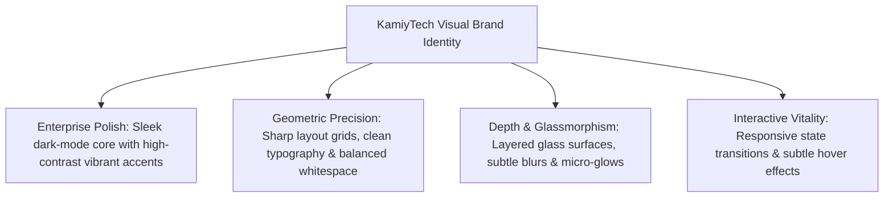
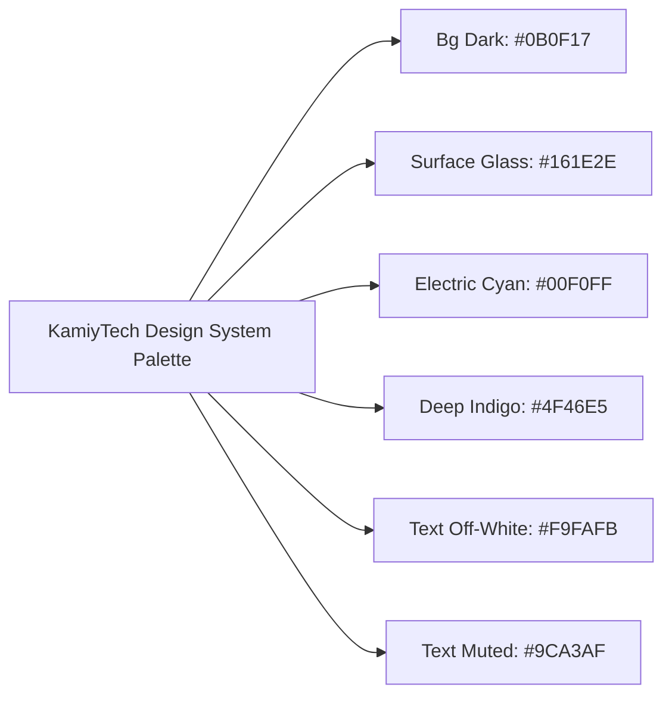

# KAMIYTECH BRAND IDENTITY SYSTEM & DESIGN TOKENS
> **DISTRIBUTABLE DOCUMENTATION PACKAGE — UI/UX & BRANDING**

> **DOCUMENT METADATA**
> - **Purpose:** Establish KamiyTech's official visual brand identity, design principles, color token architecture, typography scale, UI component specifications, and presentation guidelines for internal teams and external specialist design partners.
> - **Owner:** Creative Director & Chief Marketing Officer (CMO)
> - **Version:** 1.0.0
> - **Status:** APPROVED / LIVE
> - **Target Audience:** Internal Designers, External Design Partners, Frontend Engineers, Marketing & Sales Teams
> - **Dependencies:** Founder Strategic Foundation (`v1.0.0`), KamiyTech Brand Assets Inventory
> - **Review Schedule:** Annual Brand Audit / Semi-Annual Token Review
> - **Related Distributable Docs:** [02_UI_UX_Deliverable_Standards_and_Catalog.md](file:///c:/Users/abhis/OneDrive/Desktop/kamiytechAI/distributable_docs/4_UI_UX_Design/02_UI_UX_Deliverable_Standards_and_Catalog.md)

---

## 1. Executive Summary & Brand Philosophy

KamiyTech's visual brand identity reflects high-tech precision, enterprise-grade elegance, and dynamic responsiveness. Every digital touchpoint—from public web platforms and client proposals to custom mobile and SaaS user interfaces—must strictly adhere to these visual design principles.



### Core Design Pillars
1. **Enterprise Polish:** We favor sleek, modern dark backgrounds (`#0B0F17`) paired with electric cyan highlights (`#00F0FF`) and deep indigo gradients (`#4F46E5`). This creates an immediate "wow factor" and signals cutting-edge technical authority.
2. **Geometric Precision:** Typography, spacing, and grid layouts strictly adhere to an 8px spatial system, ensuring pixel-perfect alignment across mobile, tablet, and desktop viewports.
3. **Glassmorphism & Layered Depth:** Containers and cards utilize multi-layered glass backdrop blurs (`backdrop-filter: blur(12px)`) with hairline translucent borders (`rgba(255,255,255,0.1)`), delivering visual richness without clutter.
4. **Zero Generic Placeholders:** All visuals, illustrations, and mockups in client deliverables must use realistic production assets or AI-generated brand imagery. Generic stock photos and placeholder text are strictly prohibited.

---

## 2. Color Palette Architecture & Design Tokens

Our color system is codified as CSS Custom Properties (Tokens) to ensure seamless synchronization between design software (Figma) and codebases (React / Next.js / Tailwind CSS).



### Official Color Specification Table

| Token Name | HEX Code | HSL Representation | RGB Equivalent | Core Usage & UI Application |
| :--- | :---: | :---: | :---: | :--- |
| `--color-bg-dark` | `#0B0F17` | `hsl(220, 35%, 7%)` | `rgb(11, 15, 23)` | Root document background, main app canvas |
| `--color-surface` | `#161E2E` | `hsl(220, 35%, 13%)` | `rgb(22, 30, 46)` | Cards, modal dialogues, sidebar containers |
| `--color-surface-hover` | `#1F2A3E` | `hsl(220, 33%, 18%)` | `rgb(31, 42, 62)` | Hover state for interactive glass cards |
| `--color-accent-cyan` | `#00F0FF` | `hsl(184, 100%, 50%)` | `rgb(0, 240, 255)` | Primary CTA buttons, active state indicators, key highlights |
| `--color-brand-indigo` | `#4F46E5` | `hsl(244, 75%, 59%)` | `rgb(79, 70, 229)` | Secondary buttons, gradient stops, badge backgrounds |
| `--color-text-main` | `#F9FAFB` | `hsl(210, 40%, 98%)` | `rgb(249, 250, 251)` | Primary headings (H1–H4), high-priority body copy |
| `--color-text-muted` | `#9CA3AF` | `hsl(218, 11%, 65%)` | `rgb(156, 163, 175)` | Subtitles, metadata labels, disabled states |
| `--color-border` | `rgba(255,255,255,0.1)` | — | — | Subtle card outlines, grid dividers |
| `--color-border-glow` | `rgba(0,240,255,0.4)` | — | — | Active focus rings, hover borders |

---

## 3. Typography System & Type Scale

KamiyTech uses Google Fonts across all web platforms, mobile interfaces, and exported PDF documentation.

* **Primary Display & Headings:** `Outfit` (Sans-Serif) — Geometric, authoritative, and clean for H1–H4 headers.
* **UI & Body Copy:** `Inter` (Sans-Serif) — Highly legible at small and medium font sizes across all screens.
* **Technical Specs & Code:** `JetBrains Mono` (Monospace) — Used for code blocks, API specs, and token definitions.

### Type Scale Specifications

| Hierarchy Level | Font Family | Size (px / rem) | Line Height | Weight | Letter Spacing |
| :--- | :--- | :---: | :---: | :---: | :---: |
| **Display H1 (Hero Title)** | `Outfit` | `36px / 2.25rem` | `44px (1.22)` | `700 (Bold)` | `-0.02em` |
| **Section H2 (Major Header)** | `Outfit` | `24px / 1.50rem` | `32px (1.33)` | `600 (SemiBold)` | `-0.01em` |
| **Subsection H3 (Subheader)** | `Outfit` | `18px / 1.125rem` | `26px (1.44)` | `600 (SemiBold)` | `0.00em` |
| **Card / Label H4** | `Outfit` | `16px / 1.00rem` | `24px (1.50)` | `600 (SemiBold)` | `0.00em` |
| **Body Primary (Paragraph)** | `Inter` | `15px / 0.9375rem`| `24px (1.60)` | `400 (Regular)` | `0.00em` |
| **Body Small / Metadata** | `Inter` | `13px / 0.8125rem`| `20px (1.53)` | `500 (Medium)` | `0.01em` |
| **Code / Technical Snippets** | `JetBrains Mono`| `13px / 0.8125rem`| `20px (1.53)` | `400 (Regular)` | `0.00em` |

---

## 4. UI Component Tokens & CSS Specifications

### 4.1 Glassmorphism Card Spec
```css
/* Core Glass Card Component Token */
.kamiy-glass-card {
  background: rgba(22, 30, 46, 0.75);
  backdrop-filter: blur(12px);
  -webkit-backdrop-filter: blur(12px);
  border: 1px solid rgba(255, 255, 255, 0.1);
  border-radius: 12px;
  box-shadow: 0 8px 32px 0 rgba(0, 0, 0, 0.37);
  transition: all 0.3s cubic-bezier(0.4, 0, 0.2, 1);
}

.kamiy-glass-card:hover {
  border-color: rgba(0, 240, 255, 0.4);
  transform: translateY(-2px);
  box-shadow: 0 12px 40px 0 rgba(0, 240, 255, 0.15);
}
```

### 4.2 Button Component Tokens
* **Primary Cyan Button (`.kamiy-btn-primary`):**
  - Background: `#00F0FF`
  - Text Color: `#0B0F17` (Font Weight: 600)
  - Border Radius: `8px`
  - Hover State: Glow shadow (`0 0 20px rgba(0, 240, 255, 0.5)`), slight scale (`1.02`)
* **Secondary Indigo Button (`.kamiy-btn-secondary`):**
  - Background: `rgba(79, 70, 229, 0.15)`
  - Border: `1px solid #4F46E5`
  - Text Color: `#F9FAFB`
  - Hover State: Solid Indigo background (`#4F46E5`)

### 4.3 Form Inputs & Interactive Controls
* **Input Background:** `rgba(11, 15, 23, 0.6)`
* **Input Border:** `1px solid rgba(255, 255, 255, 0.15)`
* **Focus State:** Border `#00F0FF` with box-shadow `0 0 0 3px rgba(0, 240, 255, 0.2)`
* **Placeholder Text:** `#9CA3AF`

---

## 5. Proposal & Presentation Styling Guidelines

All external pitch decks, client proposals, SOPs, and exported PDF documentation produced by staff or design partners must adhere to these document styling standards:

1. **Structured GitHub Alert Callouts:**
   - `> [!NOTE]` — For background context and technical implementation details.
   - `> [!TIP]` — For performance optimizations and best practices.
   - `> [!IMPORTANT]` — For critical scope requirements and mandatory compliance items.
   - `> [!WARNING]` — For potential project risks or out-of-scope boundaries.
2. **Mermaid Flowcharts & Diagrams:**
   - Every system architecture and operational workflow must use Mermaid syntax.
   - Node labels must use explicit quotes to prevent rendering errors.
3. **Asset Quality Standards:**
   - SVG vectors must be used for logos, icons, and diagrams.
   - Raster screenshots or images must be high-resolution (minimum 300 DPI, retina screen density).

---

## 6. External Partner Compliance & Quality Audit

Design agencies, freelance UI/UX specialists, and external contractors representing KamiyTech must sign off on this document before initiating work.

- [ ] All Figma design files must use defined color styles matching the token hex values above.
- [ ] Auto-layout must be enforced on all Figma components and screens.
- [ ] Spacing values must strictly follow 8px grid increments (8px, 16px, 24px, 32px, 48px, 64px).
- [ ] Components must include Light/Dark state variants where applicable.

---
*End of Brand Identity System & Design Tokens Document. Maintained by Creative Director & CMO.*
