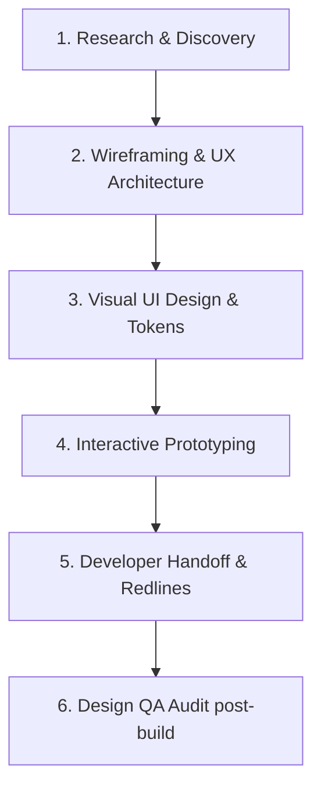
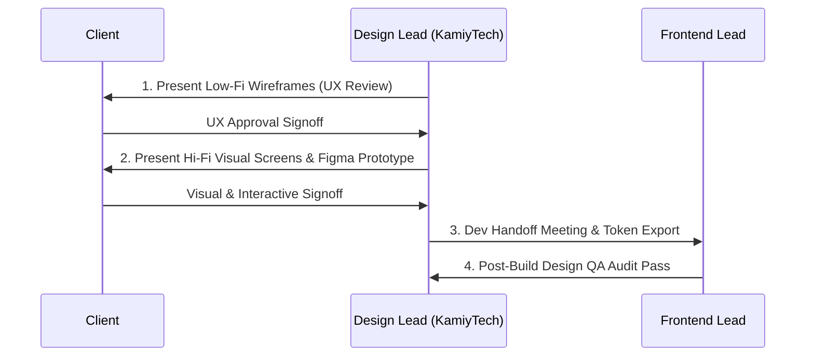

# KAMIYTECH UI/UX DELIVERABLE STANDARDS & CATALOG
> **DISTRIBUTABLE DOCUMENTATION PACKAGE — UI/UX & BRANDING**

> **DOCUMENT METADATA**
> - **Purpose:** Codify the standard service offerings, deliverable specifications, Figma file organization standards, client review workflows, and handoff protocols for KamiyTech's UI/UX design packages.
> - **Owner:** Creative Director & Lead UI/UX Designer
> - **Version:** 1.0.0
> - **Status:** APPROVED / LIVE
> - **Target Audience:** Internal Designers, External Design Partners, Frontend Engineers, Clients, Project Managers
> - **Dependencies:** `01_Brand_Identity_System_and_Design_Tokens.md`, `P1.4_service_catalog.md`
> - **Review Schedule:** Bi-Annual Design Operations Review
> - **Related Distributable Docs:** [01_Brand_Identity_System_and_Design_Tokens.md](file:///c:/Users/abhis/OneDrive/Desktop/kamiytechAI/distributable_docs/4_UI_UX_Design/01_Brand_Identity_System_and_Design_Tokens.md)

---

## 1. Executive Summary & Delivery Scope

KamiyTech delivers world-class digital user interfaces and cohesive brand identity systems for web, mobile, and custom enterprise software applications. We enforce strict deliverable standards to bridge the gap between creative design and engineering implementation, ensuring 100% fidelity during developer handoff.



---

## 2. UI/UX Service Catalog & Package Specifications

### 2.1 Brand Identity & Visual Design System Package
- **Purpose:** Establish a complete, scalable visual brand system for new companies, rebrands, or digital product launches.
- **Business Problem Solved:** Eliminates inconsistent brand presentation across web, social, pitch decks, and digital products.
- **Deliverables:**
  1. Primary & Secondary Logo Marks (SVG vector formats, dark/light variants, favicon, app icon).
  2. Brand Style Guide PDF & Web Kit (Color tokens, typography scale, iconography set).
  3. Master Figma Design Token Library (Colors, Text Styles, Shadows, Grid Specs).
  4. Core Marketing Collateral Templates (Pitch deck template, social media kit, email signature).
- **Out-of-Scope:** Physical print media production, 3D video animation, trademark legal filings.

### 2.2 Product UI/UX Design Package (Web / Mobile / SaaS)
- **Purpose:** Architect intuitive user journeys, wireframes, and high-fidelity screen designs for web applications, mobile apps, or enterprise SaaS.
- **Business Problem Solved:** Reduces user churn, eliminates checkout/workflow confusion, and accelerates frontend development speed.
- **Deliverables:**
  1. Interactive UX User Flow & Sitemap Diagram (Miro / FigJam).
  2. Low-Fidelity Wireframes for all core screens.
  3. High-Fidelity Responsive UI Screen Designs (Desktop 1440px, Mobile 375px viewports).
  4. Clickable Interactive Prototype in Figma (for UAT & investor presentations).
  5. UI Component Library with Interactive Variants (Buttons, Forms, Modals, Tables).
  6. Developer Handoff Spec Sheet & Token Export JSON (for Tailwind / CSS variables).
- **Out-of-Scope:** Frontend code implementation (governed by Engineering SOW), copy copywriting from scratch.

---

## 3. Figma File Organization & Quality Governance

All Figma files created by internal staff or external design partners must follow KamiyTech's standardized page layout structure:

```
[PROJECT NAME] — Master Figma File
├── 📄 01 | Cover & Project Metadata
├── 📄 02 | User Flows & Sitemap
├── 📄 03 | Design System & UI Tokens
├── 📄 04 | Low-Fi Wireframes
├── 📄 05 | High-Fi UI Screens (Desktop)
├── 📄 06 | High-Fi UI Screens (Mobile)
├── 📄 07 | Interactive Prototypes
└── 📄 08 | Dev Handoff & Specs
```

### Mandatory Figma Rules
1. **Auto-Layout Enforcement:** 100% of components, frames, cards, and page layouts MUST use Figma Auto-Layout (`Shift + A`). Absolute positioning is strictly prohibited except for floating badges/tooltips.
2. **Component Naming Conventions:** Components must be organized logically using slash syntax (e.g., `Button/Primary/Default`, `Button/Primary/Hover`, `Input/Text/Error`).
3. **8px Spatial System:** Padding, margins, gap spacing, and height dimensions must strictly be multiples of 8px (8, 16, 24, 32, 48, 64, 80).
4. **Token Variable Binding:** No hardcoded hex values in screens. Every fill, stroke, and text layer MUST bind to published local variables or design system styles (`--color-surface`, `--color-accent-cyan`).

---

## 4. Client Review & Delivery Signoff Protocol

To maintain project timelines and prevent scope creep, design reviews follow a structured milestone signoff cadence:



### Signoff Milestones & SLA Boundaries
* **Feedback Turnaround SLA:** Clients and internal stakeholders must provide consolidated design feedback within **3 business days** of milestone presentation.
* **Revision Limits:** Each design milestone includes up to **two (2) rounds of major revisions**. Additional revision rounds trigger a formal Change Order governed by the Rate Card.

---

## 5. Developer Handoff Checklist

Before a design package is marked "Ready for Engineering", the Lead UI/UX Designer must complete this verification checklist:

- [ ] All frames are organized in logical reading order (left-to-right, top-to-bottom).
- [ ] Responsive breakpoints are defined for both Desktop (`1440px`) and Mobile (`375px`).
- [ ] Iconography is converted to outlines and exported as clean SVGs.
- [ ] Image assets are compressed and provided in WebP and PNG formats.
- [ ] Hover, active, focus, disabled, and error states are visually defined for all interactive controls.
- [ ] Micro-interaction animation timings (e.g., `300ms ease-in-out`) are documented for developers.

---
*End of UI/UX Deliverable Standards & Catalog. Maintained by Creative Director & Lead UI/UX Designer.*
