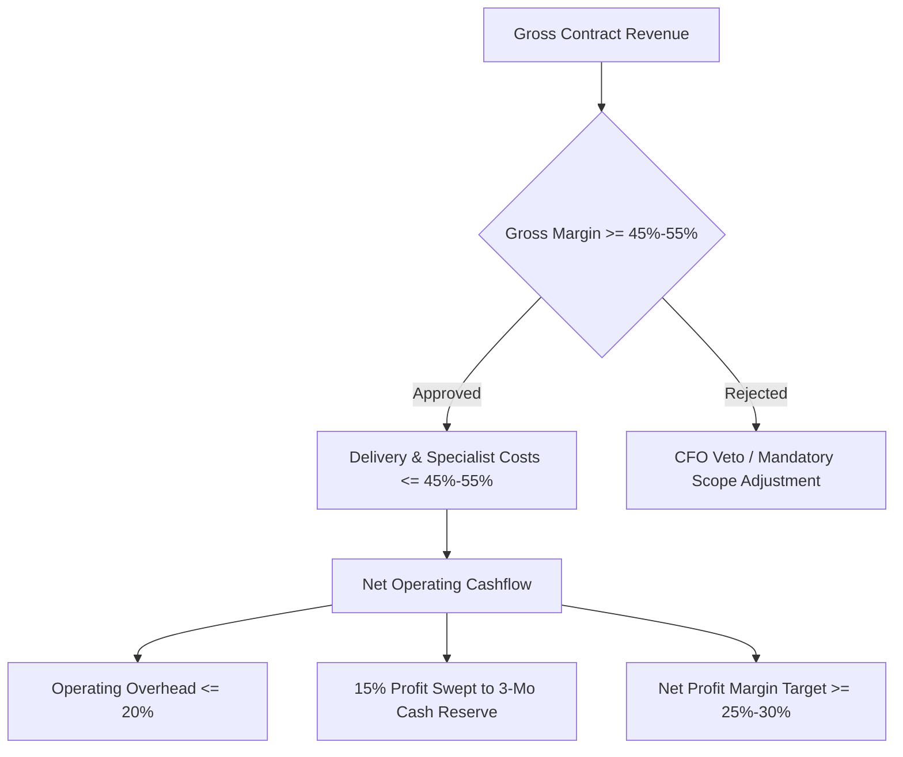
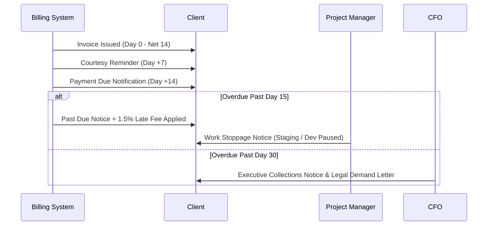
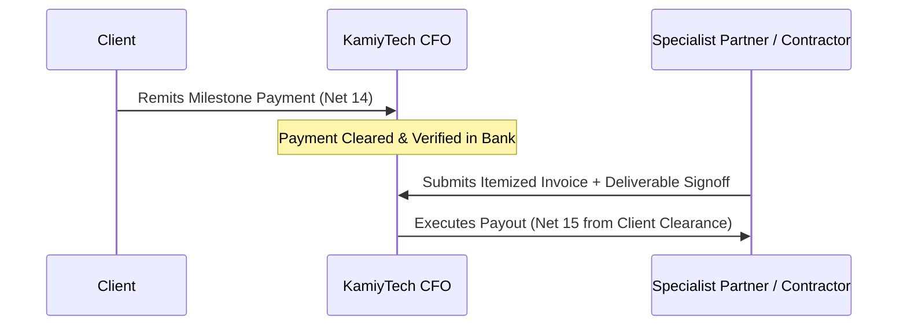

# KAMIYTECH FINANCIAL PLANNING & INVOICING SOP
> **DISTRIBUTABLE DOCUMENTATION PACKAGE — FINANCE & BILLING**

> **DOCUMENT METADATA**
> - **Purpose:** Establish official financial controls, unit economic benchmarks, client milestone invoicing schedules, payment collection protocols, past-due debt handling, contractor payout policies, and treasury operating reserves for KamiyTech.
> - **Owner:** Chief Financial Officer (CFO) & Chief Executive Officer (CEO)
> - **Version:** 1.1.0
> - **Status:** APPROVED / IN-EFFECT
> - **Target Audience:** Internal Finance & Accounting Team, Account Executives, Project Managers, External Accounting Partners, Contractors
> - **Dependencies:** Founder Strategic Directives (`v2.0.0`), `02_Rate_Card_Margin_Safeguards_and_GST_Rules.md`
> - **Review Schedule:** Monthly Financial Review / Quarterly Audit
> - **Related Distributable Docs:** [02_Rate_Card_Margin_Safeguards_and_GST_Rules.md](file:///c:/Users/abhis/OneDrive/Desktop/kamiytechAI/distributable_docs/5_Finance_and_Billing/02_Rate_Card_Margin_Safeguards_and_GST_Rules.md)

---

## 1. Unit Economic Benchmarks & Financial Governance

KamiyTech enforces strict financial health gates across all commercial operations. No contract may be executed without meeting our baseline gross profit margin and cashflow metrics.

### Baseline Financial Metrics Table

| Metric | Target Benchmark | Minimum Hard Floor | Governance Action |
| :--- | :---: | :---: | :--- |
| **Gross Profit Margin** | **50.0% – 60.0%** | **45.0%** | Requires CFO approval if projected gross margin drops below 45%. |
| **Net Profit Margin** | **30.0%** | **20.0%** | Triggers mandatory overhead audit if quarterly net drops below 20%. |
| **Operating Cash Reserve** | **3 Months OpEx** | **2 Months OpEx** | Pauses non-essential spending if reserves drop below 2 months. |
| **Days Sales Outstanding (DSO)**| **< 14 Days** | **21 Days** | Automatically pauses active project delivery if invoice overdue > 14 days. |

---

## 2. Client Invoicing Schedules & Payment Terms

### 2.1 Fixed-Price Engagements (Domestic INR ₹)
To maintain positive project cashflow, fixed-price engagements strictly follow milestone billing:

* **Single-Page Landing Websites (₹12,000 – ₹15,000):**
  - **Milestone 1:** 50% Advance Deposit upon contract signing. Work commences *only* after deposit clearance.
  - **Milestone 2:** 50% Final Payment prior to live production domain handover.
* **Multi-Page Web Solutions, Apps, AI & Custom Software:**
  - **Milestone 1 (Advance Deposit):** 40% invoice issued upon Statement of Work (SOW) signature. Delivery work commences **only after deposit clearance**.
  - **Milestone 2 (Staging Review):** 30% invoice issued upon completion of Staging Demo & Architecture milestone signoff.
  - **Milestone 3 (Production Launch):** 30% invoice issued prior to deployment to client live production environments.

### 2.2 Retainer & Maintenance Engagements
- Monthly retainers are billed **100% upfront** on the 1st business day of each calendar month.
- Payment due date: Net-7 days. Failure to remit by the 10th of the month pauses SLA guarantees and active support sprints.

### 2.3 Payment Terms & Statutory Rules
- **Standard Terms:** Net-14 days from invoice issuance date.
- **Statutory Taxes:** 18% GST itemized on official tax invoices (SAC Codes 998314 / 998313).
- **Accepted Modes:** Bank NEFT/RTGS/IMPS, Official UPI (GPay/PhonePe), Razorpay Payment Links.

---

## 3. Payment Collection & Overdue Debt Protocol

### Overdue Handling Rules
1. **Late Interest Penalty:** Invoices past due by more than 14 days automatically accrue interest at **1.5% per month (18% per annum)**.
2. **Work Suspension Rule:** If an invoice remains unpaid 14 calendar days past due (Day 29 total), project development, staging server access, and deployment pipelines are automatically suspended until full settlement.

---

## 4. Contractor & Partner Payout Policies

To eliminate cashflow risk, contractor and specialist partner payouts are directly linked to verified client invoice receipts.

### Contractor Payout Standards
- **Payout Alignment:** Partner payouts are scheduled Net-15 days following the clearance of the corresponding client milestone invoice.
- **Invoice Submission Window:** Contractors must submit itemized invoices by the 25th of each calendar month.
- **Deliverable Signoff Gate:** No contractor invoice will be paid without written approval from the Lead Engineer or Project Manager confirming milestone acceptance.

---

## 5. Treasury Management & Operating Reserves

### 5.1 Operating Reserve Allocation
- **Reserve Target:** 3 months of fixed operating overhead (software licenses, core retainers, legal/accounting reserves).
- **Profit Sweep Protocol:** 15% of all incoming net project profit is automatically swept into KamiyTech's High-Yield Reserve account on the 1st of every month until the target is satisfied.

### 5.2 Expense Approval Matrix

| Spend Category | Spend Limit (INR ₹) | Mandatory Approver |
| :--- | :--- | :--- |
| **Tier 1 (Routine Software & Tools)** | Up to ₹25,000 / month | Department Lead |
| **Tier 2 (Operational Expenses)** | ₹25,000 – ₹2,00,000 | COO / CFO |
| **Tier 3 (Capital Expenditures / Major Retainers)** | Over ₹2,00,000 | CEO & Founder Approval |

---

## 6. Monthly Financial Audit SOP

On the 1st business day of each month, the CFO conducts the following audit:
- [ ] Reconcile bank accounts, Razorpay statements, and UPI merchant logs.
- [ ] Verify Gross Margin and Net Margin across all active project SOWs.
- [ ] Audit Days Sales Outstanding (DSO) and issue past-due notices for accounts > 7 days late.
- [ ] Calculate and execute the 15% profit sweep to the 3-month operating reserve pool.
- [ ] Review contractor payout queue against verified client receipts.
- [ ] Submit Monthly Executive Financial Report to CEO and Founder.

---
*End of Financial Planning & Invoicing SOP. Maintained by CFO & CEO.*
