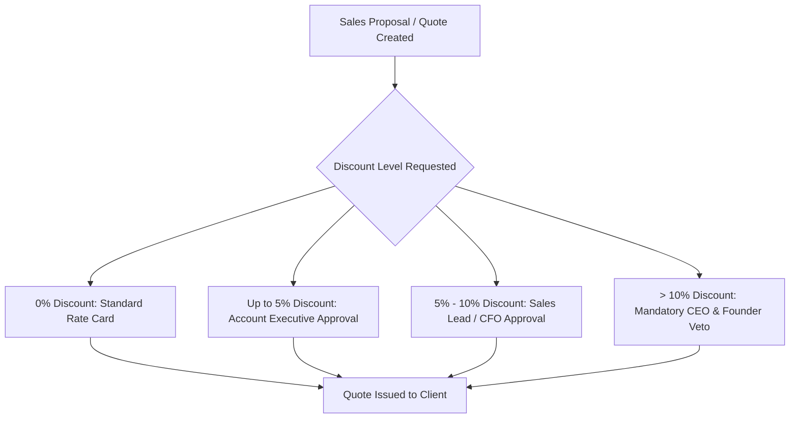

# KAMIYTECH RATE CARD, MARGIN SAFEGUARDS & GST RULES
> **DISTRIBUTABLE DOCUMENTATION PACKAGE — FINANCE & BILLING**

> **DOCUMENT METADATA**
> - **Purpose:** Codify official domestic pricing rate cards (INR ₹), fixed-price service tiers, role-based hourly rates, margin protection rules, discount limits, statutory GST tax compliance, and quotation approval SOPs for KamiyTech.
> - **Owner:** Chief Financial Officer (CFO), Head of Sales, & Chief Operating Officer (COO)
> - **Version:** 2.1.0
> - **Status:** APPROVED / LIVE (INDIAN DOMESTIC EDITION)
> - **Target Audience:** Account Executives, Sales Leads, Project Managers, External Clients, Accounting Staff
> - **Dependencies:** Founder Directives (`v2.0.0`), `P1.1_positioning_and_value_prop.md`, `01_Financial_Planning_and_Invoicing_SOP.md`
> - **Review Schedule:** Quarterly Financial Audit
> - **Related Distributable Docs:** [01_Financial_Planning_and_Invoicing_SOP.md](file:///c:/Users/abhis/OneDrive/Desktop/kamiytechAI/distributable_docs/5_Finance_and_Billing/01_Financial_Planning_and_Invoicing_SOP.md)

---

## 1. Domestic Pricing Strategy & Margin Safeguards

KamiyTech operates a high-value, transparent commercial model tailored for Indian Startups, SMBs, Mid-Market Enterprises, and Growth Businesses.

```
┌────────────────────────────────────────────────────────┐
│  MINIMUM GROSS PROFIT MARGIN TARGET: 45.0% - 55.0%    │
│  TARGET NET PROFIT MARGIN:           25.0% - 30.0%    │
│  STATUTORY GST TAX RULE:              18% GST EXTRA    │
└────────────────────────────────────────────────────────┘
```

### Commercial Engagement Summary Matrix

| Engagement Category | Primary Billing Model | Target Deal Size (INR ₹) | Payment Trigger |
| :--- | :--- | :--- | :--- |
| **Single-Page Landing Website** | Fixed-Price Package | ₹12,000 – ₹15,000 | 50% Deposit / 50% Handover |
| **Multi-Page Web Solutions** | Fixed-Price Package | ₹35,000 – ₹1,80,000 | Milestone (40/30/30) |
| **Custom Software & SaaS MVPs** | Fixed-Price / Sprint | ₹2,50,000 – ₹10,00,000+ | Milestone / Sprint billing |
| **Mobile Applications (iOS/Android)**| Fixed-Price Package | ₹1,20,000 – ₹6,50,000 | Milestone (40/30/30) |
| **AI Bots & Workflow Automation** | Fixed-Scope Package | ₹45,000 – ₹3,50,000 | Milestone (50/50) |
| **Monthly Maintenance & Support** | Monthly Retainer | ₹12,000 – ₹85,000 / mo | Monthly Upfront (1st of month) |
| **Dedicated Developer Pod** | Monthly Team Retainer | ₹1,20,000 – ₹4,50,000 / mo | Monthly Upfront |
| **Ad-Hoc Engineering & Changes** | Hourly / Day Rate Card | ₹1,500 – ₹4,500 / hr | Bi-Weekly / Monthly Invoicing |

---

## 2. Standard Role Rate Card (Hourly & Daily)

Applies to hourly consulting, out-of-scope change requests, and time & materials engagements in India:

| Role Title | Hourly Rate (INR ₹) | Daily Rate (8 hrs ₹) | Specialized Technical Scope |
| :--- | :---: | :---: | :--- |
| **Enterprise Solutions Architect** | ₹4,500 / hr | ₹32,000 / day | System architecture, cloud infra, security, tech stack setup |
| **Senior AI & Automation Specialist** | ₹3,800 / hr | ₹27,000 / day | LLM integration, OpenAI/Gemini APIs, LangChain, WhatsApp AI bots |
| **DevOps & Cloud Engineer** | ₹3,200 / hr | ₹23,000 / day | AWS, GCP, Vercel, Docker, CI/CD pipelines, DB migration |
| **Senior Full-Stack Engineer** | ₹2,800 / hr | ₹20,000 / day | Next.js, React, Node.js, FastAPI, PostgreSQL, Supabase |
| **Mobile Application Engineer** | ₹2,500 / hr | ₹18,000 / day | React Native, Flutter, Razorpay/UPI native integrations |
| **Senior UI/UX & Brand Designer** | ₹2,200 / hr | ₹16,000 / day | Figma design systems, visual identity, user flows, interactive UI |
| **Technical Project Manager (TPM)** | ₹2,200 / hr | ₹16,000 / day | Sprint planning, client syncs, backlog management, QA signoff |
| **QA Automation & Testing Engineer** | ₹1,500 / hr | ₹11,000 / day | Playwright, Vitest, API testing, security vulnerability scans |

---

## 3. Fixed-Price Service Packages Catalog

### 3.1 Web Solutions Packages
* **Single-Page Landing Website (₹12,000 – ₹15,000 + GST):**
  - 1 long-scroll responsive landing page (Hero, Services, About, CTA, Contact).
  - Next.js/React + Tailwind CSS setup. Lead capture form + WhatsApp widget.
  - Delivery: 3–5 Business Days.
* **Starter Web (Multi-Page) (₹35,000 – ₹75,000 + GST):**
  - Custom 5–7 page website (Home, About, Services, Case Studies, Contact).
  - Contact form routing, basic CMS/Blog integration, speed (<1.5s) & SEO setup.
  - Delivery: 2–3 Weeks.
* **Business Platform (₹85,000 – ₹2,20,000 + GST):**
  - Custom 10–15 page Next.js platform or Headless Storefront.
  - Razorpay/Stripe payment gateway, dynamic CMS, custom client portal, automated WhatsApp alerts.
  - Delivery: 4–5 Weeks.
* **Enterprise Web App / SaaS MVP (₹2,50,000 – ₹7,50,000+ + GST):**
  - Complex web app/SaaS MVP (Next.js frontend, Node.js/FastAPI backend).
  - Multi-tenant PostgreSQL/Supabase DB, Role-Based Access Control (RBAC), custom REST/GraphQL API suite.
  - Delivery: 6–10 Weeks.

### 3.2 AI & Automation Packages
* **Starter Business Automation (₹45,000 – ₹95,000 + GST):**
  - 2–3 core workflow automations (n8n/Make/Python). Lead qualification WhatsApp bot with OpenAI API.
  - Delivery: 2–3 Weeks.
* **Enterprise AI & RAG Suite (₹15,000 – ₹4,50,000+ + GST):**
  - Custom RAG (Retrieval-Augmented Generation) internal knowledge bot, vector DB search engine, multi-system data extraction.
  - Delivery: 4–6 Weeks.

### 3.3 Mobile Application Packages
* **Starter Mobile App (₹1,20,000 – ₹2,50,000 + GST):**
  - Cross-platform React Native/Flutter app (iOS & Android). 5–10 core screens, OTP auth, push notifications, REST API backend sync.
  - Delivery: 4–6 Weeks.
* **Enterprise Mobile Suite (₹2,80,000 – ₹7,00,000+ + GST):**
  - Dual mobile apps (Customer App + Partner/Driver App), UPI payment gateways, real-time live location tracking, admin web portal.
  - Delivery: 8–12 Weeks.

---

## 4. Statutory GST Rules & Compliance

1. **GST Rate:** All prices quoted in proposals, rate cards, and contracts are **exclusive of 18% Goods and Services Tax (GST)**.
2. **SAC Codes:**
   - `998314` — Information technology (IT) design and development services.
   - `998313` — Information technology (IT) infrastructure and web hosting maintenance.
3. **Tax Invoice Mandate:** Every payment request must be accompanied by an official Tax Invoice containing KamiyTech's registered GSTIN, client GSTIN (if applicable), itemized tax breakdown (CGST 9% + SGST 9% for intra-state, or IGST 18% for inter-state), and SAC code.
4. **International Clients:** Services supplied to clients outside India qualify as Zero-Rated Export of Services under LUT (Letter of Undertaking), subject to payment receipt in convertible foreign exchange.

---

## 5. Discount Limits & Quotation Approval SOP

To protect project margins, discount authorizations strictly follow this approval hierarchy:



### Discount Trade-Off Rules
If a discount exceeding 5% is granted, Sales MUST enforce one of the following scope trade-offs:
- Reduce delivery scope (e.g., remove 1 secondary screen or minor integration).
- Increase advance deposit (e.g., move from 40% to 50% deposit).
- Require a longer contract commitment (e.g., bundling a 6-month maintenance retainer).

---
*End of Rate Card, Margin Safeguards & GST Rules Document. Maintained by CFO & Sales.*
