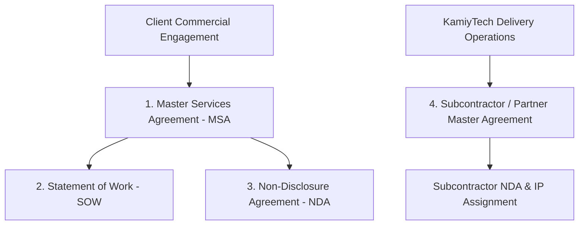

# KAMIYTECH MASTER LEGAL FRAMEWORK
> **DISTRIBUTABLE DOCUMENTATION PACKAGE — LEGAL & COMPLIANCE**

> **DOCUMENT METADATA**
> - **Purpose:** Provide complete, authoritative legal contract structures, Master Services Agreement (MSA) standards, Statement of Work (SOW) templates, Non-Disclosure Agreements (NDA), and Subcontractor / Specialist Partner Agreements for KamiyTech.
> - **Owner:** Legal & Compliance Counsel & Chief Financial Officer (CFO)
> - **Version:** 1.1.0
> - **Status:** APPROVED / LIVE
> - **Target Audience:** External Clients, Specialist Partners, Contractors, Legal Counsel, Internal Sales & Executive Teams
> - **Dependencies:** Founder Strategic Directives (`v2.0.0`), `02_Rate_Card_Margin_Safeguards_and_GST_Rules.md`
> - **Review Schedule:** Annual Legal Audit / Bi-Annual Regulatory Review
> - **Related Distributable Docs:** [01_Financial_Planning_and_Invoicing_SOP.md](file:///c:/Users/abhis/OneDrive/Desktop/kamiytechAI/distributable_docs/5_Finance_and_Billing/01_Financial_Planning_and_Invoicing_SOP.md), [02_Rate_Card_Margin_Safeguards_and_GST_Rules.md](file:///c:/Users/abhis/OneDrive/Desktop/kamiytechAI/distributable_docs/5_Finance_and_Billing/02_Rate_Card_Margin_Safeguards_and_GST_Rules.md)

---

## 1. Executive Summary & Legal Architecture Hierarchy

KamiyTech operates a robust, multi-tiered legal framework designed to protect corporate intellectual property (IP), mitigate operational liability, enforce clear commercial payment triggers, and govern relationships with external specialist delivery partners.



### Order of Precedence Rule
In the event of any conflict or ambiguity between legal documents, the following order of precedence governs:
1. Executed Statement of Work (SOW) *(solely regarding specific pricing, scope, and delivery timelines)*
2. Master Services Agreement (MSA) *(governing core legal terms, IP, liability, and warranties)*
3. Non-Disclosure Agreement (NDA)
4. Standard Operating Procedures (SOPs) & Rate Cards

---

## 2. Master Services Agreement (MSA) Core Standard Clauses

### Clause 1: Intellectual Property (IP) Transfer & Pre-Existing IP Reserve
* **Work-For-Hire Transfer:** Upon 100% full payment of all contract fees, KamiyTech irrevocably transfers and assigns to the Client all custom code, graphics, documentation, and specific deliverables authored uniquely for the Client under the applicable SOW.
* **Pre-Existing IP Reserve:** KamiyTech retains sole ownership over all pre-existing frameworks, generic code libraries, reusable tools, UI components, AI prompts, and software utilities developed prior to or independently of the project. Client is granted a non-exclusive, perpetual, royalty-free license to use such pre-existing IP embedded within the deliverable.

### Clause 2: Payment Terms, Default & Work Suspension Remedies
* **Net Terms:** All invoices are due Net 14 days from invoice date unless specified otherwise in the SOW.
* **Work Suspension:** If an invoice remains unpaid past 14 days, KamiyTech reserves the right to suspend development, revoke staging environment access, and pause deployment timelines without liability until accounts are brought current.

### Clause 3: Warranties & 30-Day Bug Fix Guarantee
* **Warranty Period:** KamiyTech provides a **30-day post-launch warranty** starting from official production deployment.
* **Coverage:** During the warranty period, KamiyTech will repair, at zero additional cost, any reproducible code bugs or discrepancies between the live system and the agreed SOW functional specifications.
* **Exclusions:** Excludes third-party API outages, client code modifications, host environment failures, or new feature additions requested post-launch.

### Clause 4: Limitation of Liability & Consequential Damages
* **Liability Cap:** KamiyTech's total cumulative financial liability arising out of or related to any agreement, contract breach, or technical failure shall strictly not exceed the total fees paid by the Client to KamiyTech under the specific SOW in the **three (3) months** preceding the claim.
* **Consequential Loss Exclusion:** Under no circumstances shall KamiyTech be liable for indirect, incidental, punitive, or consequential damages (including loss of revenue, profit, data, or business interruption).

---

## 3. Statement of Work (SOW) Master Template Structure

Every project engagement must execute a formal SOW utilizing this standardized legal layout:

```markdown
# STATEMENT OF WORK (SOW) #[SOW-NUMBER]
**Project Title:** [Project Name]  
**Client Legal Entity:** [Client Company Name]  
**Effective Date:** [YYYY-MM-DD]  
**Associated MSA Date:** [MSA Signing Date]  

### 1. Executive Summary & Deliverable Scope
[Detailed summary of custom software / web / mobile / AI solution being built]

### 2. Functional Requirements & Technical Deliverables
- Deliverable 1: [Specific component e.g., Next.js Frontend Storefront]
- Deliverable 2: [Specific component e.g., FastAPI Backend & PostgreSQL DB]
- Deliverable 3: [Specific component e.g., OpenAI API Custom RAG Engine]

### 3. Out-of-Scope Items
[Explicit list of features or services NOT included to prevent scope creep]

### 4. Milestones, Delivery Schedule & Fees (Exclusive of 18% GST)
| Milestone | Deliverable / Acceptance Target | Payment % | Fee (INR ₹) | Targeted Date |
| :--- | :--- | :---: | :---: | :--- |
| **M1: Kickoff** | Signed SOW + Architecture Blueprint | 40% | ₹X,XX,XXX | YYYY-MM-DD |
| **M2: Staging** | Staging Environment & QA Demo Pass | 30% | ₹X,XX,XXX | YYYY-MM-DD |
| **M3: Production**| Production Deployment & Handover | 30% | ₹X,XX,XXX | YYYY-MM-DD |

*(Note: Single-Page Landing Pages use 50% Deposit / 50% Handover milestone schedule)*

### 5. Client Obligations & Turnaround SLAs
- Provide API credentials, branding assets, and feedback within 48 business hours of request.

### 6. Signatures & Acceptance
**KamiyTech Representative:** ___________________  **Date:** ________  
**Client Representative:** ______________________  **Date:** ________  
```

---

## 4. Non-Disclosure Agreement (NDA) Standards

1. **Mutual Protection:** Confidential Information includes source code, product roadmaps, business logic, customer lists, financial terms, and proprietary SOPs.
2. **Term of Confidentiality:** Obligations of non-disclosure remain in effect during the engagement and for a period of **three (3) years** following contract termination.
3. **Standard Exclusions:** Excludes information that is publicly known, already in receiving party's possession without breach, or required to be disclosed by court order.

---

## 5. Subcontractor & Specialist Partner Master Agreement

To support KamiyTech's **Core + Specialist Pod Model**, every external developer, designer, or agency contractor must execute the Subcontractor Master Agreement:

```mermaid
graph LR
    Subcontractor[Specialist Partner / Subcontractor]
    
    Subcontractor --> IP[1. Automatic 100% IP Assignment to KamiyTech]
    Subcontractor --> NonSolicit[2. Strict 24-Month Non-Solicitation of Clients & Staff]
    Subcontractor --> WhiteLabel[3. Mandatory White-Label Compliance (@kamiytech.com)]
    Subcontractor --> NDA[4. Strict Client Data Confidentiality]
```

### Key Subcontractor Clauses
1. **Automatic IP Assignment:** All work, code, designs, scripts, and documentation produced by the subcontractor for KamiyTech clients immediately become the sole, exclusive intellectual property of KamiyTech.
2. **Strict 24-Month Non-Solicitation:** Subcontractors are strictly prohibited from soliciting, contacting, or directly contracting with any KamiyTech client during the contract term and for **twenty-four (24) months** post-termination. Violations carry mandatory liquidated damages equal to **100% of contract deal value**.
3. **White-Label Operating Mandate:** Subcontractors must work under white-label terms (using `@kamiytech.com` credentials when interacting with clients) and are forbidden from soliciting direct business.

---

## 6. Governing Law & Dispute Resolution

* **Governing Law:** All agreements shall be governed by and construed in accordance with the laws of the **Republic of India**.
* **Jurisdiction:** The courts at **Pune / Mumbai, Maharashtra, India** shall have exclusive jurisdiction over any disputes arising under or in connection with KamiyTech contracts.
* **Arbitration:** Prior to formal litigation, parties agree to attempt resolution through good-faith executive negotiation followed by binding arbitration under the Indian Arbitration and Conciliation Act, 1996.

---
*End of Master Legal Framework Document. Maintained by Legal Counsel & CFO.*
