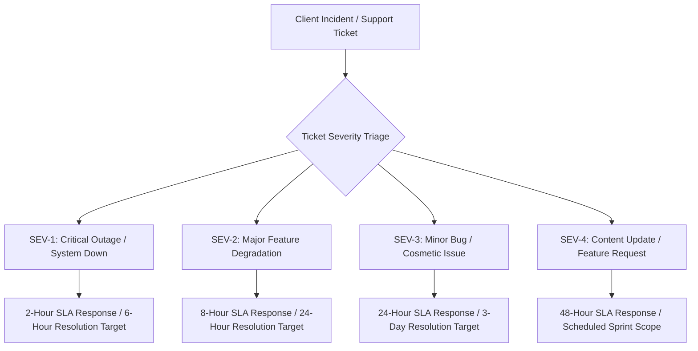
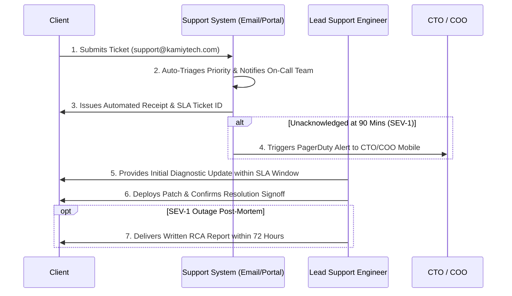

# KAMIYTECH MAINTENANCE RETAINERS & SUPPORT SLA SOP
> **DISTRIBUTABLE DOCUMENTATION PACKAGE — CUSTOMER SUPPORT & MAINTENANCE**

> **DOCUMENT METADATA**
> - **Purpose:** Standardize post-launch maintenance packages, Service Level Agreements (SLAs), ticket severity levels, incident escalation protocols, server uptime monitoring, patch management, and Root Cause Analysis (RCA) procedures.
> - **Owner:** Customer Success Lead, Chief Operating Officer (COO), & Chief Technology Officer (CTO)
> - **Version:** 1.1.0
> - **Status:** APPROVED / LIVE
> - **Target Audience:** Customer Support Staff, Technical Project Managers, System Engineers, External Retainer Clients
> - **Dependencies:** Founder Strategic Directives (`v2.0.0`), `02_Rate_Card_Margin_Safeguards_and_GST_Rules.md`
> - **Review Schedule:** Bi-Annual Operations Audit
> - **Related Distributable Docs:** [01_Financial_Planning_and_Invoicing_SOP.md](file:///c:/Users/abhis/OneDrive/Desktop/kamiytechAI/distributable_docs/5_Finance_and_Billing/01_Financial_Planning_and_Invoicing_SOP.md)

---

## 1. Executive Summary & Customer Support Philosophy

KamiyTech provides comprehensive post-launch software maintenance and support guarantees to protect client investments, ensure maximum application uptime (>99.9%), and deliver rapid issue resolution. Our Support Service Level Agreements (SLAs) define clear response and resolution targets tied directly to retainer tiers.

---

## 2. Support Severity Levels & SLA Guarantees

| Severity Level | Technical Definition & Impact | Initial Response SLA | Resolution Target | Included Retainer Tiers |
| :--- | :--- | :---: | :---: | :--- |
| **SEV-1: Critical Outage** | Production site or application down; database crash; zero checkout or payment processing; total user lockout. | **< 2 Business Hours** | **< 6 Hours** | Enterprise Managed |
| **SEV-2: Major Degradation** | Core feature broken (e.g., payment gateway failing for subset of users, login bug); workarounds exist but difficult. | **< 8 Business Hours** | **< 24 Hours** | Growth Care & Enterprise Managed |
| **SEV-3: Minor Bug** | Non-critical component bug (e.g., alignment glitch, minor form validation error, non-blocking UI bug). | **< 24 Business Hours** | **< 3 Business Days** | All Tiers (Essential, Growth, Enterprise) |
| **SEV-4: Request / Change** | Ad-hoc content updates, styling tweaks, minor feature additions, non-urgent consultation. | **< 48 Business Hours** | Scheduled in Sprint | Growth Care & Enterprise Managed |

---

## 3. Maintenance Retainer Tier Catalog

### Tier 1: Essential Care (₹12,000 / month + GST)
* **Target Client:** Small business websites, simple landing pages, low-traffic portals.
* **Included Monthly Capacity:** Up to **5 hours** of maintenance & technical support per month.
* **Core Services Included:**
  - 24/7 Uptime & SSL Certificate Monitoring (Pingdom / BetterUptime).
  - Automated weekly database & full application backups (AWS S3 / Supabase).
  - Monthly security patch & dependency updates (Next.js / Node.js packages).
  - Monthly health report & 24-hour SLA ticket response time.

### Tier 2: Growth Care (₹35,000 / month + GST)
* **Target Client:** Scaling businesses, active e-commerce platforms, high-traffic web apps.
* **Included Monthly Capacity:** Up to **15 hours** of support & minor feature development per month.
* **Core Services Included:**
  - Everything in Essential Care +
  - Priority **8-hour SLA response** for SEV-2 issues.
  - Quarterly speed & performance optimization audits (Lighthouse / Core Web Vitals).
  - Content updates, Payment Gateway & WhatsApp API maintenance, design tweaks.
  - Monthly strategic tech check-in sync with Technical Project Manager.

### Tier 3: Enterprise Managed (₹85,000 / month + GST)
* **Target Client:** Complex custom software platforms, multi-tenant SaaS, mission-critical AI workflows.
* **Included Monthly Capacity:** Up to **35 hours** of dedicated engineering & TPM capacity per month.
* **Core Services Included:**
  - Everything in Growth Care +
  - Emergency **2-hour SLA response** guarantee for SEV-1 outages.
  - Dedicated Technical Project Manager & Lead Engineer assignment.
  - Automated CI/CD deployment pipeline maintenance & vector database index tuning.
  - Monthly security vulnerability scanning & penetration audit.

---

## 4. Incident Management & Support Ticket SOP

### Step-by-Step Incident SOP
1. **Ticket Submission:** Clients submit support requests via email (`support@kamiytech.com`) or client portal.
2. **Automated Triage:** System tags ticket priority based on keyword matching ("Crash", "Down", "Payment Error") and client retainer tier.
3. **Escalation Trigger:** If a SEV-1 ticket is unacknowledged at 90 minutes, PagerDuty automatically alerts the CTO and COO via phone/SMS.
4. **Root Cause Analysis (RCA):** Any SEV-1 outage requires a formal written RCA report submitted to the client within **72 hours of resolution**, detailing:
   - Root Cause of Failure
   - Total Down Time & User Impact
   - Corrective Patch Applied
   - Preventive Safeguards Implemented

---

## 5. Server Monitoring & Backup SOP

1. **Uptime Monitoring:** All client production servers are monitored 24/7 at 1-minute intervals.
2. **Backup Schedule:**
   - Database Backups: Daily automated snapshots retained for 30 days.
   - Media Assets & Uploads: Weekly incremental backups stored in multi-region S3 buckets.
3. **Out-of-Scope Support Handling:** Support requests exceeding included retainer hours are billed at our standard role rate card (or deducted from next month's retainer upon mutual written agreement).

---
*End of Maintenance Retainers & Support SLA SOP. Maintained by Customer Success, COO & CTO.*
