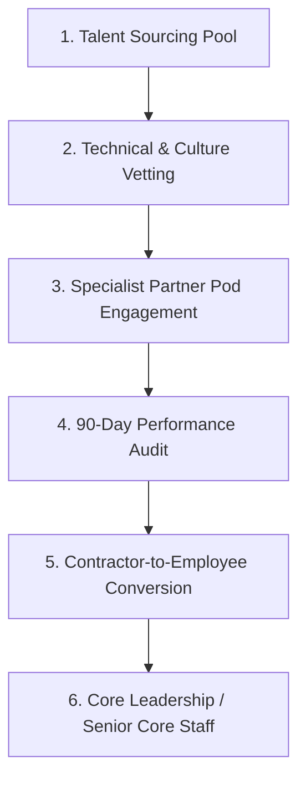
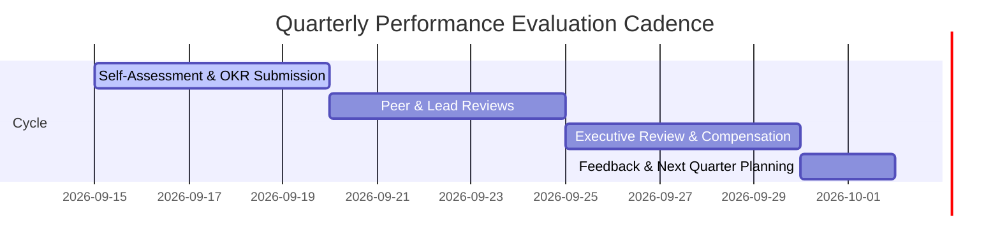

# KAMIYTECH HR & PEOPLE OPERATIONS HANDBOOK
> **DISTRIBUTABLE DOCUMENTATION PACKAGE — HR & PEOPLE OPERATIONS**

> **DOCUMENT METADATA**
> - **Purpose:** Establish end-to-end HR protocols, talent recruitment pipelines, contractor-to-employee conversion pathways, performance evaluation frameworks (OKRs), remote workplace communication rules, and onboarding/offboarding SOPs for KamiyTech.
> - **Owner:** HR & People Operations Lead & Chief Operating Officer (COO)
> - **Version:** 1.0.0
> - **Status:** APPROVED / IN-EFFECT
> - **Target Audience:** Internal Team Members, Contractors, Candidates, HR Personnel, Department Managers
> - **Dependencies:** Founder Strategic Directives (`v2.0.0`), `01_Master_Legal_Framework_MSA_SOW_NDA_Subcontractor.md`, `02_Specialist_Partner_Vetting_and_Onboarding.md`
> - **Review Schedule:** Bi-Annual Operational Review
> - **Related Distributable Docs:** [02_Specialist_Partner_Vetting_and_Onboarding.md](file:///c:/Users/abhis/OneDrive/Desktop/kamiytechAI/distributable_docs/8_HR_and_People_Ops/02_Specialist_Partner_Vetting_and_Onboarding.md)

---

## 1. Executive Summary & People Philosophy

KamiyTech operates a remote-first, async-oriented organizational model. We combine a lean core executive and engineering team with an agile network of vetted specialist partner pods. Our culture prioritizes extreme ownership, continuous technical learning, high-velocity execution, radical transparency, and zero micro-management.

---

## 2. Talent Acquisition & Recruitment Pipeline

### 2.1 Sourcing Channels
- **Direct Specialist Sourcing:** Targeted outreach for elite full-stack (Next.js/Node), AI/ML (Python/FastAPI), and mobile (React Native) engineers.
- **Vetted Partner Networks:** Engaging vetted agency partners under white-label `@kamiytech.com` credentials (governed by [02 Specialist Partner SOP](file:///c:/Users/abhis/OneDrive/Desktop/kamiytechAI/distributable_docs/8_HR_and_People_Ops/02_Specialist_Partner_Vetting_and_Onboarding.md)).

### 2.2 4-Step Selection Process
1. **Screening Call (30 mins):** Background check, communication clarity, cultural fit, alignment with remote work standards.
2. **Technical Assessment:** Hands-on code audit or 90-minute real-world architecture challenge evaluated against the 85/100 pass threshold.
3. **Executive Interview (45 mins):** Interview with COO/CTO focusing on problem-solving, client communication, and execution speed.
4. **Offer & Governance Onboarding:** Issuance of Subcontractor Partner Agreement (or Employment Offer), IP Assignment, NDA, and security setup.

---

## 3. Contractor-to-Employee Conversion Pathway

KamiyTech provides a transparent, structured pathway for high-performing contractors and freelancers to transition into full-time core staff roles.

### 3.1 Eligibility Criteria
- **Tenure:** Minimum 6 consecutive months of active engagement or 500+ delivered billable hours.
- **Quality Scorecard:** Sustained average evaluation score > 90% across 3 consecutive project cycles.
- **Client & Peer Feedback:** Positive rating from Lead Engineers and Project Managers with zero SEV-1 SLA violations.

### 3.2 Conversion Evaluation Rubric

| Assessment Dimension | Weight | Target Threshold | Description |
| :--- | :---: | :---: | :--- |
| **Technical Excellence** | 35% | > 90% | Clean, maintainable code; thorough unit/E2E test coverage (>80%). |
| **Communication & Reliability** | 25% | > 90% | Proactive status updates, punctual daily async standups, clear client presentation. |
| **Ownership & Autonomy** | 25% | > 85% | Takes initiative to solve architectural bottlenecks without micro-management. |
| **Culture & Values** | 15% | Pass | Adherence to security guidelines, confidentiality, and team collaboration. |

---

## 4. Performance Evaluation & OKR Framework

Performance reviews occur on a quarterly cadence using Objectives and Key Results (OKRs).

### OKR Scoring Standards
- **Score 1.0 (Exceeds Target):** Exceptional execution; introduces process or architectural improvements adopted across the firm.
- **Score 0.7 - 0.9 (Meets Target):** Target fully met on time and within budget. Standard expected performance.
- **Score < 0.7 (Needs Improvement):** Performance improvement plan (PIP) triggered with 30-day reassessment window.

---

## 5. Remote Work Environment & Communication Etiquette

### 5.1 Communication Protocols
- **Async-First Core:** Detailed documentation in Slack/GitHub precedes meetings. All major technical decisions must be written in Markdown RFC format.
- **Core Working Hours:** Team members must maintain overlap availability during **11:00 – 17:00 IST** for real-time collaboration.
- **Response SLAs:**
  - Internal Slack messages: Within 2 business hours during designated working windows.
  - Emergency Pager/SEV-1 Alerts: Within 15 minutes for designated on-call engineers.
- **Meeting Discipline:** Mandatory agendas provided 24 hours prior. Meetings capped at 30 minutes by default.

### 5.2 Security & Device Hygiene Guidelines
- Mandatory 2-Factor Authentication (2FA) across all company accounts (Google Workspace, GitHub, Vercel, AWS).
- Zero storage of client credentials or production API keys on local unencrypted drives.
- Hardware must use disk encryption (BitLocker / FileVault) and auto-lock after 5 minutes of inactivity.

---

## 6. Onboarding & Offboarding SOP

### 6.1 Onboarding Checklist (Day 1 - Day 7)
- [ ] Sign Subcontractor / Employment Agreement, NDA, and IP Assignment Agreement.
- [ ] Issue `@kamiytech.com` Google Workspace account and 1Password vault invite.
- [ ] Grant repository access on GitHub with branch protection rules enforced.
- [ ] Conduct 60-minute Culture & Operations Orientation with HR Lead.
- [ ] Assign Onboarding Buddy (Senior Engineer / Team Lead) for first project phase.

### 6.2 Offboarding Checklist
- [ ] Immediately revoke Google Workspace, GitHub, Vercel, Supabase, and AWS IAM access.
- [ ] Conduct Exit Interview to capture operational feedback.
- [ ] Audit and confirm wipe of local client repositories and proprietary assets.
- [ ] Issue final invoice settlement / severance release upon audit confirmation.

---
*End of HR & People Operations Handbook. Maintained by HR & People Ops.*
