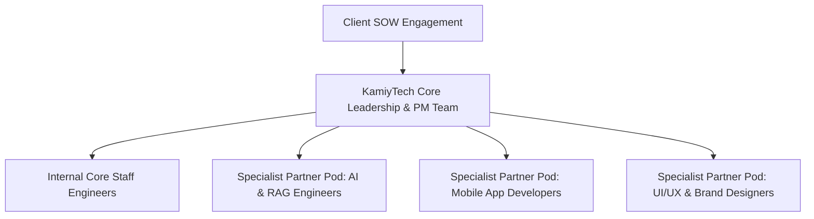
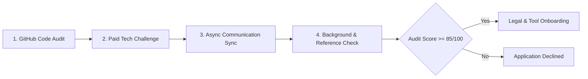

# KAMIYTECH SPECIALIST PARTNER VETTING & ONBOARDING SOP
> **DISTRIBUTABLE DOCUMENTATION PACKAGE — HR & PEOPLE OPERATIONS**

> **DOCUMENT METADATA**
> - **Purpose:** Codify the 4-step vetting rubric, technical evaluation criteria, legal onboarding, white-label operational rules, rate capping boundaries, and quarterly scorecards for KamiyTech's specialist partner network.
> - **Owner:** Chief Operating Officer (COO), HR Lead, & Chief Technology Officer (CTO)
> - **Version:** 1.1.0
> - **Status:** APPROVED / LIVE
> - **Target Audience:** Agency Partners, Specialist Freelancers, Subcontractors, Internal Delivery Leads, HR Staff
> - **Dependencies:** Founder Strategic Directives (`v2.0.0`), `01_Master_Legal_Framework_MSA_SOW_NDA_Subcontractor.md`, `02_Rate_Card_Margin_Safeguards_and_GST_Rules.md`
> - **Review Schedule:** Bi-Annual Operational Review
> - **Related Distributable Docs:** [01_HR_and_People_Operations_Handbook.md](file:///c:/Users/abhis/OneDrive/Desktop/kamiytechAI/distributable_docs/8_HR_and_People_Ops/01_HR_and_People_Operations_Handbook.md)

---

## 1. Executive Summary & Delivery Model Strategy

To achieve scalable growth without expanding fixed payroll overhead, KamiyTech operates a **Core Leadership + Specialist Pod Model**:

Under this architecture, KamiyTech retains end-to-end client ownership, project management, and quality control, while executing delivery through vetted, specialized partner pods under strict white-label agreements.

---

## 2. 4-Step Technical Vetting & Evaluation Rubric

Before any contractor or specialist agency is admitted to KamiyTech's partner roster, they must pass our rigorous 4-step evaluation process:

### Evaluation Breakdown & Passing Criteria
1. **Step 1: Portfolio & Code Sample Audit (CTO Lead):** Review candidate's public/private GitHub repositories for TypeScript strictness, Next.js/FastAPI clean architecture, unit testing, and schema design.
2. **Step 2: Paid Technical Challenge (2–4 Hours):** Candidate completes a scoped real-world challenge (e.g., Next.js component + API route with Zod validation) to evaluate speed, type safety, and code quality.
3. **Step 3: Communication & Culture Sync (COO Lead):** Evaluate English fluency, async responsiveness, transparency under pressure, and deadline reliability.
4. **Step 4: Background & Reference Audit:** Verify past project references and conduct background check.

### Partner Evaluation Rubric (Minimum Pass: 85 / 100 Points)

| Assessment Dimension | Maximum Points | Passing Threshold | Evaluation Focus |
| :--- | :---: | :---: | :--- |
| **Technical Architecture & Code Quality** | **40 Points** | **34 Points** | Type safety, clean code, modularity, test coverage |
| **Communication & Async Responsiveness** | **30 Points** | **25 Points** | Slack responsiveness, status updates, clarity |
| **Deadline Reliability & Speed** | **20 Points** | **17 Points** | On-time delivery, accurate time estimation |
| **Commercial Rate Alignment** | **10 Points** | **9 Points** | Alignment with KamiyTech partner rate caps |
| **TOTAL SCORE** | **100 Points** | **85 Points** | **Mandatory minimum score to enter partner pool** |

---

## 3. Legal Onboarding & White-Label Compliance SOP

Once vetted, partners must complete formal legal and technical onboarding before receiving project access:

1. **Legal Agreement Execution:**
   - Executed **Subcontractor Master Agreement** (including 100% IP assignment to KamiyTech and 24-month non-solicitation clause).
   - Executed Mutual Non-Disclosure Agreement (NDA).
2. **Identity & Access Management (IAM):**
   - Issue white-label `@kamiytech.com` Google Workspace account for all client-facing communications.
   - Provision access to KamiyTech GitHub organization, Slack workspace, and 1Password vault.
3. **White-Label Mandate:**
   - Partners must ALWAYS present themselves as KamiyTech team members when interacting on client channels or video calls.
   - Partners are strictly prohibited from sharing personal agency branding, direct contact details, or personal social links with KamiyTech clients.

---

## 4. Partner Rate Capping & Margin Protection Rules

To safeguard KamiyTech's **45.0% – 55.0% gross profit margin target**, partner pay rates are capped against client billing rates:

| Partner Role Tier | Maximum Allowed Partner Pay Rate (INR ₹) | Client Billing Rate (P1.2) | Target Gross Margin |
| :--- | :---: | :---: | :---: |
| **Senior Solutions Architect** | ₹1,800 – ₹2,200 / hr | ₹4,500 / hr | **51% – 60% Margin** |
| **Senior Full-Stack Engineer** | ₹1,100 – ₹1,400 / hr | ₹2,800 / hr | **50% – 60% Margin** |
| **Mobile App Engineer** | ₹1,000 – ₹1,250 / hr | ₹2,500 / hr | **50% – 60% Margin** |
| **UI/UX & Graphic Designer** | ₹900 – ₹1,100 / hr | ₹2,200 / hr | **50% – 59% Margin** |
| **QA / Testing Specialist** | ₹600 – ₹750 / hr | ₹1,500 / hr | **50% – 60% Margin** |

---

## 5. Quarterly Partner Performance Scorecard

Partners undergo quarterly performance audits conducted by the COO and CTO:

* **Tier 1: Preferred Lead Partner (Score >90):** Priority allocation for all new client projects; eligible for dedicated monthly retainer pod contracts.
* **Tier 2: Active Specialist (Score 80–89):** Allocated for overflow capacity and specialized domain requests.
* **Tier 3: Probation / Inactive (Score <80):** Temporarily paused from new project allocation pending performance review or offboarded.

---
*End of Specialist Partner Vetting & Onboarding SOP. Maintained by COO, HR & CTO.*
