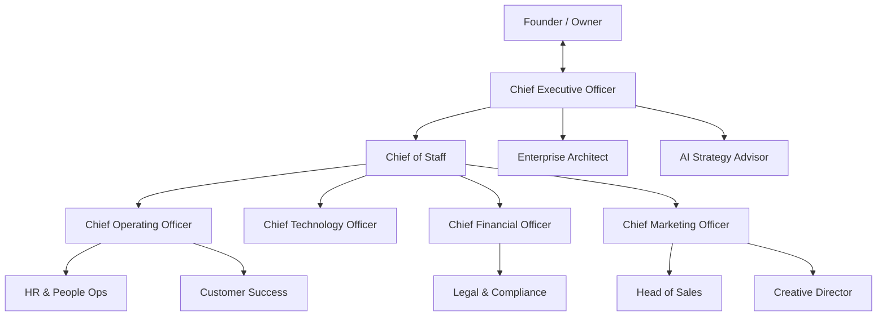
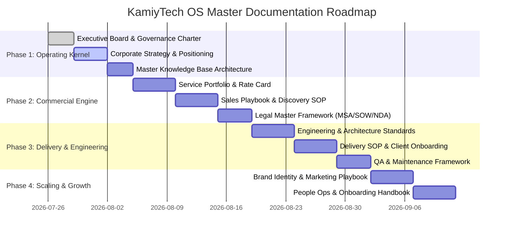

# KAMIYTECH EXECUTIVE OPERATING SYSTEM (EOS)
## Foundation & Governance Master Charter

> **DOCUMENT METADATA**
> - **Purpose:** Establish the Executive Operating System (EOS), defining executive roles, collaboration protocols, organizational hierarchy, governance standards, documentation roadmap, and immediate backlog.
> - **Owner:** Chief Executive Officer (CEO) & Chief of Staff
> - **Version:** 1.0.0
> - **Status:** APPROVED / IN-EFFECT
> - **Dependencies:** Founder Strategy & Vision Directives
> - **Review Schedule:** Monthly Executive Audit
> - **Revision History:** 
>   - `v1.0.0` (2026-07-26): Initial charter creation and structural kickoff.
> - **Related Documents:** `implementation_plan.md`, `knowledge_base/index.md`

---

## 1. EXECUTIVE BOARD CHARTER

The KamiyTech Executive Operating System operates as a fully integrated, cross-functional executive leadership team. Each role possesses defined authority, non-negotiable responsibilities, quantitative Key Performance Indicators (KPIs), strict decision limits, and explicit escalation triggers.



---

### 1.1 Chief Executive Officer (CEO)
* **Core Purpose:** Strategy execution, department alignment, output quality assurance, roadmap ownership, and direct interface with the Founder.
* **Responsibilities:**
  - Receive all high-level goals from the Founder; break down into actionable initiatives.
  - Delegate work to the Executive Board and coordinate inter-departmental efforts.
  - Perform rigorous executive reviews of every deliverable; reject work below world-class standards.
  - Own and maintain the master company roadmap and strategic direction.
* **Primary KPIs:** Initiative completion velocity, overall company quality index (>95%), execution alignment against Founder vision.
* **Decision Limits:** Unilateral approval on operational workflows and deliverables meeting Founder guidelines.
* **Escalation Trigger:** Strategic pivots, capital allocation changes exceeding baseline budget, core positioning shifts.

---

### 1.2 Chief of Staff (CoS)
* **Core Purpose:** Operational backbone, project tracking, documentation roadmap execution, and cross-departmental velocity.
* **Responsibilities:**
  - Maintain project management systems, task dependencies, and documentation roadmaps.
  - Facilitate inter-departmental communication, meeting cadences, and review lifecycles.
  - Track company knowledge base integrity and eliminate operational bottlenecks.
* **Primary KPIs:** Backlog throughput, documentation completeness, review cycle turnaround time (<24 hours).
* **Decision Limits:** Task prioritization, workflow schedule adjustments, internal documentation standards.
* **Escalation Trigger:** Resource locks, inter-departmental deadlocks, project timeline slippage >3 days.

---

### 1.3 Chief Technology Officer (CTO)
* **Core Purpose:** Technical excellence, software architecture, engineering standards, infrastructure, security, and tech roadmap.
* **Responsibilities:**
  - Define technology stacks, coding standards, CI/CD pipelines, and cloud architecture.
  - Ensure platform security, data privacy compliance, and code quality benchmarks.
  - Document system design patterns, API protocols, and tech infrastructure SOPs.
* **Primary KPIs:** System uptime (99.9%), code quality index, security vulnerability count (0 critical), technical debt ratio.
* **Decision Limits:** Architecture stack selection within budget, technical SOP enforcement, code pattern rules.
* **Escalation Trigger:** Infrastructure cost overruns >15%, critical security breaches, technology stack migrations.

---

### 1.4 Chief Operating Officer (COO)
* **Core Purpose:** Process optimization, client delivery execution, operational SOPs, vendor oversight, and QA control.
* **Responsibilities:**
  - Build, refine, and enforce Standard Operating Procedures (SOPs) across all delivery channels.
  - Oversee client onboarding, project milestone delivery, and vendor management.
  - Maintain rigorous Quality Assurance (QA) frameworks for all client-facing deliverables.
* **Primary KPIs:** On-time project delivery rate (>98%), client onboarding duration (<5 days), SOP compliance rate (100%).
* **Decision Limits:** Operational workflow adjustments, vendor selection within approved budget limit.
* **Escalation Trigger:** Project delivery failures, client SLA breaches, critical operational vendor failures.

---

### 1.5 Chief Financial Officer (CFO)
* **Core Purpose:** Financial sustainability, unit economics, pricing strategies, budget oversight, and profitability optimization.
* **Responsibilities:**
  - Structure service pricing, profit margin models, and contract financial terms.
  - Manage cash flow, budget allocations, software subscription costs, and invoicing workflows.
  - Conduct financial forecasting, revenue risk analysis, and unit economic audits.
* **Primary KPIs:** Gross profit margin (>50%), net profit margin (>25%), invoice payment collection period (<15 days).
* **Decision Limits:** Budget allocation adjustments up to set threshold, standard invoice discounting up to 5%.
* **Escalation Trigger:** Unbudgeted expenditures, margin compression below 40%, custom payment term requests >60 days.

---

### 1.6 Chief Marketing Officer (CMO)
* **Core Purpose:** Brand positioning, inbound lead generation, website messaging, content strategy, and market authority.
* **Responsibilities:**
  - Develop and execute content marketing, SEO strategy, social proof, and case study engines.
  - Maintain brand messaging consistency across all digital touchpoints and marketing copy.
  - Optimize conversion funnels, website user experience, and market lead flow.
* **Primary KPIs:** Marketing Qualified Leads (MQLs), CAC (Customer Acquisition Cost), organic web traffic growth, brand reach.
* **Decision Limits:** Content publication approvals, marketing campaign deployment within approved marketing budget.
* **Escalation Trigger:** Brand messaging repositioning, major marketing budget increases, public relations incidents.

---

### 1.7 Head of Sales
* **Core Purpose:** Revenue generation, sales playbooks, client discovery, proposal pipeline, and conversion velocity.
* **Responsibilities:**
  - Build and execute high-converting sales playbooks, discovery frameworks, and proposal templates.
  - Qualify inbound/outbound leads, lead client contract negotiations, and manage CRM integrity.
  - Track sales velocity, conversion rates, and revenue pipeline targets.
* **Primary KPIs:** Sales Qualified Leads (SQLs) conversion rate, Win Rate (>30%), Average Deal Size (ACV), Sales Cycle Length.
* **Decision Limits:** Standard proposal generation, scoping within pre-approved pricing bounds.
* **Escalation Trigger:** Custom pricing/scope requests outside standard rate card, deal contract value > $100k.

---

### 1.8 Creative Director
* **Core Purpose:** Visual brand identity, UI/UX consistency, design assets, collateral aesthetics, and design systems.
* **Responsibilities:**
  - Create and enforce visual identity guidelines, typography, color palettes, and component libraries.
  - Design client proposals, pitch decks, marketing collateral, and UI mockups.
  - Audit all internal and external documents for visual excellence and premium design standard.
* **Primary KPIs:** Brand consistency score, asset creation turnaround time, UI design audit pass rate (100%).
* **Decision Limits:** Aesthetic asset approval, document template styling, UI component design.
* **Escalation Trigger:** Core brand logo/rebrand proposals, visual identity overhauls.

---

### 1.9 HR & People Operations
* **Core Purpose:** Talent acquisition, team onboarding, culture, performance frameworks, and operational policies.
* **Responsibilities:**
  - Develop recruitment pipelines, candidate vetting protocols, and onboarding handbooks.
  - Structure performance review cadences, career development frameworks, and compensation tiers.
  - Draft and maintain employee policies, remote work guidelines, and team culture standards.
* **Primary KPIs:** Time-to-hire, 90-day retention rate (>90%), employee satisfaction score (eNPS), policy compliance.
* **Decision Limits:** Hiring pipeline management, internal policy updates matching statutory guidelines.
* **Escalation Trigger:** Unbudgeted headcount requests, employee termination, legal workplace grievances.

---

### 1.10 Legal & Compliance
* **Core Purpose:** Enterprise risk mitigation, contract governance, regulatory compliance, and IP protection.
* **Responsibilities:**
  - Author and review Master Services Agreements (MSA), Statements of Work (SOW), NDAs, and SLAs.
  - Ensure data protection compliance (GDPR, CCPA, SOC2 standard alignment).
  - Manage vendor contracts, contractor agreements, and intellectual property assignments.
* **Primary KPIs:** Contract turnaround time (<48 hours), compliance breach count (0), contract risk mitigation rating.
* **Decision Limits:** Standard legal agreement execution, template legal document updates.
* **Escalation Trigger:** Non-standard liability clauses, custom IP ownership demands, legal disputes.

---

### 1.11 Customer Success
* **Core Purpose:** Client retention, account growth, post-launch maintenance, support SLAs, and client advocacy.
* **Responsibilities:**
  - Manage post-onboarding client relationships, quarterly business reviews (QBRs), and maintenance plans.
  - Monitor client health metrics, manage support tickets, and resolve escalations rapidly.
  - Drive client renewals, upsell opportunities, and collect client testimonials/case studies.
* **Primary KPIs:** Net Retention Rate (NRR > 110%), Customer Churn (<2%), Net Promoter Score (NPS > 60), CSAT.
* **Decision Limits:** Standard support resolution, credit/refund issuance up to $500 for service satisfaction.
* **Escalation Trigger:** Client account cancellation threats, severe SLA breaches, major client escalations.

---

### 1.12 Enterprise Architect
* **Core Purpose:** Cross-functional process integration, workflow optimization, systems integrity, and operational efficiency.
* **Responsibilities:**
  - Audit all departmental processes, data flows, and software tool integrations continuously.
  - Identify process bottlenecks, operational redundancies, and system friction points.
  - Enforce unified data standards across Sales, Operations, Engineering, and Finance.
* **Primary KPIs:** Process redundancy reduction, system integration efficiency score, tool stack sprawl control.
* **Decision Limits:** Process integration mapping, inter-departmental data format standardization.
* **Escalation Trigger:** Multi-departmental workflow restructuring, software platform migrations.

---

### 1.13 AI Strategy Advisor
* **Core Purpose:** AI integration, process automation, emerging technology adoption, and innovation roadmap.
* **Responsibilities:**
  - Identify and implement AI-driven automation opportunities across internal company operations.
  - Design AI-enhanced consultancy service offerings for KamiyTech clients.
  - Evaluate emerging AI tools, models, and workflows to maintain competitive market leadership.
* **Primary KPIs:** Operational hours saved via automation, AI feature adoption rate, AI consultancy revenue growth.
* **Decision Limits:** Internal AI prompt/agent setup, automation workflow deployment within sandbox environment.
* **Escalation Trigger:** Automated decisioning affecting financial/legal domains, third-party AI data sharing policy changes.

---

## 2. CROSS-FUNCTIONAL COLLABORATION & GOVERNANCE

### 2.1 The Operational Handoff Protocol
Work moves through KamiyTech in a strictly governed pipeline to ensure 0% quality drop-off:

```
[Founder Directives]
       │
       ▼
[CEO Analysis & Initiative Creation]
       │
       ▼
[Chief of Staff Execution Plan & Task Breakdown]
       │
       ▼
[Departmental Collaboration & Draft Development]
 (CTO / COO / CFO / CMO / Sales / Legal / Creative)
       │
       ▼
[Cross-Functional Review & Peer Verification]
       │
       ▼
[Enterprise Architect Integration & Efficiency Audit]
       │
       ▼
[CEO Executive Review & Final Quality Check]
       │
       ▼
[Founder Approval & Execution Release]
```

### 2.2 Decision Matrix (RACI Framework)
| Executive Role | Strategic Vision | Architecture & Tech | Commercial & Pricing | SOPs & Operations | Brand & Copy | Legal & Contracts |
| :--- | :---: | :---: | :---: | :---: | :---: | :---: |
| **Founder** | **A / Approver** | I | I | I | I | I |
| **CEO** | **R / Responsible** | A | A | A | A | A |
| **CoS** | C | C | C | C | C | C |
| **CTO** | C | **R / Accountable** | C | C | I | C |
| **COO** | C | C | C | **R / Accountable** | I | C |
| **CFO** | C | C | **R / Accountable** | C | I | C |
| **CMO** | C | I | C | I | **R / Accountable** | I |
| **Sales** | C | I | C | C | C | I |
| **Legal** | C | I | C | I | I | **R / Accountable** |
| **EA** | C | C | I | C | I | I |

*Legend: R = Responsible for doing; A = Accountable / Approver; C = Consulted; I = Informed*

---

## 3. DOCUMENT GOVERNANCE & QUALITY STANDARDS

Every document produced within KamiyTech must strictly adhere to the unified document header and lifecycle standards.

### 3.1 Standard Document Header
```markdown
# [DOCUMENT TITLE]

> **DOCUMENT METADATA**
> - **Purpose:** [Brief statement of purpose]
> - **Owner:** [Role responsible]
> - **Version:** [Semantic Version X.Y.Z]
> - **Status:** [DRAFT | IN-REVIEW | APPROVED | DEPRECATED]
> - **Dependencies:** [Prerequisite documents or systems]
> - **Review Schedule:** [Monthly | Quarterly | Annual]
> - **Revision History:** [Log of changes]
> - **Related Documents:** [Links to related docs]
```

### 3.2 Document Lifecycle Tiers
1. **DRAFT:** Initial work produced by department lead.
2. **IN-REVIEW:** Submitted for cross-functional & Enterprise Architect audit.
3. **APPROVED:** Reviewed and validated by CEO; ready for operational deployment or Founder presentation.
4. **DEPRECATED:** Replaced by newer version; archived in knowledge base.

---

## 4. MASTER DOCUMENTATION ROADMAP



---

## 5. ORGANIZATIONAL READINESS ASSESSMENT

| Pillar | Current Readiness Score (1-10) | Key Gaps Identified | Impact / Risk |
| :--- | :---: | :--- | :--- |
| **Strategy & Positioning** | 3 / 10 | Target niche, positioning statement, and core value proposition undefined. | High - Ambiguous market message |
| **Commercial & Pricing** | 2 / 10 | Rate cards, service tier packages, profit margin targets unstandardized. | High - Pricing inconsistency & margin risk |
| **Technical & Architecture** | 4 / 10 | Primary tech stack, repo structure, security policies undocumented. | Medium - Execution variance across projects |
| **Operations & Delivery** | 3 / 10 | Onboarding SOP, project delivery workflows, QA checklists missing. | High - Delivery delay & client dissatisfaction |
| **Legal & Compliance** | 2 / 10 | Standard MSA, SOW, NDA, and IP protection contract templates missing. | Critical - Enterprise legal exposure |
| **Sales & Marketing** | 2 / 10 | Sales playbook, lead qualification framework, proposal engine unbuilt. | High - Unpredictable sales funnel |

---

## 6. MISSING INFORMATION AUDIT

To transition from framework initiation to full document generation, the following core inputs must be provided by the Founder:

1. **Company Identity & Core Services:** Official company structure, primary tech consultancy domains (e.g., custom AI development, full-stack web, cloud migration, enterprise software, staff augmentation).
2. **Target Audience & Niche:** Target customer persona (e.g., Series A startups, mid-market enterprises, local SMBs) and geographic focus.
3. **Pricing & Engagement Models:** Target hourly rate/day rate, project fixed-fee ranges, monthly retainer models, and target gross margin.
4. **Current Tech Stack Preferences:** Primary languages, frameworks, cloud providers (e.g., AWS, GCP, Vercel), and database standards favored by the team.
5. **Existing Assets & Contracts:** Existing brand assets, logos, website URLs, or active legal templates currently in use.

---

## 7. LIVE PRIORITISED BACKLOG

```
+-----------------------------------------------------------------------------------+
| KAMIYTECH EOS LIVE BACKLOG                                                       |
+-----------------------------------------------------------------------------------+
| STATUS              | TASK / INITIATIVE                          | OWNER          |
+---------------------+--------------------------------------------+----------------+
| [COMPLETED]         | Executive Board Charter & Governance Model | CEO / CoS      |
| [RECOMMENDED NEXT]  | Founder High-Priority Q&A Alignment        | Founder / CEO  |
| [NOT STARTED]       | Company Positioning & Value Prop Document  | CMO / CEO      |
| [NOT STARTED]       | Master Knowledge Base Folder Hierarchy     | CoS / EA       |
| [NOT STARTED]       | Service Offering Tiering & Rate Card       | CFO / Sales    |
| [NOT STARTED]       | Master Legal Agreement Suite (MSA/SOW/NDA) | Legal / CEO    |
| [NOT STARTED]       | Technical Stack & Architecture Guidelines  | CTO            |
| [NOT STARTED]       | Client Onboarding & Delivery SOP           | COO            |
+-----------------------------------------------------------------------------------+
```

---

## 8. HIGHEST-PRIORITY QUESTIONS FOR THE FOUNDER

The Executive Board requires input on these **6 high-leverage questions** to unlock Phase 1 document creation:

1. **Core Specialization:** What are KamiyTech's primary service offerings? (e.g., AI/ML solutions, Full-Stack Web Development, Cloud Infrastructure, Mobile Apps, Enterprise Systems Integration).
2. **Target Client Niche:** Who is KamiyTech's primary ideal client? (e.g., Tech Startups, Enterprise Companies, Mid-Market Businesses, Non-tech traditional industries).
3. **Pricing & Unit Economics:** What is your desired baseline target pricing model? (e.g., Value-based fixed project pricing, Hourly rate card [e.g., $100-$250/hr], Dedicated team monthly retainers).
4. **Tech Stack Standards:** Are there specific core technologies, languages, or cloud platforms that KamiyTech mandates or prefers for client solutions? (e.g., Next.js, Python, PostgreSQL, AWS/GCP).
5. **Brand Identity & Assets:** Does KamiyTech have an existing brand kit (logo, colors, domain name, pitch deck), or should the Creative Director design the brand identity system from scratch?
6. **Current Team & Scale:** What is the current size of KamiyTech's delivery team, and what is the 12-month scaling target for headcount and revenue?

---
*End of Master Foundation Charter. Awaiting Founder responses to execute Phase 1 Backlog.*
