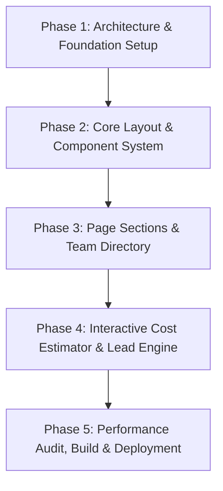

# IMPLEMENTATION PLAN: KAMIYTECH.COM PRODUCTION WEB APPLICATION

> **GOAL:** Design, build, and deploy the official high-converting `KamiyTech.com` production web application using Next.js, React, TypeScript, and Tailwind CSS. The web app will integrate our brand tokens (P2.3), approved website copy (P2.4), official vector logo assets, team directory, and an interactive domestic Project Cost Estimator (P1.2 Rate Card).

---

## Phased Development Roadmap

---

## Proposed Phases & Deliverables

### Phase 1: Architecture & Design System Setup
- Initialize Next.js 15 (App Router), React 19, TypeScript, Tailwind CSS, Lucide React icons.
- Configure folder structure (`app/`, `components/`, `lib/`, `public/assets/logo/`).
- Import vector logo assets ([logo.svg](file:///c:/Users/abhis/OneDrive/Desktop/kamiytechAI/assets/logo/logo.svg) & [logo-icon.svg](file:///c:/Users/abhis/OneDrive/Desktop/kamiytechAI/assets/logo/logo-icon.svg)) into public assets.
- Configure P2.3 Design System tokens in `tailwind.config.ts` and `app/globals.css`:
  - Background: Deep Space Obsidian (`#0B0F17`)
  - Cards & Surfaces: Slate Glass (`#161E2E`)
  - Accents: Electric Cyan (`#00F0FF`) & Deep Indigo (`#4F46E5`)
  - Text: Pure Off-White (`#F9FAFB`) & Slate Gray (`#9CA3AF`)

---

### Phase 2: Core Components & Layout Shell
- **`Navbar.tsx`**: Header featuring vector logo, navigation links (`#services`, `#about`, `#estimator`, `#contact`), and direct `Schedule Call` CTA button.
- **`Footer.tsx`**: Corporate footer featuring logo, quick links, Indore HQ address (`1/32, behind SICA School Road, Vijay Nagar, Indore, MP 452010`), and main line (`+91 9977858817` Ankit Vaja).
- **`GlassCard.tsx`**: Reusable glassmorphic UI card with subtle backdrop blur and cyan hover glow.
- **`Button.tsx`**: Reusable primary (Electric Cyan) and secondary (Deep Indigo outline) buttons.

---

### Phase 3: Page Sections & Copy Integration (P2.4 & Company Profile)
- **`HeroSection.tsx`**: Badge tag `⚡ NEXT-GEN TECHNOLOGY CONSULTANCY`, H1 headline, subheadline, trust metrics (99.9% uptime, <1.5s load speed, 50%+ hours saved).
- **`ServicesShowcase.tsx`**: Interactive grid of all services ([P1.4 Catalog](file:///c:/Users/abhis/OneDrive/Desktop/kamiytechAI/knowledge_base/P1.4_service_catalog.md)) across Web Solutions, Custom Software, AI & Automation, Mobile Apps, and Marketing & SEO.
- **`TeamSection.tsx`**: Executive team cards:
  - **Abhishek Chedwal** — Founder & CEO / CTO
  - **Ankit Vaja** — Co-Founder & Business Manager (`+91 9977858817`)
  - **Sahil Dhameliya** — Marketing & SEO Lead
  - **Vaidehi Gupta** — Business Executive
- **`WhyChooseUs.tsx`**: Differentiator grid (Enterprise Code Quality, AI-First Automation, Fixed INR Pricing, Partner Scale).

---

### Phase 4: Interactive Cost Estimator & Lead Engine
- **`ProjectCostEstimator.tsx`**: Dynamic real-time cost calculator based on [P1.2 Rate Card](file:///c:/Users/abhis/OneDrive/Desktop/kamiytechAI/knowledge_base/P1.2_rate_card_and_pricing_framework.md):
  - Service Selector: Single-Page Landing (₹12k–₹15k), Multi-Page Web Platform (₹35k–₹2.2L), Custom SaaS/ERP (₹2.5L–₹7.5L+), Mobile App (₹1.2L–₹6.5L), AI Automation (₹45k–₹3.5L).
  - Add-on Tiers: Maintenance retainers (₹12k/mo, ₹35k/mo, ₹85k/mo) & SEO growth retainer.
  - Calculation Output: Real-time estimated range in INR (₹) + itemized 18% GST note + milestone schedule (40/30/30 or 50/50).
- **`ContactSection.tsx`**: Lead capture form + WhatsApp direct chat trigger button (`+91 9977858817`) + Indore HQ address card.

---

### Phase 5: Verification, SEO Optimization & Git Synchronization
- Run build verification (`npm run build` or `npx next build`).
- Verify WCAG AAA contrast, mobile responsiveness, and page load speed (<1.5s).
- Create walkthrough report.
