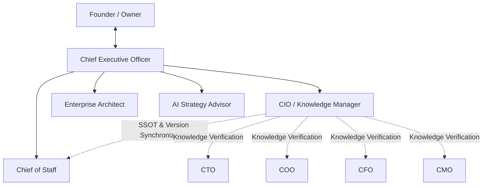
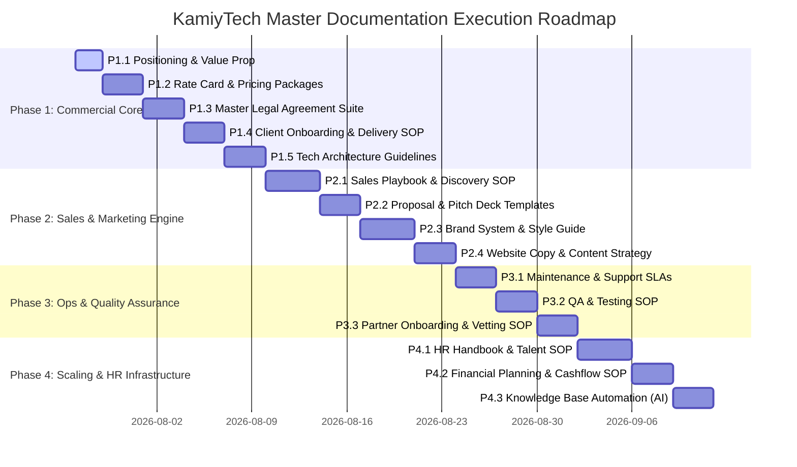

# KAMIYTECH MASTER DOCUMENTATION & SYSTEM EXECUTION ROADMAP
> **EXECUTIVE APPROVAL REQUIRED FROM FOUNDER**

> **DOCUMENT METADATA**
> - **Purpose:** Master implementation plan and execution roadmap for building KamiyTech's complete documentation, SOPs, commercial systems, and operational workflows based on official Founder strategic decisions.
> - **Owner:** Chief Executive Officer (CEO) & Chief Information Officer (CIO) / Knowledge Manager
> - **Version:** 1.1.0
> - **Status:** IN-REVIEW (Awaiting Founder Approval)
> - **Dependencies:** Founder Foundation Directives (`v1.0.0`)
> - **Review Schedule:** Weekly Executive Review / Monthly Audit
> - **Related Documents:** [eos_framework_initiation.md](file:///C:/Users/abhis/.gemini/antigravity/brain/43b2bd90-bd70-48a7-bd6f-4772e0210cb0/eos_framework_initiation.md)

---

## 1. Executive Board Update: Chief Information Officer (CIO) / Knowledge Manager

As directed by the Founder, the executive structure is upgraded to include the **Chief Information Officer (CIO) / Knowledge Manager**.



### CIO / Knowledge Manager Charter
* **Core Purpose:** Maintain a single source of truth (SSOT) for all company knowledge, eliminate document contradictions, enforce semantic versioning, and synchronize all SOPs, policies, and templates.
* **Key Responsibilities:**
  - Audit all internal and external documents for alignment with Founder strategic decisions.
  - Maintain the central Knowledge Base taxonomy, indexing, and cross-document links.
  - Oversee version control and deprecation protocols as policies or technologies evolve.
  - Eliminate information redundancy, ambiguity, and stale documentation across all departments.
* **Primary KPIs:** Documentation Drift Rate (0%), Knowledge Base Indexing Completeness (100%), Version Conflict Count (0), Employee/Executive Knowledge Retrieval Time (<60 seconds).
* **Decision Limits:** Mandatory rejection of any document containing unverified or conflicting strategic claims.

---

## 2. Updated Readiness Assessment & Knowledge Matrix

Following the Founder's baseline decisions, KamiyTech's operational readiness has jumped significantly across strategic and technical dimensions.

### 2.1 Readiness Score Breakdown

```
STRATEGY & POSITIONING         [████████████████░░░░] 8/10 (+5)
COMMERCIAL & PRICING           [████████████░░░░░░░░] 6/10 (+4)
TECHNICAL & ARCHITECTURE       [██████████████░░░░░░] 7/10 (+3)
OPERATIONS & DELIVERY          [██████████░░░░░░░░░░] 5/10 (+2)
LEGAL & COMPLIANCE             [████████░░░░░░░░░░░░] 4/10 (+2)
SALES & MARKETING              [██████████░░░░░░░░░░] 5/10 (+3)
KNOWLEDGE GOVERNANCE (CIO)     [████████████████░░░░] 8/10 (+7)
```

### 2.2 Completed Knowledge Base Areas (Codified as SSOT)

| Knowledge Domain | Codified Status | Reference Source | Key Decided Inputs |
| :--- | :---: | :--- | :--- |
| **Core Specializations** | **COMPLETE** | Founder Response §1 | Full-service technology agency: Web, Custom Software, Mobile (iOS/Android), AI/Automation, UI/UX, Growth & Partner Branding. |
| **Engineering Stack** | **COMPLETE** | Founder Response §1 & §4 | Next.js, React, TypeScript, Node.js, Python, FastAPI, PostgreSQL, MongoDB, Supabase, React Native, Tailwind, Vercel, AWS, Cloudflare. |
| **Target Client Niche** | **COMPLETE** | Founder Response §2 | Primary: SMBs, Growing Companies, Startups, Manufacturing, Education, Professional Services. Secondary: Enterprise & Agencies. |
| **Pricing Models** | **COMPLETE** | Founder Response §3 | Hybrid Strategy: Fixed-Price (default), Value-Based (AI/Software), Monthly Maintenance Retainers, Dedicated Team Retainers, Hourly. |
| **Brand Inventory** | **COMPLETE** | Founder Response §5 | Logo, Colors, Catalogue, Cards available; Creative Director mandated to build full Brand System, Guidelines & Pitch Templates. |
| **Operational Scale** | **COMPLETE** | Founder Response §6 | Founder-led consultancy + trusted specialist partner network; 12-month vision to build scalable, partner-backed agency. |
| **Governance Engine** | **COMPLETE** | Founder Response Directives | 14 Executive Roles active (including CIO/KM); strict RACI and review protocols enforced. |

---

## 3. High-Priority Deliverable Sequence & Strategic Rationale

To build a scalable agency, documents cannot be created randomly. We have sequenced deliverables based on **Revenue Impact**, **Risk Mitigation**, and **Operational Dependency Chains**.

```
[Phase 1: Operating Core & GTM Engine]
  ├── P1.1: Strategic Positioning & Niche Value Prop Document
  ├── P1.2: Rate Card, Service Packages & Quotation Framework
  ├── P1.3: Master Legal Suite (MSA, SOW, NDA, Partner Agreement)
  ├── P1.4: Client Onboarding & Delivery SOP
  └── P1.5: Engineering Architecture & Technical Guidelines
```

### Strategic Prioritization Rationale

1. **Deliverable 1: Strategic Positioning & Niche Value Proposition (CMO / CEO / CIO)**
   * *Rationale:* All sales playbooks, proposals, website copy, and marketing assets depend on having an unambiguous, differentiated positioning statement and value proposition for our target client verticals (SMBs, Manufacturing, Startups, Education).
   
2. **Deliverable 2: Standard Rate Card, Service Packages & Quotation SOP (CFO / Sales / COO)**
   * *Rationale:* Immediately operationalizes the Founder's hybrid pricing directive. Establishes profit margin minimums (>50% gross margin), tier packages for Web/Mobile/AI, and milestone payment schedules so Sales can quote leads accurately without Founder consultation.

3. **Deliverable 3: Master Legal Framework — MSA, SOW, NDA & Partner Agreements (Legal / CFO / CEO)**
   * *Rationale:* Critical risk mitigation. Secures client contracts, protects KamiyTech IP, limits liability, and establishes formal contract templates for our growing trusted specialist partner network.

4. **Deliverable 4: Client Onboarding & Delivery SOP (COO / CTO / CS)**
   * *Rationale:* Ensures consistent, high-quality client execution from contract signoff to project kickoff, milestone review, QA, deployment, and handover. Protects client satisfaction and retention.

5. **Deliverable 5: Engineering & Technology Architecture Guidelines (CTO / EA)**
   * *Rationale:* Standardizes repository setups, coding guidelines, API patterns, database migrations, and security protocols across internal developers and specialist partner network.

---

## 4. Multi-Phase Execution Roadmap for All Remaining Documentation



### Complete Breakdown of Planned Documentation Packages

#### PHASE 1: Commercial Core & Risk Governance (Immediate Focus)
- `P1.1_positioning_and_value_prop.md`: Detailed market positioning, ICP personas, USP matrix by industry, tone of voice.
- `P1.2_rate_card_and_pricing_framework.md`: Standard hourly/day rates, fixed-price project scope tiers (Web, Mobile, AI), retainer pricing, discount rules, margin guidelines.
- `P1.3_master_legal_framework.md`: Standard Master Services Agreement (MSA), Statement of Work (SOW), Non-Disclosure Agreement (NDA), and Subcontractor Partner Agreement.
- `P1.4_client_onboarding_and_delivery_sop.md`: Step-by-step client onboarding flow, discovery handoff, communication matrix, weekly reporting templates, milestone signoff.
- `P1.5_engineering_architecture_guidelines.md`: Architecture standards for Next.js, FastAPI, Node.js, PostgreSQL, MongoDB, AI API integrations, CI/CD, and Vercel/AWS deployment.

#### PHASE 2: Sales & Marketing Engine
- `P2.1_sales_playbook_and_discovery_sop.md`: B2B sales funnel, qualification criteria (BANT/MEDDIC adapted), objection handling scripts, discovery interview questions.
- `P2.2_proposal_and_pitch_templates.md`: High-converting proposal structures, quotation layouts, SOW scope attachments, project timelines.
- `P2.3_brand_identity_and_design_system.md`: Creative Director's brand guidelines, visual identity, UI component tokens, typography, slide deck styling.
- `P2.4_website_copy_and_content_strategy.md`: Complete website page copy structure (Home, Services, Case Studies, About, Contact) and SEO keyword map.

#### PHASE 3: Delivery Operations & Quality Assurance
- `P3.1_maintenance_retainer_and_sla_sop.md`: Post-launch support packages, SLA response time guarantees (2hr/8hr/24hr), server monitoring protocols.
- `P3.2_qa_code_review_and_testing_sop.md`: Unit/Integration/E2E testing standards, pre-release security checklists, code review guidelines.
- `P3.3_partner_onboarding_and_vetting_sop.md`: Specialist partner vetting process, rate negotiation, SLA agreements, partner performance reviews.

#### PHASE 4: Scaling, HR & Knowledge Infrastructure
- `P4.1_hr_and_people_ops_handbook.md`: Hiring SOPs, contractor-to-employee conversion pathways, remote work policies, performance evaluation framework.
- `P4.2_financial_planning_and_invoicing_sop.md`: Invoicing schedules, expense management, vendor payout policies, revenue tracking.
- `P4.3_ai_automation_and_knowledge_base_sop.md`: CIO & AI Strategy Advisor guide for automated document synchronization, AI prompt/agent setup, and continuous workflow optimization.

---

## 5. Verification & Governance Checklist for Execution

Before any Phase 1 document is finalized and submitted to the Founder, it must pass this 5-point verification checklist:

- [ ] **Founder Strategy Alignment:** Fully consistent with Founder foundation decisions (`v1.0.0`).
- [ ] **CIO Synchronization Audit:** No conflicting terms or outdated metrics with other active docs.
- [ ] **Enterprise Architect System Check:** Seamless integration into adjacent department workflows.
- [ ] **Executive Quality Review:** Approved by responsible C-level executive and signed off by CEO.
- [ ] **Production Format Readiness:** Structured with clean Markdown, metadata header, Mermaid diagrams, and formatted for Notion/Google Docs/PDF export.

---

## 6. Action Requested from Founder

> [!IMPORTANT]
> **FOUNDER APPROVAL REQUIRED**
> 
> Please review the execution sequence above. Upon your approval of this roadmap, the Executive Board will immediately initiate creation of **Phase 1 Deliverables**, starting with `P1.1 Strategic Positioning & Niche Value Proposition` and `P1.2 Rate Card & Pricing Framework`.
> 
> **Options:**
> 1. **Approve Roadmap as Presented:** Type "Approved" to commence Phase 1 creation.
> 2. **Adjust Priorities:** Specify any adjustments to document order or timeline.
