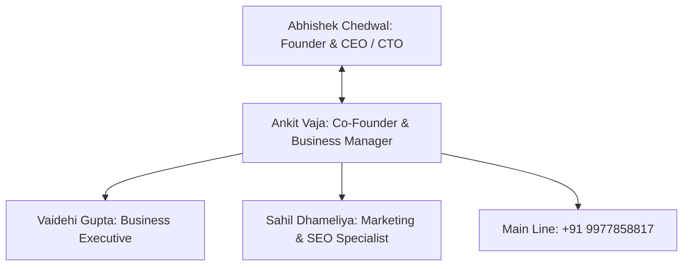

# KAMIYTECH OFFICIAL COMPANY PROFILE & EXECUTIVE DIRECTORY
> **CORPORATE MASTER DATA & TEAM INFRASTRUCTURE**

> **DOCUMENT METADATA**
> - **Purpose:** Authoritative record of KamiyTech's official corporate address, executive team directory, leadership structure, and primary business contact channels.
> - **Owner:** Executive Board (Abhishek Chedwal & Ankit Vaja)
> - **Version:** 1.1.0
> - **Status:** APPROVED / LIVE
> - **Dependencies:** `P1.1_positioning_and_value_prop.md`, `P2.4_website_copy_and_content_strategy.md`
> - **Related Documents:** [index.md](file:///c:/Users/abhis/OneDrive/Desktop/kamiytechAI/knowledge_base/index.md), [P2.4_website_copy_and_content_strategy.md](file:///c:/Users/abhis/OneDrive/Desktop/kamiytechAI/knowledge_base/P2.4_website_copy_and_content_strategy.md)

---

## 1. CORPORATE IDENTIFICATION & CONTACT METADATA

- **Official Entity Name:** KamiyTech (KamiyTech AI)
- **Headquarters Address:** 1/32, behind SICA School Road, Vijay Nagar, Scheme No 54, Indore, MP 452010, India
- **Primary Business Contact:** +91 9977858817 (Ankit Vaja, Co-Founder & Business Manager)
- **Official Website:** `https://KamiyTech.com`
- **Tax & Billing Region:** Madhya Pradesh, India (18% GST Compliance)

---

## 2. EXECUTIVE LEADERSHIP & TEAM DIRECTORY

### Executive Roster:

1. **Abhishek Chedwal**
   - **Role:** Founder & CEO / CTO
   - **Responsibility:** Executive Leadership, Strategic Direction, Technical Architecture & Engineering Operations.

2. **Ankit Vaja**
   - **Role:** Co-Founder & Business Manager
   - **Responsibility:** Commercial Operations, Business Development, Client Relationship Management & Payout Governance.
   - **Primary Contact Number:** `+91 9977858817`

3. **Sahil Dhameliya**
   - **Role:** Marketing & SEO Lead / Specialist
   - **Responsibility:** Brand building, inbound lead generation, search engine optimization (SEO), and marketing growth implementation for KamiyTech and client platforms.

4. **Vaidehi Gupta**
   - **Role:** Business Executive
   - **Responsibility:** Lead Qualification, Client Onboarding, Business Operations & Client Success.

---

## 3. INTEGRATION ACROSS KNOWLEDGE BASE & PRODUCTS

This official company metadata is synchronized across:
- **`KamiyTech.com` Contact Page & Footer:** Address, phone (+91 9977858817), and Indore HQ map.
- **`KamiyTech.com` Team Section:** Highlighting leadership profiles (Abhishek Chedwal, Ankit Vaja, Sahil Dhameliya, Vaidehi Gupta).
- **Proposals ([P2.2](file:///c:/Users/abhis/OneDrive/Desktop/kamiytechAI/knowledge_base/P2.2_proposal_and_pitch_templates.md)) & SOW Contracts ([P1.3](file:///c:/Users/abhis/OneDrive/Desktop/kamiytechAI/knowledge_base/P1.3_master_legal_framework.md)):** Registered office address & authorized signers.

---
*End of Company Profile & Executive Directory (v1.1.0). Maintained by Executive Board.*
