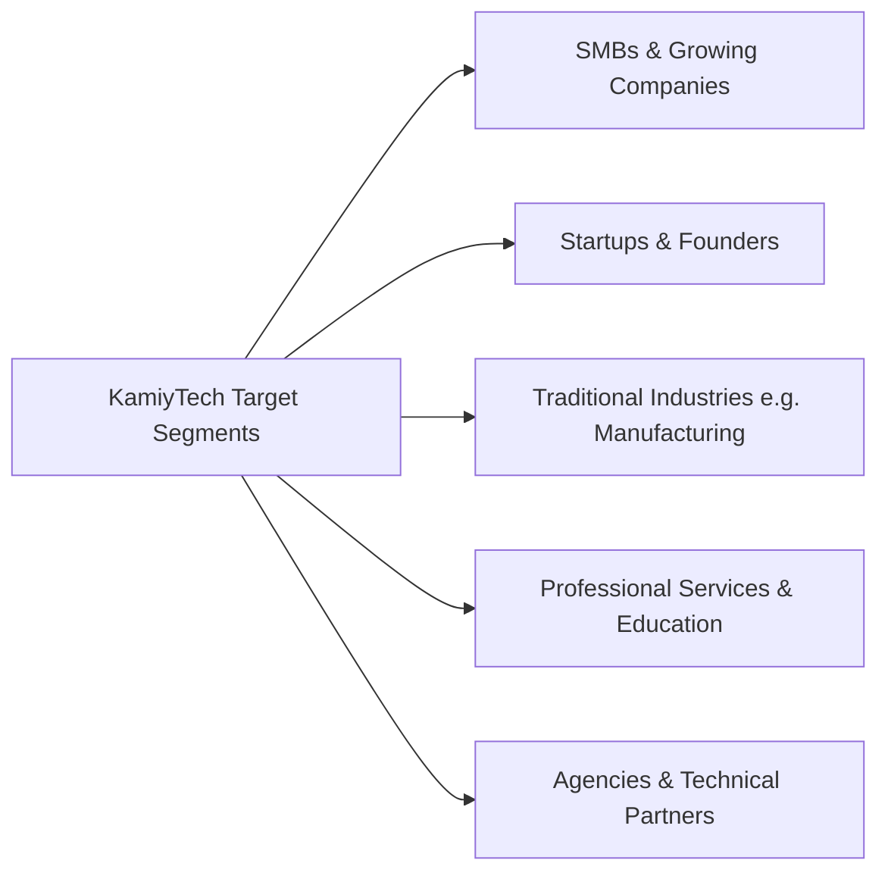

# KAMIYTECH STRATEGIC POSITIONING & VALUE PROPOSITION
> **COMMERCIAL CORE DOCUMENT P1.1**

> **DOCUMENT METADATA**
> - **Purpose:** Establish KamiyTech's official market positioning, Ideal Customer Profiles (ICPs), Unique Selling Proposition (USP) matrix, industry messaging, and brand tone of voice.
> - **Owner:** Chief Marketing Officer (CMO) & Chief Executive Officer (CEO)
> - **Version:** 1.1.0
> - **Status:** APPROVED / LIVE
> - **Dependencies:** Founder Strategic Directives (`v2.0.0`)
> - **Review Schedule:** Quarterly Strategy Audit
> - **Related Documents:** [index.md](file:///c:/Users/abhis/OneDrive/Desktop/kamiytechAI/knowledge_base/index.md), [P1.2_rate_card_and_pricing_framework.md](file:///c:/Users/abhis/OneDrive/Desktop/kamiytechAI/knowledge_base/P1.2_rate_card_and_pricing_framework.md), [P1.4_service_catalog.md](file:///c:/Users/abhis/OneDrive/Desktop/kamiytechAI/knowledge_base/P1.4_service_catalog.md)

---

## 1. Core Positioning Statement

> **"KamiyTech is a full-service technology solutions consultancy that designs, builds, and automates high-performance digital products for growth-focused businesses, modernizing operations through custom software, web platforms, mobile apps, and enterprise AI."**

### Strategic Market Positioning
KamiyTech bridges the gap between **freelance budget constraints** and **overpriced legacy enterprise agencies**. We provide enterprise-grade software engineering, modern aesthetic design, and AI-driven automation with the agility, transparency, and cost-effectiveness required by growing SMBs, mid-market companies, and ambitious startups.

---

## 2. Ideal Customer Profiles (ICPs) & Target Personas



### ICP 1: Small & Medium Businesses (SMBs) & Growing Companies
* **Characteristics:** Growing annual revenue; 10–100 employees; operating with legacy manual processes or outdated websites.
* **Key Decision Maker:** Founder, Managing Director, COO, or VP of Operations.
* **Core Pain Points:** Disjointed tools, slow manual data entry, customer churn due to poor digital experience, high operational overhead.
* **KamiyTech Solution:** End-to-end digital modernization: custom web portals, automated business workflows, mobile field apps, integrated database management.

### ICP 2: Tech Startups & Product Founders
* **Characteristics:** Seed to Series A funded; fast-moving product roadmaps; tight release deadlines; lean technical team.
* **Key Decision Maker:** Founder, CEO, CTO, or Head of Product.
* **Core Pain Points:** Lack of senior engineering bandwidth, slow MVP launch velocity, unscalable codebase, high in-house developer hiring cost.
* **KamiyTech Solution:** Dedicated engineering pods (Next.js, FastAPI, PostgreSQL), AI feature integration, rapid MVP build and scale-up.

### ICP 3: Traditional Industries (Manufacturing, Logistics, Real Estate)
* **Characteristics:** Operations-heavy businesses with legacy ERP/CRM reliance, paper-based workflows, and fragmented logistics data.
* **Key Decision Maker:** General Manager, VP Supply Chain, Operations Lead.
* **Core Pain Points:** Lack of real-time visibility, inventory tracking friction, manual client reporting, siloed legacy software.
* **KamiyTech Solution:** Custom web/mobile dashboards, IoT/API integrations, automated inventory & workflow engines, bespoke internal software tools.

### ICP 4: Professional Service Firms & Educational Institutions
* **Characteristics:** Consultancies, law firms, accounting practices, schools, and online training platforms.
* **Key Decision Maker:** Managing Partner, Executive Director, IT Director.
* **Core Pain Points:** Outdated web presence, manual client/student onboarding, inefficient scheduling, lack of secure client portals.
* **KamiyTech Solution:** Premium corporate websites, custom student/client portals, automated billing & booking workflows, LMS setup.

---

## 3. Industry-Specific Value Proposition Matrix

| Target Industry | Primary Customer Goal | Key Technical Deliverable | Primary Business Outcome |
| :--- | :--- | :--- | :--- |
| **Manufacturing** | Real-time supply & inventory visibility | Web Dashboard + Mobile Field App + Database | 35% reduction in inventory tracking errors |
| **Education** | Seamless student onboarding & portal | Next.js Student Portal + Supabase/PostgreSQL | 50% faster enrollment processing |
| **Healthcare** | Secure patient scheduling & portals | HIPAA-compliant Web App + Automated Reminders | 40% reduction in missed appointments |
| **Retail / E-commerce** | High-converting headless storefront | Next.js Headless Store + Stripe/Razorpay/MongoDB | 2.5x website load speed & higher checkout conversion |
| **Logistics** | Automated fleet tracking & dispatch | Mobile Driver App + Web Dispatch Console | 20% reduction in route dispatch latency |
| **Professional Services** | Premium client portal & onboarding | React/Node.js Custom Client Portal | Elevated brand prestige & reduced admin hours |

---

## 4. Competitive Differentiators (Why KamiyTech?)

1. **Enterprise Standards at Agency Speed:** We enforce strict code reviews, CI/CD automated deployments, and modular architecture (Next.js, FastAPI) without bureaucratic enterprise overhead.
2. **AI-First Automation Mindset:** We don't just build websites or apps; we embed AI workflows (OpenAI, Gemini, LangChain) into client processes to reduce recurring manual labor.
3. **Agile Partner-Backed Scale:** Supported by a trusted network of specialized domain experts in engineering, creative design, and digital growth, allowing us to scale team capacity dynamically.
4. **Transparent Hybrid Pricing:** Clear fixed-price scopes for predictable budgets, combined with value-driven retainer models for continuous enhancement—no hidden fee surprises.

---

## 5. Brand Tone of Voice & Messaging Principles

```
  [AUTHORITATIVE & EXPERT] ───► Clear, confident technical leadership without esoteric jargon.
  [PRAGMATIC & VALUE-DRIVEN] ───► Focus heavily on ROI, operational hours saved, and revenue growth.
  [TRANSPARENT & DIRECT] ────────► Direct answers, realistic project timelines, strict accountability.
  [PREMIUM & MODERN] ────────────► Cutting-edge aesthetics, seamless UI/UX, enterprise polish.
```

### Elevator Pitch (30-Second Version)
> *"At KamiyTech, we build high-impact custom software, web platforms, and AI automation systems that turn operational complexity into business growth. Whether you need an enterprise web app, a mobile application, or a fully automated workflow, we combine modern engineering with strategic design to help your company scale seamlessly."*

---
*End of Strategic Positioning & Value Proposition (P1.1 v1.1.0). Maintained by CMO & CEO.*
