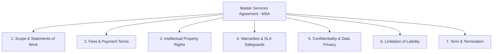

# KAMIYTECH MASTER LEGAL FRAMEWORK
> **COMMERCIAL CORE DOCUMENT P1.3**

> **DOCUMENT METADATA**
> - **Purpose:** Provide complete legal contract structures, Master Services Agreement (MSA) standards, Statement of Work (SOW) templates, Non-Disclosure Agreements (NDA), and Subcontractor Partner Agreements for KamiyTech.
> - **Owner:** Legal & Compliance & Chief Financial Officer (CFO)
> - **Version:** 1.1.0
> - **Status:** APPROVED / LIVE
> - **Dependencies:** Founder Strategic Directives (`v2.0.0`), `P1.2_rate_card_and_pricing_framework.md`
> - **Review Schedule:** Annual Legal Audit
> - **Related Documents:** [index.md](file:///c:/Users/abhis/OneDrive/Desktop/kamiytechAI/knowledge_base/index.md), [P1.2_rate_card_and_pricing_framework.md](file:///c:/Users/abhis/OneDrive/Desktop/kamiytechAI/knowledge_base/P1.2_rate_card_and_pricing_framework.md), [P1.4_service_catalog.md](file:///c:/Users/abhis/OneDrive/Desktop/kamiytechAI/knowledge_base/P1.4_service_catalog.md)

---

## 1. Master Services Agreement (MSA) Core Standard Clauses



### Clause 1: Intellectual Property (IP) Ownership & Transfer
* **Rule:** Upon 100% full payment of all contract fees, KamiyTech irrevocably transfers and assigns to the Client all custom code, graphics, documentation, and specific deliverables authored uniquely for the Client under the applicable SOW.
* **Pre-Existing IP Reserve:** KamiyTech retains sole ownership over all pre-existing frameworks, generic code libraries, reusable tools, UI components, AI prompts, and software utilities developed prior to or independently of the project. Client is granted a non-exclusive, perpetual, royalty-free license to use such pre-existing IP embedded within the deliverable.

### Clause 2: Payment Terms & Default Remedies
* **Net Terms:** All invoices are due Net 14 days from invoice date unless specified otherwise in the SOW.
* **Work Suspension:** If an invoice remains unpaid past 14 days, KamiyTech reserves the right to suspend development, revoke staging environment access, and pause deployment timelines without liability until accounts are brought current.

### Clause 3: Warranties & Bug Fix Guarantee Period
* **Warranty Period:** KamiyTech provides a **30-day post-launch warranty** starting from official production deployment.
* **Coverage:** During the warranty period, KamiyTech will repair, at zero additional cost, any reproducible code bugs or discrepancies between the live system and the agreed SOW functional specifications.
* **Exclusions:** Excludes third-party API outages, client code modifications, host environment failures, or new feature additions requested post-launch.

### Clause 4: Limitation of Liability
* **Liability Cap:** KamiyTech's total cumulative financial liability arising out of or related to any agreement, contract breach, or technical failure shall strictly not exceed the total fees paid by the Client to KamiyTech under the specific SOW in the **three (3) months** preceding the claim.
* **Consequential Losses:** Under no circumstances shall KamiyTech be liable for indirect, incidental, punitive, or consequential damages (including loss of revenue, profit, data, or business interruption).

---

## 2. Statement of Work (SOW) Standard Structure Template

Every project engagement must execute a formal SOW utilizing this standard template:

```markdown
# STATEMENT OF WORK (SOW) #[SOW-NUMBER]
**Project Title:** [Project Name]  
**Client Legal Entity:** [Client Company Name]  
**Effective Date:** [Date]  
**Associated MSA Date:** [MSA Signing Date]  

### 1. Executive Summary & Deliverable Scope
[Detailed summary of custom software / web / mobile / AI solution being built]

### 2. Functional Requirements & Technical Deliverables
- Deliverable 1: [Specific component e.g., Next.js Frontend Storefront]
- Deliverable 2: [Specific component e.g., FastAPI Backend & PostgreSQL DB]
- Deliverable 3: [Specific component e.g., OpenAI API Custom RAG Engine]

### 3. Out-of-Scope Items
[Explicit list of features or services NOT included to prevent scope creep]

### 4. Milestones, Delivery Schedule & Fees
| Milestone | Deliverable / Acceptance Target | Payment % | Fee (INR ₹) | Targeted Date |
| :--- | :--- | :---: | :---: | :--- |
| **M1: Kickoff** | Signed SOW + Architecture Blueprint | 40% | ₹X,XX,XXX | YYYY-MM-DD |
| **M2: Staging** | Staging Environment & QA Demo Pass | 30% | ₹X,XX,XXX | YYYY-MM-DD |
| **M3: Production**| Production Deployment & Handover | 30% | ₹X,XX,XXX | YYYY-MM-DD |

*(Note: Single-Page Landing Pages use 50% Deposit / 50% Handover milestone schedule)*

### 5. Client Obligations
- Provide API credentials, branding assets, and feedback within 48 business hours of request.

### 6. Signatures
**KamiyTech Representative:** ___________________  **Date:** ________
**Client Representative:** ______________________  **Date:** ________
```

---

## 3. Subcontractor & Specialist Partner Agreement Standards

To execute our vision of scaling through a trusted partner network, every contractor or specialist agency must sign the **KamiyTech Subcontractor Master Agreement**:

1. **Automatic IP Assignment:** All work, code, designs, and technical documentation produced by the subcontractor for KamiyTech clients immediately become the sole, exclusive intellectual property of KamiyTech.
2. **Strict Non-Solicitation:** Subcontractors are strictly prohibited from soliciting, contacting, or directly contracting with any KamiyTech client during the contract term and for **twenty-four (24) months** post-termination. Violations carry a mandatory liquidated damages penalty equal to 100% of contract deal value.
3. **Confidentiality & Client Protection:** Subcontractors must work under white-label terms (using `@kamiytech.com` credentials when interacting with clients) and sign strict NDAs regarding client data and internal SOPs.

---
*End of Master Legal Framework (P1.3 v1.1.0). Maintained by Legal & CFO.*
