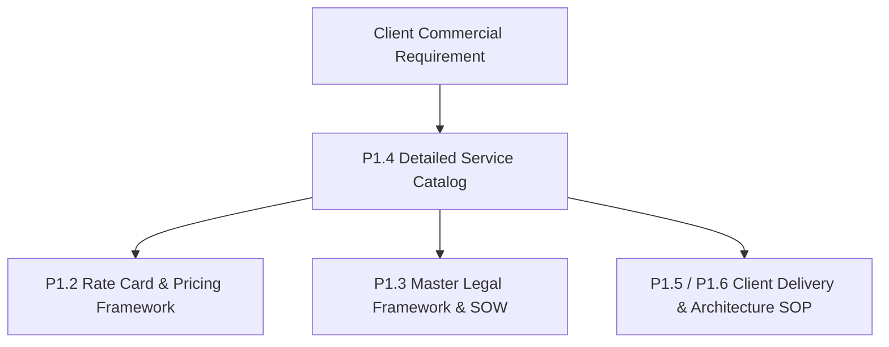

# KAMIYTECH DETAILED SERVICE CATALOG
> **COMMERCIAL CORE DOCUMENT P1.4**

> **DOCUMENT METADATA**
> - **Purpose:** Define every official KamiyTech service offering in technical and operational detail, outlining purpose, business problems solved, scope boundaries, tangible deliverables, client responsibilities, executive ownership, dependencies, and out-of-scope exclusions.
> - **Owner:** Chief Executive Officer (CEO), Chief Technology Officer (CTO), & Chief Operating Officer (COO)
> - **Version:** 1.0.0
> - **Status:** APPROVED / LIVE
> - **Dependencies:** `P1.1_positioning_and_value_prop.md`, `P1.2_rate_card_and_pricing_framework.md`, `P1.3_master_legal_framework.md`
> - **Review Schedule:** Bi-Annual Operational Audit
> - **Related Documents:** [index.md](file:///c:/Users/abhis/OneDrive/Desktop/kamiytechAI/knowledge_base/index.md), [P1.1_positioning_and_value_prop.md](file:///c:/Users/abhis/OneDrive/Desktop/kamiytechAI/knowledge_base/P1.1_positioning_and_value_prop.md), [P1.2_rate_card_and_pricing_framework.md](file:///c:/Users/abhis/OneDrive/Desktop/kamiytechAI/knowledge_base/P1.2_rate_card_and_pricing_framework.md), [P1.3_master_legal_framework.md](file:///c:/Users/abhis/OneDrive/Desktop/kamiytechAI/knowledge_base/P1.3_master_legal_framework.md)

---

## 1. SERVICE CATALOG ARCHITECTURE & GOVERNANCE

This document establishes the official Service Catalog for KamiyTech. Every client proposal, Statement of Work (SOW), and project delivery milestone must align with the service definitions, deliverables, and scope boundaries codified herein.

*Note on Commercial Terms & Pricing:* All commercial rates, fixed-price packages, retainer tiers, discount thresholds, and milestone billing schedules are explicitly governed by **[P1.2 Rate Card & Pricing Framework](file:///c:/Users/abhis/OneDrive/Desktop/kamiytechAI/knowledge_base/P1.2_rate_card_and_pricing_framework.md)**. Pricing references throughout this catalog defer directly to P1.2.

---

## 2. WEB SOLUTIONS & DIGITAL PLATFORMS

### 2.1 Single-Page Landing Website
- **Purpose:** Provide an entry-level, conversion-optimized digital front door designed to turn visitor traffic into verified leads or instant customer actions.
- **Business Problem Solved:** Eliminates high customer bounce rates, outdated digital presences, and complex multi-page navigation for single-product launches, local service businesses, or ad campaign destinations.
- **Scope:**
  - 1 long-scroll responsive landing page (Hero, Features/Services, About, Social Proof, CTA, Contact).
  - Modern UI built with Next.js/React or WordPress + Tailwind CSS.
  - Integration of lead capture form and instant WhatsApp chat widget.
  - On-page SEO meta tags, mobile responsiveness, and page speed optimization (<1.5s load target).
- **Deliverables:** Fully deployed single-page website on client Vercel/hosting account, source code repository access, configured lead capture form, and 1-hour CMS training session.
- **Client Responsibilities:** Provide brand logo, high-resolution media assets, approved copy text, domain access, and DNS setup authorization.
- **Internal Ownership:** Creative Director (UI/UX) & Senior Full-Stack Engineer.
- **Dependencies:** Approved client domain name, hosting infrastructure account, and brand kit.
- **Out-of-Scope Items:** Multi-page expansion, payment gateway integration, custom database architecture, multi-language support, custom backend APIs.
- **Pricing Reference:** Governed by **[P1.2 Rate Card §3.1](file:///c:/Users/abhis/OneDrive/Desktop/kamiytechAI/knowledge_base/P1.2_rate_card_and_pricing_framework.md)** *(Single-Page Landing Website Tier)*.

---

### 2.2 Starter Multi-Page Web Solution
- **Purpose:** Build a complete, structured corporate or small business web presence establishing brand authority and multi-service clarity.
- **Business Problem Solved:** Replaces fragmented information and outdated static websites with a modern, structured multi-page platform that captures inbound search traffic and builds market credibility.
- **Scope:**
  - Custom 5–7 page website structure (Home, About Us, Services, Portfolio/Case Studies, Blog, Contact).
  - Built on Next.js/React + Tailwind CSS with Headless CMS or WordPress integration.
  - On-page SEO optimization, contact form routing, lead capturing, and Google Analytics setup.
  - Cross-browser compatibility and full mobile responsiveness.
- **Deliverables:** Production web application, CMS access credentials, GitHub repository access, analytics integration, and CMS editor documentation.
- **Client Responsibilities:** Timely content provision (page copy, images, case study details), domain/DNS access, and milestone signoffs within 5 business days.
- **Internal Ownership:** Lead Full-Stack Engineer & Technical Project Manager (TPM).
- **Dependencies:** Signed SOW, clearance of 40% initial deposit, domain name ownership.
- **Out-of-Scope Items:** E-commerce checkout, user portal login/registration, third-party ERP integration, custom API development.
- **Pricing Reference:** Governed by **[P1.2 Rate Card §3.1](file:///c:/Users/abhis/OneDrive/Desktop/kamiytechAI/knowledge_base/P1.2_rate_card_and_pricing_framework.md)** *(Starter Web Tier)*.

---

### 2.3 Business Web Platform & Headless E-commerce
- **Purpose:** Deliver a high-performance web platform integrated with dynamic content engines, payment processing, or headless e-commerce capabilities.
- **Business Problem Solved:** Resolves slow page load speeds, checkout abandonments, and rigid legacy e-commerce limitations that hinder revenue growth for scaling businesses.
- **Scope:**
  - Custom 10–15 page Next.js platform or Headless Storefront (Shopify Headless / WooCommerce API).
  - Razorpay / PhonePe / Paytm / Stripe payment gateway integration with automated invoicing.
  - Client portal / booking engine / custom lead capture workflows with WhatsApp automated notifications.
  - High-speed performance tuning (<1.5s load speed) and full SEO engine setup.
- **Deliverables:** Production Next.js e-commerce or platform build, integrated payment webhooks, database setup, admin management console, and deployment pipeline configuration.
- **Client Responsibilities:** Product catalog data (SKUs, pricing, images), payment gateway merchant account setup, shipping partner API keys, and regulatory compliance documents.
- **Internal Ownership:** Enterprise Solutions Architect & Senior Full-Stack Engineer.
- **Dependencies:** Merchant API credentials (Razorpay/Stripe), product catalog database, domain/hosting configuration.
- **Out-of-Scope Items:** Native mobile application development, warehouse inventory hardware integration, custom ERP building.
- **Pricing Reference:** Governed by **[P1.2 Rate Card §3.1](file:///c:/Users/abhis/OneDrive/Desktop/kamiytechAI/knowledge_base/P1.2_rate_card_and_pricing_framework.md)** *(Business Platform Tier)*.

---

### 2.4 Enterprise Web Application & SaaS MVP
- **Purpose:** Architect and construct complex custom web applications, multi-tenant SaaS platforms, or proprietary business software engines.
- **Business Problem Solved:** Eliminates reliance on off-the-shelf software constraints, enabling companies to build proprietary IP, automate multi-department workflows, and launch monetizable SaaS products.
- **Scope:**
  - End-to-end custom SaaS MVP or enterprise application (Next.js frontend, Node.js / FastAPI backend).
  - Multi-tenant PostgreSQL / Supabase / MongoDB database architecture.
  - Role-Based Access Control (RBAC) for Admin, Staff, and Client roles.
  - Custom REST/GraphQL API suite, third-party software sync, automated subscription billing, and enterprise audit logging.
- **Deliverables:** Full source code repository, technical database schema documentation, CI/CD deployment pipeline, production environment setup on AWS/Vercel, and API documentation.
- **Client Responsibilities:** Product requirement specifications, user workflow approval, third-party API subscription ownership, and UAT (User Acceptance Testing) signoff.
- **Internal Ownership:** Enterprise Solutions Architect & Chief Technology Officer (CTO).
- **Dependencies:** Technical architecture approval ([P1.5 / P1.6 Guidelines](file:///c:/Users/abhis/OneDrive/Desktop/kamiytechAI/knowledge_base/P1.5_engineering_architecture_guidelines.md)), AWS/Vercel cloud account access.
- **Out-of-Scope Items:** Legacy data extraction from un-API'd physical mainframes, ongoing 24/7 infrastructure monitoring (unless covered under retainer).
- **Pricing Reference:** Governed by **[P1.2 Rate Card §3.1](file:///c:/Users/abhis/OneDrive/Desktop/kamiytechAI/knowledge_base/P1.2_rate_card_and_pricing_framework.md)** *(Enterprise Web App Tier)*.

---

## 3. AI SOLUTIONS & BUSINESS AUTOMATION

### 3.1 Starter Business Workflow Automation
- **Purpose:** Automate repetitive manual data entry, lead qualification, and cross-platform notifications using modern integration engines and light AI models.
- **Business Problem Solved:** Eliminates human data entry errors, slow customer response times, and manual copying of information across disparate business tools.
- **Scope:**
  - 2–3 core business workflow automations utilizing Make, n8n, or custom Python scripts.
  - Integration across CRM (HubSpot/Zoho), Google Workspace, Email, and payment webhooks.
  - AI-assisted lead qualification or content parsing bot using OpenAI / Gemini APIs.
  - WhatsApp Business API trigger notifications (e.g., instant lead alerts to sales reps).
- **Deliverables:** Configured automation scenarios/scripts, API webhook connections, process documentation, and operational monitoring dashboard setup.
- **Client Responsibilities:** Provide access tokens/API keys for target software accounts, define business rules and escalation pathways.
- **Internal Ownership:** Senior AI & Automation Specialist.
- **Dependencies:** Active third-party software subscriptions (Make/n8n/OpenAI API accounts).
- **Out-of-Scope Items:** Custom LLM fine-tuning, complex on-premise server deployment, manual historical data cleaning.
- **Pricing Reference:** Governed by **[P1.2 Rate Card §3.2](file:///c:/Users/abhis/OneDrive/Desktop/kamiytechAI/knowledge_base/P1.2_rate_card_and_pricing_framework.md)** *(Starter Automation Tier)*.

---

### 3.2 Enterprise AI & RAG Knowledge Suite
- **Purpose:** Build proprietary Retrieval-Augmented Generation (RAG) knowledge bots, document search engines, and multi-system data processing AI pipelines.
- **Business Problem Solved:** Solves internal information silos, slow customer support resolution times, and manual analysis of extensive PDF/document repositories.
- **Scope:**
  - Custom RAG architecture connecting enterprise documents (PDFs, docs, databases) to LLMs.
  - Vector database implementation (Supabase Vector / Pinecone) with LangChain or LlamaIndex pipelines.
  - Web & WhatsApp chatbot widgets with human-in-the-loop fallback admin interfaces.
  - Automated multi-system data extraction, document indexing, and PDF report generation pipelines.
- **Deliverables:** Deployed AI RAG system, vector database setup, custom administrative dashboard, system prompt architecture, and enterprise data privacy configurations.
- **Client Responsibilities:** Provide clean documentation repositories, define query permissions, cover direct LLM API token consumption costs.
- **Internal Ownership:** Senior AI & Automation Specialist & Chief Information Officer (CIO).
- **Dependencies:** OpenAI / Anthropic / Gemini API credentials, vector storage provisioning, security compliance clearance.
- **Out-of-Scope Items:** Hardware AI model training on local GPU clusters (unless explicitly scoped in custom SOW).
- **Pricing Reference:** Governed by **[P1.2 Rate Card §3.2](file:///c:/Users/abhis/OneDrive/Desktop/kamiytechAI/knowledge_base/P1.2_rate_card_and_pricing_framework.md)** *(Enterprise AI Suite Tier)*.

---

## 4. MOBILE APPLICATION DEVELOPMENT

### 4.1 Starter Cross-Platform Mobile App
- **Purpose:** Develop cost-effective, high-performance cross-platform mobile applications for iOS and Android using a single unified codebase.
- **Business Problem Solved:** Reduces mobile app development costs by 40–50% while ensuring simultaneous presence on Apple App Store and Google Play Store.
- **Scope:**
  - Cross-platform mobile app built with React Native or Flutter.
  - 5–10 core screens with responsive mobile UI/UX design.
  - Mobile OTP authentication (Firebase / Msg91 / Fast2SMS) and push notification engine.
  - REST API synchronization with backend web platform.
- **Deliverables:** Compiled iOS (.ipa) and Android (.apk/.aab) binaries, production source code repository, App Store / Play Store submission support.
- **Client Responsibilities:** Apple Developer Account ($99/yr) and Google Play Console ($25 one-time) ownership, app store listing text and privacy policies.
- **Internal Ownership:** Mobile Application Engineer & Creative Director.
- **Dependencies:** Client developer portal accounts, backend REST APIs.
- **Out-of-Scope Items:** Bluetooth low-energy (BLE) custom firmware programming, complex 3D mobile gaming engines.
- **Pricing Reference:** Governed by **[P1.2 Rate Card §3.3](file:///c:/Users/abhis/OneDrive/Desktop/kamiytechAI/knowledge_base/P1.2_rate_card_and_pricing_framework.md)** *(Starter Mobile App Tier)*.

---

### 4.2 Enterprise Mobile Suite & Multi-App Ecosystem
- **Purpose:** Construct comprehensive multi-app mobile ecosystems (e.g., Dual Customer App + Partner/Driver App + Admin Web Dashboard).
- **Business Problem Solved:** Powers complex logistics, multi-vendor delivery, field operations, and real-time service marketplaces requiring live tracking and instant coordination.
- **Scope:**
  - Dual mobile applications (Customer App + Field Partner/Vendor App).
  - Integration of payment gateways (Razorpay, PhonePe, Cashfree, Paytm UPI).
  - Real-time location tracking, live WebSocket notifications, and offline data sync.
  - Custom Admin Web Dashboard for central dispatch, monitoring, and analytics.
- **Deliverables:** Dual mobile app builds (iOS & Android), admin web dashboard portal, WebSocket server architecture, source code repositories, and app store deployment.
- **Client Responsibilities:** Merchant gateway registration, SMS gateway account funding, third-party mapping API keys (Google Maps / MapmyIndia).
- **Internal Ownership:** Enterprise Solutions Architect & Mobile Application Engineer.
- **Dependencies:** Google Maps API credentials, payment gateway keys, server infrastructure setup.
- **Out-of-Scope Items:** Hardware GPS tracker device manufacturing or firmware installation.
- **Pricing Reference:** Governed by **[P1.2 Rate Card §3.3](file:///c:/Users/abhis/OneDrive/Desktop/kamiytechAI/knowledge_base/P1.2_rate_card_and_pricing_framework.md)** *(Enterprise Mobile Suite Tier)*.

---

## 5. CUSTOM ENTERPRISE SYSTEMS & UI/UX DESIGN

### 5.1 Custom ERP / CRM Systems
- **Purpose:** Design and build tailored Enterprise Resource Planning (ERP) or Customer Relationship Management (CRM) platforms aligned with specific business processes.
- **Business Problem Solved:** Replaces rigid off-the-shelf ERP subscription costs and uncustomizable software with a tailored operational platform owned 100% by the business.
- **Scope:**
  - Custom modules: Sales Pipeline CRM, Inventory Management, HR & Attendance, Invoicing & GST compliance, Supplier Management.
  - Role-based multi-user permissions, automated PDF generation, and exportable financial/operational reports.
  - Database architecture designed for high scalability and secure data backup.
- **Deliverables:** Fully deployed custom ERP/CRM web platform, database schema documentation, user role setup, and comprehensive staff training materials.
- **Client Responsibilities:** Provide workflow mapping specifications, sample business forms/invoices, legacy data export files (Excel/Tally).
- **Internal Ownership:** CTO & Enterprise Solutions Architect.
- **Dependencies:** Legacy data mapping clearance, cloud server provisioning.
- **Out-of-Scope Items:** Physical inventory counting, hardware barcode scanner supply.
- **Pricing Reference:** Governed by **[P1.2 Rate Card §3.4 / §1](file:///c:/Users/abhis/OneDrive/Desktop/kamiytechAI/knowledge_base/P1.2_rate_card_and_pricing_framework.md)** *(Custom Software Engagements)*.

---

### 5.2 UI/UX Design & Brand System
- **Purpose:** Create modern, user-centric visual identities, Figma design systems, interactive UI prototypes, and cohesive brand design tokens.
- **Business Problem Solved:** Eliminates poor user conversion, inconsistent brand assets, and developer friction by providing production-ready design tokens and interactive prototypes.
- **Scope:**
  - User journey mapping, wireframing, and interactive Figma prototyping.
  - Visual brand design tokens (color palettes, typography scales, glassmorphism UI components).
  - Design asset library export for web and mobile platforms.
- **Deliverables:** Master Figma file with interactive prototypes, visual style guide, exported SVG/PNG asset packages, and design token documentation.
- **Client Responsibilities:** Provide brand background, target audience profiles, design references, and prompt feedback on wireframe milestones.
- **Internal Ownership:** Creative Director & Senior UI/UX Designer.
- **Dependencies:** Initial kickoff design intake alignment.
- **Out-of-Scope Items:** Physical print collateral manufacturing, video animation production.
- **Pricing Reference:** Governed by **[P1.2 Rate Card §2](file:///c:/Users/abhis/OneDrive/Desktop/kamiytechAI/knowledge_base/P1.2_rate_card_and_pricing_framework.md)** *(Design Role Rates & Custom Packages)*.

---

## 6. MAINTENANCE RETAINERS & DEDICATED PODS

### 6.1 Monthly Maintenance & Support Retainers
- **Purpose:** Provide continuous technical support, infrastructure maintenance, security patching, and proactive performance optimization.
- **Business Problem Solved:** Prevents website downtime, unpatched security vulnerabilities, broken payment gateways, and unexpected technical failures post-launch.
- **Scope & Tiers:**
  - **Essential Care:** SSL & domain check, daily database backups, core security updates, 5 hrs/mo minor tweaks, 24hr SLA.
  - **Growth Care:** Essential + speed optimization, feature additions, Payment Gateway & WhatsApp API maintenance, 15 hrs/mo support, 8hr SLA.
  - **Enterprise Managed:** Dedicated TPM, 2hr SEV-1 emergency response SLA, security audits, feature development sprints, 35 hrs/mo support.
- **Deliverables:** Monthly maintenance logs, uptime reports, security audit summaries, and completed support ticket items.
- **Client Responsibilities:** Submit tickets via designated support channels, maintain active retainer payments upfront.
- **Internal Ownership:** Customer Success Lead & DevOps Engineer.
- **Dependencies:** Active Maintenance Retainer Agreement ([P1.3 / P3.1](file:///c:/Users/abhis/OneDrive/Desktop/kamiytechAI/knowledge_base/P3.1_maintenance_retainer_and_sla_sop.md)).
- **Out-of-Scope Items:** Complete product redesigns or major architectural rewrites under routine maintenance hours.
- **Pricing Reference:** Governed by **[P1.2 Rate Card §4](file:///c:/Users/abhis/OneDrive/Desktop/kamiytechAI/knowledge_base/P1.2_rate_card_and_pricing_framework.md)** *(Retainer Tiers)*.

---

### 6.2 Dedicated Developer / Engineering Pod
- **Purpose:** Supply a dedicated, full-time engineering squad (Full-Stack, Mobile, AI, DevOps, TPM) operating as an extension of the client's internal team.
- **Business Problem Solved:** Eliminates high in-house developer hiring costs, lengthy recruitment cycles, and team management overhead for scaling tech companies.
- **Scope:**
  - Dedicated monthly allocation of specialized engineering bandwidth.
  - Direct integration into client's Slack, GitHub, Jira/Linear, and daily agile standups.
  - Sprint planning, continuous integration, and rapid code deployment.
- **Deliverables:** Weekly sprint production releases, pull request code submissions, technical documentation, and weekly progress reports.
- **Client Responsibilities:** Provide product direction, sprint backlog priorities, and daily developer sync participation.
- **Internal Ownership:** COO & CTO.
- **Dependencies:** Execution of Dedicated Pod SOW, monthly upfront retainer payment.
- **Out-of-Scope Items:** Permanent employment transfer of developers without formal buyout agreement.
- **Pricing Reference:** Governed by **[P1.2 Rate Card §1](file:///c:/Users/abhis/OneDrive/Desktop/kamiytechAI/knowledge_base/P1.2_rate_card_and_pricing_framework.md)** *(Dedicated Developer Pod Model)*.

---
*End of Detailed Service Catalog (P1.4 v1.0.0). Maintained by CEO, CTO & COO.*
