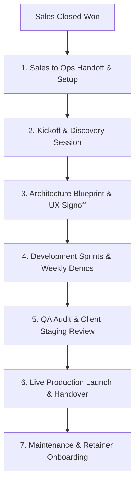

# KAMIYTECH CLIENT ONBOARDING & PROJECT DELIVERY SOP
> **COMMERCIAL CORE DOCUMENT P1.5**

> **DOCUMENT METADATA**
> - **Purpose:** Standardize the end-to-end client delivery lifecycle—from closed sales contract handoff to discovery, kickoff, sprint execution, QA testing, production deployment, and maintenance transition.
> - **Owner:** Chief Operating Officer (COO), Technical Project Manager (TPM), & Customer Success
> - **Version:** 1.1.0
> - **Status:** APPROVED / LIVE
> - **Dependencies:** Founder Strategic Directives (`v2.0.0`), `P1.2_rate_card_and_pricing_framework.md`, `P1.3_master_legal_framework.md`, `P1.4_service_catalog.md`
> - **Review Schedule:** Bi-Annual Operational Review
> - **Related Documents:** [index.md](file:///c:/Users/abhis/OneDrive/Desktop/kamiytechAI/knowledge_base/index.md), [P1.4_service_catalog.md](file:///c:/Users/abhis/OneDrive/Desktop/kamiytechAI/knowledge_base/P1.4_service_catalog.md), [P1.6_engineering_architecture_guidelines.md](file:///c:/Users/abhis/OneDrive/Desktop/kamiytechAI/knowledge_base/P1.6_engineering_architecture_guidelines.md)

---

## 1. Master Delivery Lifecycle Map



---

## 2. Phase 1: Onboarding & Kickoff Protocols (Days 1–5)

### Step 1.1: Sales-to-Ops Handoff Package (Within 24 Hours of Deal Closure)
Sales transfers the following assets to the Technical Project Manager (TPM):
* Signed MSA & SOW.
* Received 40% initial deposit invoice payment confirmation (or 50% for Landing Pages).
* Client key contact details & project scope notes.
* Initial client assets (logos, credentials, content files).

### Step 1.2: Client Environment Provisioning (Day 2)
The COO/TPM provisions the project infrastructure:
* Create private GitHub repository (`kamiytech/[client-name]-[project]`).
* Create Slack/WhatsApp client communication channel (`#ext-[client]-kamiytech`).
* Create Figma project workspace & Notion client dashboard portal.
* Send automated **Client Welcome Package & Discovery Questionnaire**.

### Step 1.3: Official Kickoff Meeting Agenda (60 Mins - Day 4)
* **00–10 min:** Team introductions & role clarification.
* **10–25 min:** Review SOW scope, objectives, and acceptance criteria.
* **25–40 min:** Technical discovery (credential requirements, API keys, third-party systems).
* **40–55 min:** Communication guidelines, weekly demo schedule, milestone targets.
* **55–60 min:** Q&A and next steps signoff.

---

## 3. Phase 2: Sprint Execution & Quality Control

### Weekly Client Communication Cadence
1. **Asynchronous Async Status Update (Every Monday by 10 AM):** 
   - Summary of completed tasks from prior week.
   - Target milestones for current week.
   - Required client inputs or approvals needed (highlighting blockers).
2. **Bi-Weekly Live Demo Sync (30 Mins):**
   - Live walkthrough of completed features on the staging server (`https://[client]-staging.kamiytech.app`).

### Pre-Release Quality Assurance (QA) Gate Check
Before any staging build is presented to the client, the QA Lead must verify:
- [ ] **Cross-Browser & Device Test:** Responsive check across Desktop (Chrome, Safari), Mobile (iOS, Android).
- [ ] **Performance Check:** Google Lighthouse performance score > **85** on desktop/mobile.
- [ ] **Functional Form Check:** All contact forms, checkout flows, and API requests execute cleanly without errors.
- [ ] **Console Hygiene:** Zero unhandled JavaScript errors in browser developer console.

---

## 4. Phase 3: Production Deployment & Handover SOP

```
   [STAGING APPROVAL] ──► [CLIENT SIGNOFF] ──► [QA FINAL SCAN] ──► [PRODUCTION LAUNCH]
```

### Step 4.1: Pre-Launch Readiness Checklist (48 Hours Prior to Launch)
* Verify client final payment (30% final milestone invoice issued & cleared).
* Domain DNS configuration (Cloudflare / Vercel / AWS Route53).
* SSL Certificate provisioning and enforcement.
* Production environment secrets (`.env.production`) updated with live API keys.
* Database backup snapshot taken before live migration.

### Step 4.2: Official Handover Deliverables Package
Upon live deployment, the client is delivered:
1. **System Admin Credentials:** Master admin access to CMS, Cloud Console, and APIs.
2. **User Documentation Guide:** Video walkthrough & PDF admin guide on how to manage site content or software tools.
3. **Written Handover & Acceptance Signoff Document:** Executed client signoff marking completion of SOW and initiation of the 30-day warranty period.

---

## 5. Phase 4: Maintenance Retainer Transition

During **Week 3 of the 30-Day Warranty Period**, the Customer Success Lead conducts a **Project Wrap-Up & Maintenance Review**:
* Present monthly maintenance package options (**Essential Care**, **Growth Care**, **Enterprise Managed** as per [P1.2 §4](file:///c:/Users/abhis/OneDrive/Desktop/kamiytechAI/knowledge_base/P1.2_rate_card_and_pricing_framework.md)).
* Transition client communication from active sprint channel to support portal.
* Collect client testimonial & request approval for KamiyTech portfolio case study publication.

---
*End of Client Onboarding & Project Delivery SOP (P1.5 v1.1.0). Maintained by COO & CS.*
