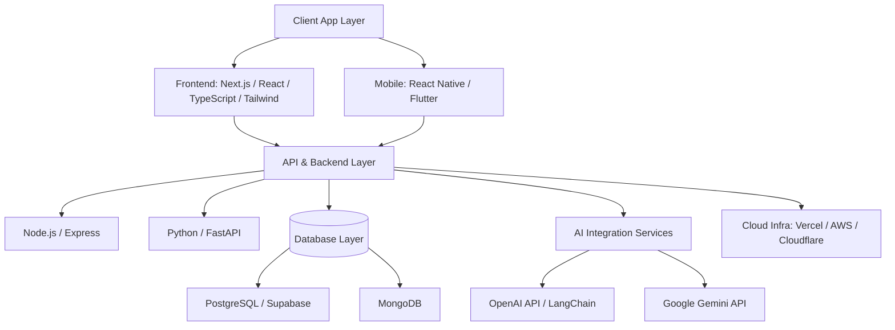

# KAMIYTECH ENGINEERING ARCHITECTURE & TECHNOLOGY GUIDELINES
> **COMMERCIAL CORE DOCUMENT P1.6**

> **DOCUMENT METADATA**
> - **Purpose:** Establish official engineering standards, technology stack configurations, repository structures, type safety rules, database migration protocols, AI API integration patterns, and CI/CD security pipelines for KamiyTech.
> - **Owner:** Chief Technology Officer (CTO) & Enterprise Architect
> - **Version:** 1.1.0
> - **Status:** APPROVED / LIVE
> - **Dependencies:** Founder Strategic Directives (`v2.0.0`), `P1.4_service_catalog.md`
> - **Review Schedule:** Bi-Annual Technical Review
> - **Related Documents:** [index.md](file:///c:/Users/abhis/OneDrive/Desktop/kamiytechAI/knowledge_base/index.md), [P1.4_service_catalog.md](file:///c:/Users/abhis/OneDrive/Desktop/kamiytechAI/knowledge_base/P1.4_service_catalog.md), [P1.5_client_onboarding_and_delivery_sop.md](file:///c:/Users/abhis/OneDrive/Desktop/kamiytechAI/knowledge_base/P1.5_client_onboarding_and_delivery_sop.md)

---

## 1. Technical Vision & Core Engineering Principles

```
  [TYPE-SAFETY FIRST] ─────► Strict TypeScript & Python Type Hints across 100% of codebases.
  [MODULAR ARCHITECTURE] ──► Clean component separation, custom hooks, isolated API routes.
  [AUTOMATED CI/CD] ────────► Zero manual FTP/SSH uploads; automated GitHub Actions & Vercel builds.
  [SECURITY BY DESIGN] ────► Secret isolation, sanitised inputs, OWASP Top 10 protection.
```

---

## 2. Mandatory Technology Stack Standard



### Approved Technology Choices
* **Frontend Web Framework:** Next.js (App Router preferred) with React, TypeScript, and Tailwind CSS.
* **Backend Services:** Node.js (TypeScript/Express) for lightweight web APIs; Python (FastAPI) for data processing, complex backend logic, and AI workflows.
* **Databases:** PostgreSQL (via Supabase or AWS RDS using Prisma/Drizzle ORM) for relational data; MongoDB for document-heavy un-structured data.
* **Mobile Stack:** React Native (Expo framework preferred) as primary standard; Flutter for specialized cross-platform requests.
* **AI & Machine Learning:** OpenAI API (`gpt-4o`/`gpt-4o-mini`), Google Gemini API (`gemini-1.5-pro`/`flash`), LangChain, LlamaIndex, vector databases (Pinecone / Supabase Vector).
* **Cloud & Infrastructure:** Vercel (Frontend & Serverless Functions), AWS (S3, EC2, RDS, ECS), Cloudflare (DNS, Edge Security, Workers).

---

## 3. Standard Repository & Directory Architecture

### Next.js (App Router) Standard Project Layout
```
/my-kamiytech-project
├── /src
│   ├── /app                  # Next.js App Router Pages & Layouts
│   │   ├── /api              # API Route Handlers
│   │   ├── (auth)            # Auth Route Group
│   │   ├── (dashboard)       # Dashboard Route Group
│   │   ├── layout.tsx        # Root Layout
│   │   └── page.tsx          # Homepage Component
│   ├── /components           # Shared Modular UI Components
│   │   ├── /ui               # Atomic UI Elements (Buttons, Inputs, Modals)
│   │   └── /forms            # Business Form Components
│   ├── /lib                  # Shared Utilities, Database Clients, API SDKs
│   │   ├── prisma.ts         # ORM Database Instance
│   │   ├── openai.ts         # OpenAI Client SDK Instance
│   │   └── utils.ts          # Helper functions (cn, formatters)
│   ├── /types                # Shared TypeScript Type Interfaces
│   └── /hooks                # Custom React Hooks
├── /public                   # Static Assets (Images, Favicons)
├── .env.example              # Template for Environment Variables
├── .eslintrc.json            # ESLint Rule Configuration
├── tsconfig.json             # TypeScript Strict Configuration
└── package.json
```

---

## 4. Code Quality, Type Safety & Linting Rules

### 1. TypeScript Strictness Rules
* `tsconfig.json` MUST enforce `"strict": true` and `"noImplicitAny": true`.
* The use of `any` type is **strictly forbidden**. Developers must define explicit interfaces or use `unknown` with runtime type validation (Zod).

### 2. Git Commit & Branching Convention
All developers and specialist partners must follow Conventional Commits:
* `feat:` New feature addition.
* `fix:` Bug repair.
* `docs:` Documentation update.
* `refactor:` Code refactoring without functionality changes.
* `chore:` Build scripts or dependency updates.

**Branch Naming Format:** `feat/[short-description]`, `fix/[issue-id]`, `staging`, `main`.

---

## 5. AI API Integration Standards

1. **API Key Isolation:** API keys (OpenAI, Gemini) must NEVER be committed to version control or exposed in frontend bundle code. All AI calls must run server-side via Next.js Server Actions or FastAPI endpoints.
2. **Streaming Response Standard:** High-latency AI calls must implement streaming responses (Server-Sent Events / Vercel AI SDK) to ensure immediate visual feedback for users (<500ms initial token latency).
3. **Fallback & Cost Protection:** AI integrations must enforce token usage caps (`max_tokens`), rate limiting, and fallback error handlers to protect client budgets against runaway loop costs.

---

## 6. Security & CI/CD Deployment Pipelines

```
[GIT PUSH BRANCH] ──► [GITHUB ACTIONS CI (LINT & TEST)] ──► [VERCEL PREVIEW BUILD] ──► [MAIN MERGE PRODUCTION BUILD]
```

### Security Enforcement Protocols
1. **Secret Scanning:** Repository commits are scanned automatically via GitHub Secret Scanning to prevent credential leaks.
2. **Input Sanitization:** All user inputs must be validated server-side using **Zod** schema validation to prevent SQL injection and XSS attacks.
3. **HTTPS & CORS:** Mandatory HTTPS redirection and strict Cross-Origin Resource Sharing (CORS) policy headers enforced across all APIs.

---
*End of Engineering Architecture & Technology Guidelines (P1.6 v1.1.0). Maintained by CTO & EA.*
