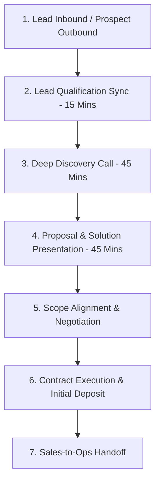

# KAMIYTECH SALES PLAYBOOK & DISCOVERY SOP
> **COMMERCIAL CORE DOCUMENT P2.1**

> **DOCUMENT METADATA**
> - **Purpose:** Standardize KamiyTech's B2B sales funnel, lead qualification criteria, discovery call scripts, objection handling frameworks, closing techniques, and CRM pipeline management for the Indian domestic market.
> - **Owner:** Head of Sales & Chief Marketing Officer (CMO)
> - **Version:** 1.1.0
> - **Status:** APPROVED / LIVE
> - **Dependencies:** Founder Strategic Directives (`v2.0.0`), `P1.1_positioning_and_value_prop.md`, `P1.2_rate_card_and_pricing_framework.md`, `P1.4_service_catalog.md`
> - **Review Schedule:** Quarterly Sales Audit
> - **Related Documents:** [index.md](file:///c:/Users/abhis/OneDrive/Desktop/kamiytechAI/knowledge_base/index.md), [P1.2_rate_card_and_pricing_framework.md](file:///c:/Users/abhis/OneDrive/Desktop/kamiytechAI/knowledge_base/P1.2_rate_card_and_pricing_framework.md), [P1.4_service_catalog.md](file:///c:/Users/abhis/OneDrive/Desktop/kamiytechAI/knowledge_base/P1.4_service_catalog.md), [P2.2_proposal_and_pitch_templates.md](file:///c:/Users/abhis/OneDrive/Desktop/kamiytechAI/knowledge_base/P2.2_proposal_and_pitch_templates.md)

---

## 1. B2B Sales Funnel Architecture



---

## 2. Lead Qualification Framework (Adapted BANT/MEDDIC)

Before scheduling a 45-minute discovery call, Sales reps must qualify prospects during the initial 15-minute qualification sync against **5 Core Filters**:

1. **Budget Alignment:** Does the prospect have budget matching our minimum deal sizes (₹12,000 for Landing Pages; ₹35,000–₹2,20,000 for Web; ₹1,20,000+ for Custom Apps/AI)?
2. **Authority:** Is the contact a key decision-maker (Founder, CEO, Managing Director, COO, VP Operations)?
3. **Need & Urgency:** Is there a compelling event, operational bottleneck, or clear launch deadline within 30–90 days?
4. **Technical Fit:** Does the required solution align with our engineering stack (Next.js, React, Node.js, FastAPI, Python, React Native, AI)?
5. **Cultural & Risk Fit:** Is the client cooperative, open to structured processes, and appreciative of quality over bargain-basement pricing?

---

## 3. Discovery Call Script & Interview Framework (45 Mins)

```
   [00-05m: AGENDA & RAPPORT] ──► [05-25m: DIAGNOSTIC INTERVIEW] ──► [25-35m: CAPABILITY SHOWCASE] ──► [35-45m: NEXT STEPS & PROPOSAL AGREEMENT]
```

### Stage 1: Diagnostic Questions (Uncovering Pain Points & Impact)
* *"Can you walk me through your current process for [specific operational area]? Where are the biggest manual bottlenecks or friction points today?"*
* *"What is this operational bottleneck costing your business each month in terms of lost revenue, wasted team hours, or delayed client onboarding?"*
* *"What tools or software systems are you currently using, and why aren't they meeting your current growth requirements?"*
* *"If we build the exact custom platform/AI automation we are discussing, what metric or outcome would make this project a massive success for your executive team?"*

### Stage 2: Scope & Timeline Exploration
* *"What is your target launch deadline for this initiative, and is there a specific industry event, fundraising milestone, or marketing push driving that date?"*
* *"Have you allocated a target budget range for this transformation project (₹50k–₹2L, ₹2L–₹10L+)?"*
* *"Who else on your leadership team will be evaluating the proposal and helping make the final decision?"*

---

## 4. Objection Handling Matrix

| Common Client Objection | Strategic Response Framework | Recommended Script Response |
| :--- | :--- | :--- |
| **"Your price is higher than cheap local freelancers."** | Reframe from cost to risk & enterprise quality. | *"We understand you can find low-cost template builders. However, KamiyTech operates as an enterprise technology partner—we provide senior architecture, strict type safety, zero technical debt, and long-term support. Fixing broken template code often costs 2x more than building it right the first time."* |
| **"Can we start with a smaller test project first?"** | Validate desire to manage risk; offer modular Phase 1 scoping. | *"Absolutely. We encourage starting with a single-page landing website or Phase 1 Architecture Blueprint (₹12,000–₹35,000). This lets you test our communication, design quality, and engineering standards with zero long-term commitment before rolling into Phase 2 build."* |
| **"We need to discuss this internally with the board."** | Secure commitment on next step & offer custom executive deck. | *"That makes complete sense. To make your internal presentation seamless, let's schedule a 30-minute Proposal Review Sync for next Tuesday. I will prepare a clean executive summary deck covering ROI, architecture, and milestones that you can present to your board."* |

---

## 5. Closing Techniques & Pipeline Rules

1. **The Mutual Action Plan (MAP) Close:** Never send a proposal via email blindly. Always schedule a live **Proposal Walkthrough Meeting** before sending the PDF document.
2. **The 48-Hour SLA Follow-Up Rule:** Every open deal in the CRM must have a scheduled next step within 48 hours. No deal sits in "Proposal Sent" stage without an active follow-up task.
3. **Closing Checklist:**
   - [ ] Proposal Walkthrough completed with key decision-makers.
   - [ ] Scope revisions finalized and SOW attached.
   - [ ] Contract sent via electronic signature platform.
   - [ ] Initial deposit invoice (40% or 50%) issued by CFO.

---
*End of Sales Playbook & Discovery SOP (P2.1 v1.1.0). Maintained by Head of Sales & CMO.*
