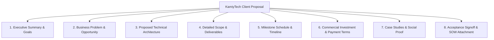

# KAMIYTECH PROPOSAL & PITCH DECK TEMPLATES
> **COMMERCIAL CORE DOCUMENT P2.2**

> **DOCUMENT METADATA**
> - **Purpose:** Standardize client proposal formats, executive pitch deck layouts, commercial quotation presentation, and SOW scope attachments for KamiyTech sales operations.
> - **Owner:** Creative Director, Head of Sales, & Chief Financial Officer (CFO)
> - **Version:** 1.1.0
> - **Status:** APPROVED / LIVE
> - **Dependencies:** Founder Strategic Directives (`v2.0.0`), `P1.1_positioning_and_value_prop.md`, `P1.2_rate_card_and_pricing_framework.md`, `P1.4_service_catalog.md`
> - **Review Schedule:** Bi-Annual Sales Audit
> - **Related Documents:** [index.md](file:///c:/Users/abhis/OneDrive/Desktop/kamiytechAI/knowledge_base/index.md), [P1.2_rate_card_and_pricing_framework.md](file:///c:/Users/abhis/OneDrive/Desktop/kamiytechAI/knowledge_base/P1.2_rate_card_and_pricing_framework.md), [P1.4_service_catalog.md](file:///c:/Users/abhis/OneDrive/Desktop/kamiytechAI/knowledge_base/P1.4_service_catalog.md), [P2.1_sales_playbook_and_discovery_sop.md](file:///c:/Users/abhis/OneDrive/Desktop/kamiytechAI/knowledge_base/P2.1_sales_playbook_and_discovery_sop.md)

---

## 1. Master Proposal Document Layout Standard



---

## 2. Production Proposal Markdown Template

```markdown
# TECHNOLOGY SOLUTION PROPOSAL
**Prepared For:** [Client Company Name]  
**Project Title:** [Project Name e.g., Enterprise Web Portal & AI Automation Engine]  
**Date:** [Date]  
**Document ID:** PRO-2026-[CLIENT-ID]  
**Prepared By:** KamiyTech Executive Team (contact@kamiytech.com)  

---

## 1. Executive Summary
KamiyTech is pleased to present this custom technology proposal to [Client Company Name]. Based on our discovery sessions with [Client Key Contact Name], our team has designed a tailored solution to modernize your digital infrastructure, automate core business workflows, and elevate user experience.

### Key Project Objectives
- Modernize [Client Company Name]'s digital web presence with a high-performance Next.js platform.
- Build a custom backend API & PostgreSQL database architecture to automate client data workflows.
- Implement an AI automation module to reduce manual operational processing time by an estimated 40%.

---

## 2. Technical Architecture & Stack Specification
To ensure speed, type safety, security, and scalability, KamiyTech will build your platform using our validated enterprise stack:

- **Frontend Interface:** Next.js (App Router), React, TypeScript, Tailwind CSS.
- **Backend API & Logic:** Node.js / Python (FastAPI) running serverless microservices.
- **Database & Storage:** PostgreSQL (Supabase) + AWS S3 cloud storage.
- **AI Automation Engine:** OpenAI API (`gpt-4o`) integrated via custom server-side endpoints.
- **Infrastructure & Hosting:** Vercel Global Edge Network with SSL and DDoS protection.

---

## 3. Scope of Deliverables

### Phase 1: UX/UI Design & System Architecture (Weeks 1–3)
- Complete Figma high-fidelity prototypes for all web pages and admin dashboards.
- Database entity-relationship diagram (ERD) & API specification document.

### Phase 2: Core Engineering & Integration (Weeks 4–7)
- Responsive frontend web application built in Next.js/React.
- Secure user authentication & multi-role permissions system.
- Integration of custom AI workflow automation engine.

### Phase 3: QA Testing, Staging & Handover (Weeks 8–9)
- Cross-browser testing, mobile optimization, and security audits.
- Production deployment, DNS setup, and 60-minute admin training session.

---

## 4. Commercial Investment & Payment Terms

| Milestone | Deliverable / Phase | Investment (INR ₹) | Payment Terms |
| :--- | :--- | :---: | :--- |
| **Milestone 1** | Initial Deposit & Project Kickoff | ₹X,XX,XXX (40%) | Due at Contract Signing |
| **Milestone 2** | Staging Build Delivery & QA Demo | ₹X,XX,XXX (30%) | Due upon Staging Signoff |
| **Milestone 3** | Production Deployment & Handover | ₹X,XX,XXX (30%) | Due prior to Live Launch |
| **TOTAL** | **Complete Project Investment** | **₹X,XX,XXX (+ 18% GST)** | **Fixed-Price Guarantee** |

*(Note: Single-Page Landing Pages use 50% Deposit / 50% Launch Handover billing structure)*

---

## 5. Acceptance & Signoff
By signing below, the parties agree to the scope, timeline, and financial investment detailed in this proposal and associated Master Services Agreement (MSA).

**For [Client Company Name]:**  
Signature: _______________________  Date: ____________  
Name & Title: _____________________________________  

**For KamiyTech:**  
Signature: _______________________  Date: ____________  
Name & Title: _____________________________________  
```

---

## 3. Executive Pitch Deck Structure (10-Slide Master Layout)

For live client presentations and enterprise pitch opportunities, Sales reps must follow the Creative Director's **10-Slide Deck Format**:

1. **Slide 1: Title Slide** (Clean KamiyTech logo, client name, proposal title, date).
2. **Slide 2: Executive Summary & Context** (Acknowledging client goals and market context).
3. **Slide 3: The Core Problem** (Highlighting operational friction, legacy code debt, or manual overhead).
4. **Slide 4: The KamiyTech Solution** (Overview of custom software, modern web, or AI automation).
5. **Slide 5: Technical Architecture** (Visual stack diagram: Next.js, FastAPI, PostgreSQL, Cloud).
6. **Slide 6: Scope Breakdown & Deliverables** (Clear 3-phase execution roadmap as per [P1.4 Service Catalog](file:///c:/Users/abhis/OneDrive/Desktop/kamiytechAI/knowledge_base/P1.4_service_catalog.md)).
7. **Slide 7: Case Studies & Social Proof** (Metrics: 35% time saved, 2.5x load speed improvement).
8. **Slide 8: Team & Specialist Partner Network** (Senior engineering oversight + agile scale).
9. **Slide 9: Investment & Milestone Schedule** (Transparent fixed-price tiers & payment terms as per [P1.2 Rate Card](file:///c:/Users/abhis/OneDrive/Desktop/kamiytechAI/knowledge_base/P1.2_rate_card_and_pricing_framework.md)).
10. **Slide 10: Call to Action & Kickoff Date** (Immediate next steps to reserve sprint capacity).

---
*End of Proposal & Pitch Deck Templates (P2.2 v1.1.0). Maintained by Creative Director, Sales & CFO.*
