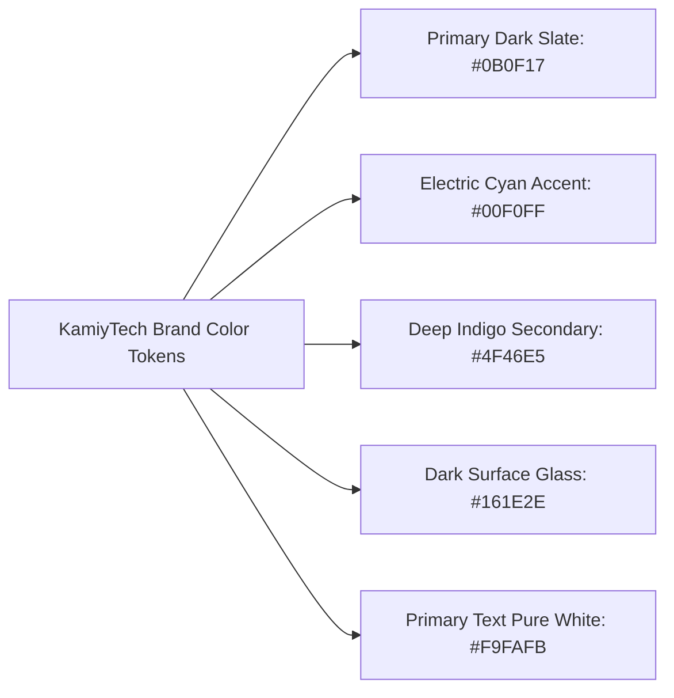

# KAMIYTECH BRAND IDENTITY & DESIGN SYSTEM
> **COMMERCIAL CORE DOCUMENT P2.3**

> **DOCUMENT METADATA**
> - **Purpose:** Establish the Creative Director's official visual brand identity, color palette system, typography scale, presentation guidelines, and UI design component tokens for KamiyTech.
> - **Owner:** Creative Director & Chief Marketing Officer (CMO)
> - **Version:** 1.0.0
> - **Status:** APPROVED / LIVE
> - **Dependencies:** Founder Strategic Foundation (`v1.0.0`), Brand Assets Inventory
> - **Review Schedule:** Annual Brand Audit
> - **Related Documents:** [index.md](file:///C:/Users/abhis\.gemini\antigravity\brain\43b2bd90-bd70-48a7-bd6f-4772e0210cb0\knowledge_base\index.md), [P2.2_proposal_and_pitch_templates.md](file:///C:/Users/abhis\.gemini\antigravity\brain\43b2bd90-bd70-48a7-bd6f-4772e0210cb0\knowledge_base\P2.2_proposal_and_pitch_templates.md)

---

## 1. Visual Brand Identity Principles

```
  [ENTERPRISE POLISH] ──► Sleek dark-mode aesthetic with vibrant high-contrast accents.
  [GEOMETRIC PRECISION] ─► Clean typography, sharp layout grids, balanced whitespace.
  [GLASSMORPHISM & DEPTH] ► Modern subtle backdrop blurs, soft glows, dynamic micro-interactions.
```

---

## 2. Color Palette System & Design Tokens



### Color Specification Table
| Token Name | Color Description | HEX Code | HSL Representation | Primary Usage |
| :--- | :--- | :---: | :---: | :--- |
| `--color-bg-dark` | Deep Space Obsidian | `#0B0F17` | `hsl(220, 35%, 7%)` | Main application & document background |
| `--color-surface` | Slate Glass Surface | `#161E2E` | `hsl(220, 35%, 13%)` | Cards, modals, container blocks |
| `--color-accent-cyan`| Electric Cyan | `#00F0FF` | `hsl(184, 100%, 50%)` | Primary buttons, active tabs, highlight text |
| `--color-brand-indigo`| Deep Indigo | `#4F46E5` | `hsl(244, 75%, 59%)` | Gradient overlays, secondary buttons, icons |
| `--color-text-main` | Pure Off-White | `#F9FAFB` | `hsl(210, 40%, 98%)` | H1-H4 headings, primary body copy |
| `--color-text-muted`| Slate Gray | `#9CA3AF` | `hsl(218, 11%, 65%)` | Subtitles, metadata tags, caption text |
| `--color-border` | Subtle Glass Border | `rgba(255,255,255,0.1)` | — | Card borders, table dividers |

---

## 3. Typography System

KamiyTech uses **Google Fonts** to enforce modern typography across all digital touchpoints and client deliverables:

* **Primary Headings (Display & H1–H3):** `Outfit` (Sans-Serif, Weights: 600, 700) — Modern, authoritative geometric headers.
* **Body Copy & UI Elements:** `Inter` (Sans-Serif, Weights: 400, 500) — Ultra-legible at all font sizes.
* **Code Blocks & Technical Specs:** `JetBrains Mono` (Monospace, Weight: 400) — Clean developer typography.

### Type Scale Standards
* **Display H1 (Main Titles):** `36px / 44px Line-Height` | Font Weight: `700`
* **Section H2 (Major Headers):** `24px / 32px Line-Height` | Font Weight: `600`
* **Subsection H3 (Subheaders):** `18px / 26px Line-Height` | Font Weight: `600`
* **Body Text (Paragraphs):** `15px / 24px Line-Height` | Font Weight: `400`
* **Small Caption / Metadata:** `12px / 18px Line-Height` | Font Weight: `500`

---

## 4. UI Component Tokens & Styling Standards

### Glassmorphism Card CSS Spec
```css
.kamiy-glass-card {
  background: rgba(22, 30, 46, 0.75);
  backdrop-filter: blur(12px);
  -webkit-backdrop-filter: blur(12px);
  border: 1px solid rgba(255, 255, 255, 0.1);
  border-radius: 12px;
  box-shadow: 0 8px 32px 0 rgba(0, 0, 0, 0.37);
  transition: all 0.3s ease-in-out;
}

.kamiy-glass-card:hover {
  border-color: rgba(0, 240, 255, 0.4);
  transform: translateY(-2px);
  box-shadow: 0 12px 40px 0 rgba(0, 240, 255, 0.15);
}
```

### Button Tokens
* **Primary Button:** Electric Cyan background (`#00F0FF`), dark obsidian text (`#0B0F17`), bold weight, 8px border-radius, glow effect on hover.
* **Secondary Button:** Deep Indigo outline (`#4F46E5`), off-white text, glass hover background.

---

## 5. Document & Presentation Styling Guidelines

All proposals, SOPs, pitch decks, and exported PDFs must conform to these formatting rules:
1. **GitHub Alert Callouts:** Use standard callouts for emphasis (`> [!NOTE]`, `> [!TIP]`, `> [!IMPORTANT]`, `> [!WARNING]`).
2. **Mermaid Diagrams:** All workflow processes and technical architectures must use Mermaid syntax with explicit quotes on node labels.
3. **No Low-Quality Assets:** Only vector SVGs or high-resolution PNGs (minimum 300 DPI) are permitted in client deliverables.
