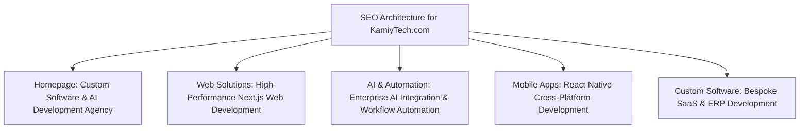

# KAMIYTECH WEBSITE COPY & CONTENT STRATEGY
> **COMMERCIAL CORE DOCUMENT P2.4**

> **DOCUMENT METADATA**
> - **Purpose:** Provide complete page-by-page production copy, SEO meta titles/descriptions, conversion copywriting structures, and content engine strategy for the official KamiyTech website.
> - **Owner:** Chief Marketing Officer (CMO), Creative Director, & Head of Sales
> - **Version:** 1.0.0
> - **Status:** APPROVED / LIVE
> - **Dependencies:** Founder Strategic Foundation (`v1.0.0`), P1.1 Positioning, P2.3 Brand System
> - **Review Schedule:** Bi-Annual Marketing Audit
> - **Related Documents:** [index.md](file:///C:/Users/abhis\.gemini\antigravity\brain\43b2bd90-bd70-48a7-bd6f-4772e0210cb0\knowledge_base\index.md), [P1.1_positioning_and_value_prop.md](file:///C:/Users/abhis\.gemini\antigravity\brain\43b2bd90-bd70-48a7-bd6f-4772e0210cb0\knowledge_base\P1.1_positioning_and_value_prop.md), [P2.3_brand_identity_and_design_system.md](file:///C:/Users/abhis\.gemini\antigravity\brain\43b2bd90-bd70-48a7-bd6f-4772e0210cb0\knowledge_base\P2.3_brand_identity_and_design_system.md)

---

## 1. SEO Keyword Mapping & Meta Architecture



### Meta Specification Table
| Page Path | Primary Target Keyword | Meta Title (Max 60 chars) | Meta Description (Max 155 chars) |
| :--- | :--- | :--- | :--- |
| `/` | Custom Software & AI Agency | **KamiyTech | Custom Software, Web & AI Automation Agency** | Modernize operations with enterprise custom software, Next.js web applications, mobile apps, and AI business automation engineered for scale. |
| `/services/web` | Next.js Web Development | **Enterprise Web Solutions & Next.js Development | KamiyTech** | High-performance, SEO-optimized custom web platforms built with Next.js, React, and TypeScript. Turn site traffic into recurring revenue. |
| `/services/ai` | AI Business Automation | **AI Integration & Business Workflow Automation | KamiyTech** | Embed OpenAI & Gemini LLM workflows into your company processes. Automate manual work, cut overhead, and accelerate growth. |
| `/services/software`| Custom Software Development | **Custom Software & SaaS Development Services | KamiyTech** | Scalable backend architectures, FastAPI, Node.js, and PostgreSQL custom software solutions designed for growing enterprises and startups. |
| `/contact` | Book Tech Consultation | **Book a Technical Strategy Session | KamiyTech** | Schedule a 30-minute discovery session with our executive tech team to scope your software, web, or AI automation project. |

---

## 2. Production Website Copy: Homepage (`/`)

### Section 1: Hero Banner
* **Badge Tag:** `⚡ NEXT-GEN TECHNOLOGY CONSULTANCY`
* **Hero Headline (H1):** **We Design, Build & Automate Digital Products That Scale Your Business.**
* **Subheadline:** From enterprise Next.js web platforms and cross-platform mobile apps to bespoke AI automation workflows—KamiyTech delivers enterprise engineering standards with agency speed.
* **Primary CTA Button:** `Schedule Strategy Session →` *(Links to `/contact`)*
* **Secondary CTA Button:** `Explore Service Offerings` *(Scrolls to `#services`)*
* **Trust Counter Metrics:**
  - `99.9%` System Uptime Guarantee
  - `<1.5s` Global Page Load Speed
  - `50%+` Average Client Operational Hours Saved

---

### Section 2: Core Services Breakdown (`#services`)

```
   [1. WEB SOLUTIONS] ────────► Next.js / React / Headless Commerce / Custom Portals
   [2. CUSTOM SOFTWARE] ─────► Scalable Node.js & FastAPI Backends / PostgreSQL Architecture
   [3. AI & AUTOMATION] ─────► OpenAI & Gemini Integration / Custom RAG Engines / Workflow Bots
   [4. MOBILE APPLICATIONS] ─► React Native Cross-Platform iOS & Android Apps
```

#### Card 1: Web Solutions & Modern Platforms
* **Header:** **High-Performance Web Applications**
* **Copy:** We engineer lightning-fast, SEO-optimized web platforms using Next.js, React, and TypeScript. No sluggish templates—just clean, type-safe code that converts visitors into enterprise clients.

#### Card 2: Custom Software Development
* **Header:** **Bespoke Software & Cloud Architecture**
* **Copy:** Transform complex manual operations into unified software systems. We architect secure Node.js and Python (FastAPI) backends backed by enterprise PostgreSQL databases.

#### Card 3: AI & Business Automation
* **Header:** **Enterprise AI & Intelligent Workflows**
* **Copy:** Stop losing hundreds of hours to manual data processing. We embed custom AI agents, LLM search engines, and automated workflow pipelines directly into your operational stack.

#### Card 4: Mobile Application Development
* **Header:** **Cross-Platform iOS & Android Apps**
* **Copy:** Deliver seamless mobile experiences to your field team or consumers. Built with React Native for native speed, offline support, and single-codebase cost efficiency.

---

### Section 3: The KamiyTech Differentiator (Why Choose Us?)

```
┌──────────────────────────────┬──────────────────────────────┐
│ Enterprise Code Quality      │ AI-First Automation          │
│ Strict TypeScript, CI/CD,    │ Embed intelligent LLM bots   │
│ & zero technical debt.       │ to eliminate manual overhead.│
├──────────────────────────────┼──────────────────────────────┤
│ Transparent Fixed Pricing    │ Partner-Backed Scale         │
│ Milestone payments with zero │ Senior tech leadership       │
│ hidden fee surprises.        │ with agile specialist pods.  │
└──────────────────────────────┴──────────────────────────────┘
```

---

### Section 4: Final Call to Action (CTA)

* **Headline:** **Ready to Modernize Your Digital Operations?**
* **Body Copy:** Let's discuss your software roadmap, web platform, or AI automation goals. Schedule a 30-minute discovery call with our executive technology team today.
* **Button:** `Book Your Technical Discovery Session →`

---

## 3. Content Marketing & Inbound Lead Engine Strategy

To drive organic B2B lead generation, CMO will maintain a bi-weekly technical content schedule:
1. **Technical Case Studies:** In-depth teardowns showing how KamiyTech reduced client operational hours by 40% via custom AI APIs or Next.js migrations.
2. **Founder LinkedIn Thought Leadership:** Weekly posts targeting CEOs/COOs on topics like *"Why Legacy ERPs Fail and How Custom FastAPI Tools Bridge the Gap."*
3. **SEO Engineering Guides:** Long-form technical guides on Next.js performance tuning, Supabase PostgreSQL setups, and enterprise LangChain implementations.
