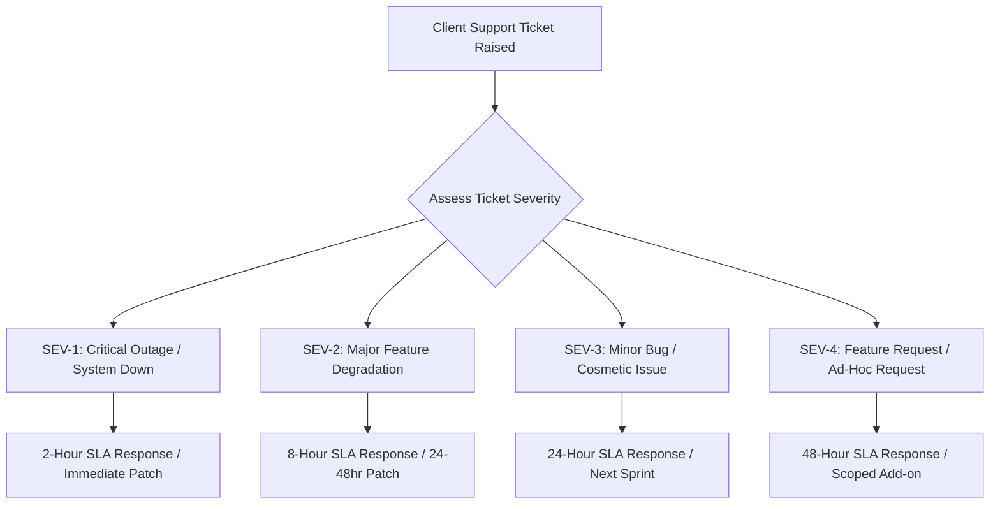

# KAMIYTECH MAINTENANCE RETAINER & SUPPORT SLA SOP
> **COMMERCIAL CORE DOCUMENT P3.1**

> **DOCUMENT METADATA**
> - **Purpose:** Standardize post-launch client maintenance packages, Service Level Agreements (SLAs), uptime monitoring protocols, patch management, emergency response workflows, and support ticketing for KamiyTech.
> - **Owner:** Customer Success Lead, Chief Operating Officer (COO), & Chief Financial Officer (CFO)
> - **Version:** 1.1.0
> - **Status:** APPROVED / LIVE
> - **Dependencies:** Founder Strategic Directives (`v2.0.0`), `P1.2_rate_card_and_pricing_framework.md`, `P1.4_service_catalog.md`, `P1.5_client_onboarding_and_delivery_sop.md`
> - **Review Schedule:** Bi-Annual Operations Audit
> - **Related Documents:** [index.md](file:///c:/Users/abhis/OneDrive/Desktop/kamiytechAI/knowledge_base/index.md), [P1.2_rate_card_and_pricing_framework.md](file:///c:/Users/abhis/OneDrive/Desktop/kamiytechAI/knowledge_base/P1.2_rate_card_and_pricing_framework.md), [P1.4_service_catalog.md](file:///c:/Users/abhis/OneDrive/Desktop/kamiytechAI/knowledge_base/P1.4_service_catalog.md), [P1.5_client_onboarding_and_delivery_sop.md](file:///c:/Users/abhis/OneDrive/Desktop/kamiytechAI/knowledge_base/P1.5_client_onboarding_and_delivery_sop.md)

---

## 1. Master Support Severity & SLA Response Matrix

### SLA Guarantee Matrix
| Severity Level | Definition | Targeted Initial Response | Targeted Resolution Time | Included Retainer Tiers |
| :--- | :--- | :---: | :---: | :--- |
| **SEV-1: Critical** | Live production site or database down; total user lock out; zero transaction processing. | **< 2 Business Hours** | **< 6 Hours** | Enterprise Managed |
| **SEV-2: Major** | Core feature broken (e.g., checkout failing, login bug); workarounds exist but difficult. | **< 8 Business Hours** | **< 24 Hours** | Growth Care & Enterprise |
| **SEV-3: Minor** | Non-critical component bug (e.g., alignment glitch, minor form validation error). | **< 24 Business Hours** | **< 3 Business Days** | All Tiers (Essential+) |
| **SEV-4: Request** | Ad-hoc content updates, new feature requests, styling tweaks. | **< 48 Business Hours** | Scheduled in Sprint | Growth Care & Enterprise |

---

## 2. Maintenance Retainer Tiers & Deliverables

### Tier 1: Essential Care (₹12,000 / month + GST)
* **Target Client:** SMB business websites and simple web platforms.
* **Included Monthly Capacity:** Up to **5 hours** of dedicated maintenance and technical support per month.
* **Core Services Included:**
  - 24/7 Uptime & SSL Certificate Monitoring (Pingdom / BetterUptime).
  - Automated weekly database & full application backups (AWS S3 / Supabase).
  - Monthly security patch & dependency updates (Next.js / Node.js packages).
  - Monthly health report & 24-hour SLA ticket response time.

### Tier 2: Growth Care (₹35,000 / month + GST)
* **Target Client:** Growing companies, active e-commerce stores, high-traffic portals.
* **Included Monthly Capacity:** Up to **15 hours** of support and minor feature development per month.
* **Core Services Included:**
  - Everything in Essential Care +
  - 8-hour SLA response time guarantee for SEV-2 issues.
  - Quarterly speed & performance optimization audits (Lighthouse / Core Web Vitals).
  - Content updates, Payment Gateway/WhatsApp API maintenance, design tweaks, and minor feature additions.
  - Monthly strategic tech check-in sync with Technical Project Manager.

### Tier 3: Enterprise Managed (₹85,000 / month + GST)
* **Target Client:** Complex custom software platforms, multi-tenant SaaS, mission-critical AI workflows.
* **Included Monthly Capacity:** Up to **35 hours** of dedicated engineering & TPM capacity per month.
* **Core Services Included:**
  - Everything in Growth Care +
  - Priority **2-hour emergency SLA response** guarantee for SEV-1 outages.
  - Dedicated Technical Project Manager & lead developer assignment.
  - Automated CI/CD deployment pipeline maintenance & vector database index tuning.
  - Monthly security vulnerability scanning & penetration audit.

---

## 3. Incident Escalation & Support Ticket SOP

1. **Ticket Submission:** Clients submit support requests via dedicated support email (`support@kamiytech.com`) or client portal.
2. **Automated Triage:** Support system automatically tags priority based on client retainer tier and keywords (e.g., "Down", "Error", "Crash").
3. **Escalation Protocol:**
   - If SEV-1 ticket is unacknowledged at 90 minutes: Automated PagerDuty alert triggers to CTO and COO mobile devices.
   - If SEV-2 ticket is unacknowledged at 6 hours: Alert triggers to TPM and Lead Engineer.
4. **Post-Mortem Requirement:** Any SEV-1 production outage requires a written **Root Cause Analysis (RCA)** report submitted to the client within 72 hours of resolution.

---
*End of Maintenance Retainer & Support SLA SOP (P3.1 v1.1.0). Maintained by Customer Success, COO & CFO.*
