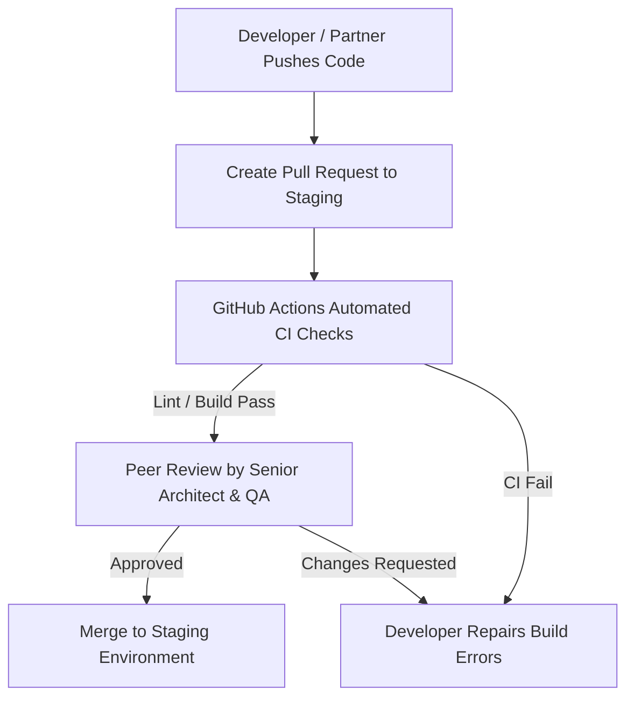

# KAMIYTECH QA CODE REVIEW & TESTING SOP
> **COMMERCIAL CORE DOCUMENT P3.2**

> **DOCUMENT METADATA**
> - **Purpose:** Establish official Quality Assurance (QA) standards, peer code review protocols, automated testing guidelines (Playwright, Jest, PyTest), pre-release security audits, and production deployment gates for KamiyTech.
> - **Owner:** Chief Technology Officer (CTO), QA Lead, & Enterprise Architect
> - **Version:** 1.1.0
> - **Status:** APPROVED / LIVE
> - **Dependencies:** Founder Strategic Directives (`v2.0.0`), `P1.6_engineering_architecture_guidelines.md`
> - **Review Schedule:** Bi-Annual Engineering Audit
> - **Related Documents:** [index.md](file:///c:/Users/abhis/OneDrive/Desktop/kamiytechAI/knowledge_base/index.md), [P1.6_engineering_architecture_guidelines.md](file:///c:/Users/abhis/OneDrive/Desktop/kamiytechAI/knowledge_base/P1.6_engineering_architecture_guidelines.md), [P1.5_client_onboarding_and_delivery_sop.md](file:///c:/Users/abhis/OneDrive/Desktop/kamiytechAI/knowledge_base/P1.5_client_onboarding_and_delivery_sop.md)

---

## 1. Code Review & Pull Request (PR) Protocol



### Pull Request Standard Requirements
1. **Branch Protection:** Direct commits to `main` or `staging` branches are strictly blocked. All code must pass through a Pull Request.
2. **Review Signoff:** Every PR requires at least **one Senior Engineer approval** and passing CI automated tests before merging.
3. **PR Template Mandate:**
   - **Summary:** Concise description of features or fixes included.
   - **Testing Proof:** Screenshots/GIFs of working UI or local terminal test pass output.
   - **Breaking Change Warning:** Flag any database migrations or environment variable additions (`.env`).

---

## 2. Automated Testing Standard Hierarchy

```
       [E2E TESTS] ────────► Playwright End-to-End User Flow Tests (Critical Paths)
       [API TESTS] ────────► Postman / Supertest Backend Endpoint Contract Tests
       [UNIT TESTS] ───────► Vitest / Jest / PyTest Pure Function & Logic Coverage (>80%)
```

### 1. Unit & Integration Testing
* **Frontend (React / Next.js):** Vitest / React Testing Library for utility functions, custom hooks, and form state validation.
* **Backend (FastAPI / Python):** PyTest for testing database query models, data transformation logic, and AI prompt helper functions.
* **Coverage Threshold:** Core business logic and calculations must maintain **>80% test coverage**.

### 2. End-to-End (E2E) Testing with Playwright
Playwright test suites must execute against the staging environment before production release, covering:
- User registration, login, and password reset flows.
- E-commerce checkout, Razorpay / Stripe payment processing, and invoice generation.
- Form submissions, file uploads, and dashboard navigation.

---

## 3. Pre-Release Security & OWASP Audit Checklist

Before any client deliverable is approved for production, the QA Lead must execute the **10-Point Security Gate Audit**:

- [ ] **1. Secret Isolation:** Zero hardcoded API keys, DB passwords, or tokens in source code (`.env.production` managed via Vercel/AWS Secrets Manager).
- [ ] **2. Injection Defense:** All SQL database queries use ORM parameterized inputs (Prisma/Drizzle/SQLAlchemy); zero raw string concatenation.
- [ ] **3. XSS Protection:** Inputs sanitized using Zod schemas and DOMPurify for rendered HTML.
- [ ] **4. Auth & Session Security:** JWT tokens stored in HttpOnly, Secure, SameSite cookies; password hashing via Argon2 or bcrypt.
- [ ] **5. CORS & Headers:** Strict Content Security Policy (CSP), HSTS headers, and explicit CORS origin lists.
- [ ] **6. Dependency Audit:** `npm audit` or `pip-audit` returns 0 critical or high vulnerability packages.
- [ ] **7. Rate Limiting:** API endpoints protected against brute-force attacks via Redis / Cloudflare rate limiters.
- [ ] **8. Console Cleaning:** All `console.log` debug statements stripped from production javascript builds.
- [ ] **9. Asset Optimization:** Images optimized via `next/image` with WebP/AVIF formatting and responsive breakpoints.
- [ ] **10. Error Masking:** Production errors return clean sanitized error codes (e.g., `INTERNAL_SERVER_ERROR`); internal stack trace details hidden from client browser.

---
*End of QA Code Review & Testing SOP (P3.2 v1.1.0). Maintained by CTO & QA Lead.*
