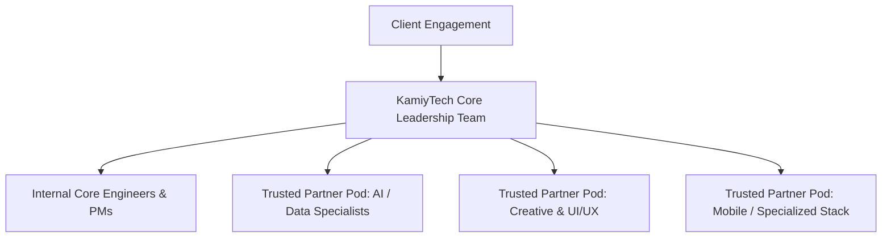

# KAMIYTECH SPECIALIST PARTNER ONBOARDING & VETTING SOP
> **COMMERCIAL CORE DOCUMENT P3.3**

> **DOCUMENT METADATA**
> - **Purpose:** Standardize the vetting, technical evaluation, legal onboarding, rate negotiation, white-label compliance, and performance scorecards for KamiyTech's trusted specialist partner network in India.
> - **Owner:** Chief Operating Officer (COO), HR & People Ops, & CTO
> - **Version:** 1.1.0
> - **Status:** APPROVED / LIVE
> - **Dependencies:** Founder Strategic Directives (`v2.0.0`), `P1.3_master_legal_framework.md`, `P1.2_rate_card_and_pricing_framework.md`
> - **Review Schedule:** Bi-Annual Operational Review
> - **Related Documents:** [index.md](file:///c:/Users/abhis/OneDrive/Desktop/kamiytechAI/knowledge_base/index.md), [P1.2_rate_card_and_pricing_framework.md](file:///c:/Users/abhis/OneDrive/Desktop/kamiytechAI/knowledge_base/P1.2_rate_card_and_pricing_framework.md), [P1.3_master_legal_framework.md](file:///c:/Users/abhis/OneDrive/Desktop/kamiytechAI/knowledge_base/P1.3_master_legal_framework.md)

---

## 1. Specialist Partner Network Model & Strategy

To achieve the Founder's vision of building a scalable agency without heavy fixed overhead, KamiyTech operates a **Core + Specialist Pod Model**:

---

## 2. 4-Step Technical Vetting & Evaluation Rubric

Before any contractor or specialist agency is admitted to KamiyTech's partner roster, they must pass our rigorous 4-step vetting process:

1. **Step 1: Portfolio & Code Sample Audit (CTO Lead):** Review candidate's GitHub repositories for TypeScript strictness, Next.js/FastAPI architecture, code comments, and database schemas.
2. **Step 2: Paid Technical Practical Challenge (2–4 Hours):** Candidate completes a scoped technical task (e.g., building a Next.js component + API route with Zod validation) to evaluate speed, type safety, and attention to detail.
3. **Step 3: Communication & Culture Sync (COO Lead):** Evaluate English fluency, asynchronous responsiveness, transparency, and attitude towards deadlines.
4. **Step 4: Background & Reference Check:** Verify past client projects and check 2 professional references.

### Partner Scoring Rubric (Minimum Pass: 85/100)
* Technical Architecture & Code Quality: **40 Points**
* Communication & Async Responsiveness: **30 Points**
* Deadline Reliability & Speed: **20 Points**
* Value / Rate Alignment: **10 Points**

---

## 3. Legal Onboarding & White-Label Compliance SOP

Once vetted, the partner completes formal onboarding before receiving any project access:

1. **Legal Execution:** Sign the **KamiyTech Subcontractor Agreement** (containing IP transfer to KamiyTech and 24-month non-solicitation clause) and Mutual NDA.
2. **Identity & Access Management (IAM):**
   - Issue white-label `@kamiytech.com` email address for client-facing communication.
   - Provision access to private GitHub organization, Slack workspace, and 1Password shared team vault.
3. **White-Label Operating Rules:**
   - Partners must ALWAYS present themselves as KamiyTech team members when interacting on client channels or video calls.
   - Partners are strictly forbidden from sharing personal agency branding, direct contact info, or personal social links with KamiyTech clients.

---

## 4. Rate Negotiation & Financial Safeguards

To protect KamiyTech's **45% – 55% gross profit margin target**, partner pay rates are capped against client billing rates ([P1.2 Rate Card](file:///c:/Users/abhis/OneDrive/Desktop/kamiytechAI/knowledge_base/P1.2_rate_card_and_pricing_framework.md)):

| Partner Role Tier | Maximum Allowed Partner Pay Rate (INR ₹) | Client Billing Rate (P1.2) | Target Margin |
| :--- | :---: | :---: | :---: |
| **Senior Solutions Architect** | ₹1,800 – ₹2,200 / hr | ₹4,500 / hr | **51% – 60% Margin** |
| **Senior Full-Stack Engineer** | ₹1,100 – ₹1,400 / hr | ₹2,800 / hr | **50% – 60% Margin** |
| **Mobile App Engineer** | ₹1,000 – ₹1,250 / hr | ₹2,500 / hr | **50% – 60% Margin** |
| **UI/UX & Graphic Designer** | ₹900 – ₹1,100 / hr | ₹2,200 / hr | **50% – 59% Margin** |
| **QA / Testing Specialist** | ₹600 – ₹750 / hr | ₹1,500 / hr | **50% – 60% Margin** |

---

## 5. Partner Tiering & Quarterly Scorecard

Partners are audited quarterly by the COO and CTO and assigned to performance tiers:

* **Tier 1: Preferred Lead Partner (Score >90):** Priority allocation for all new client projects; eligible for dedicated monthly retainer pod contracts.
* **Tier 2: Active Specialist (Score 80–89):** Allocated for overflow capacity and specialized domain requests.
* **Tier 3: Probation / Inactive (Score <80):** Temporarily paused from new project allocation pending performance review or offboarded.

---
*End of Specialist Partner Onboarding & Vetting SOP (P3.3 v1.1.0). Maintained by COO, HR & CTO.*
