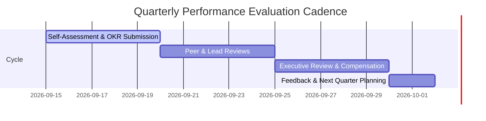

# KAMIYTECH HR & PEOPLE OPERATIONS HANDBOOK
> **HUMAN RESOURCES, TALENT ACQUISITION & WORKPLACE POLICIES**

> **DOCUMENT METADATA**
> - **Purpose:** Establish end-to-end HR protocols, recruitment pipelines, contractor-to-employee pathways, performance evaluation frameworks, and remote workplace guidelines.
> - **Owner:** HR & People Operations Lead / COO
> - **Version:** 1.0.0
> - **Status:** APPROVED / IN-EFFECT
> - **Dependencies:** `P1.3_master_legal_framework.md`, `P3.3_partner_onboarding_and_vetting_sop.md`
> - **Review Schedule:** Bi-Annual Audit
> - **Related Documents:** [index.md](file:///c:/Users/abhis/OneDrive/Desktop/kamiytechAI/knowledge_base/index.md), [P3.3_partner_onboarding_and_vetting_sop.md](file:///c:/Users/abhis/OneDrive/Desktop/kamiytechAI/knowledge_base/P3.3_partner_onboarding_and_vetting_sop.md)

---

## 1. EXECUTIVE SUMMARY & PEOPLE PHILOSOPHY

KamiyTech operates a high-velocity, remote-first talent architecture. We combine a lean core executive team with specialized partner pods and scalable engineering talent. Our HR policy emphasizes autonomous accountability, continuous skill advancement, transparent career growth, and strict adherence to professional standards.

```mermaid
graph TD
    TalentPool[Talent Sourcing Pool] --> Vetting[Technical & Culture Vetting (P3.3)]
    Vetting --> SpecialistPod[Specialist Contractor / Partner Pod]
    SpecialistPod --> Evaluation[90-Day Performance Audit]
    Evaluation --> CorePath[Contractor-to-Employee Conversion Pathway]
    CorePath --> CoreTeam[Core Leadership / Senior Staff Role]
```

---

## 2. TALENT ACQUISITION & RECRUITMENT PIPELINE

### 2.1 Sourcing Channels
- **Direct Specialist Sourcing:** Targeted outreach for elite full-stack (Next.js/Node), AI/ML (Python/FastAPI), and mobile (React Native) engineers.
- **Vetted Partner Networks:** Engaging vetted agency partners under white-label `@kamiytech.com` credentials (governed by [P3.3 Partner SOP](file:///c:/Users/abhis/OneDrive/Desktop/kamiytechAI/knowledge_base/P3.3_partner_onboarding_and_vetting_sop.md)).

### 2.2 4-Step Selection Process
1. **Screening Call (30 mins):** Background check, communication clarity, cultural fit, alignment with remote work standards.
2. **Technical Assessment:** Hands-on code audit or 90-minute real-world architecture challenge evaluated against the 85/100 pass threshold.
3. **Executive Interview (45 mins):** Interview with COO/CTO focusing on problem-solving, client communication, and execution speed.
4. **Offer & Governance Onboarding:** Issuance of Subcontractor Partner Agreement (or Employment Offer), IP Assignment, NDA, and security setup.

---

## 3. CONTRACTOR-TO-EMPLOYEE CONVERSION PATHWAY

KamiyTech provides a structured transition from project-based contractor roles to full-time core employee positions.

### 3.1 Eligibility Criteria
- **Tenure:** Minimum 6 consecutive months of active engagement or 500+ delivered billable hours.
- **Quality Scorecard:** Sustained average evaluation score > 90% across 3 consecutive project cycles.
- **Client & Peer Feedback:** Positive rating from Lead Engineers and Project Managers with zero SEV-1 SLA violations.

### 3.2 Conversion Evaluation Rubric

| Assessment Dimension | Weight | Target Threshold | Description |
| :--- | :---: | :---: | :--- |
| **Technical Excellence** | 35% | > 90% | Clean, maintainable code; thorough unit/E2E test coverage (>80%). |
| **Communication & Reliability** | 25% | > 90% | Proactive status updates, punctual daily async standups, clear client presentation. |
| **Ownership & Autonomy** | 25% | > 85% | Takes initiative to solve architectural bottlenecks without micro-management. |
| **Culture & Values** | 15% | Pass | Adherence to security guidelines, confidentiality, and team collaboration. |

---

## 4. PERFORMANCE EVALUATION & OKR FRAMEWORK

Performance reviews occur on a quarterly cadence using Objectives and Key Results (OKRs).



### 4.1 OKR Structure & Scoring
- **Score 1.0 (Exceeds Target):** Exceptional execution; introduces process or architectural improvements adopted across the firm.
- **Score 0.7 - 0.9 (Meets Target):** Target fully met on time and within budget. Standard expected performance.
- **Score < 0.7 (Needs Improvement):** Performance improvement plan (PIP) triggered with 30-day reassessment window.

---

## 5. REMOTE WORK ENVIRONMENT & COMMUNICATION ETIQUETTE

### 5.1 Communication Protocols
- **Async-First Core:** Detailed documentation in Slack/GitHub precedes meetings. All major technical decisions must be written in Markdown RFC format.
- **Response SLAs:**
  - Internal Slack messages: Within 2 business hours during designated working windows.
  - Emergency Pager/SEV-1 Alerts: Within 15 minutes for designated on-call engineers.
- **Meeting Discipline:** Mandatory agendas provided 24 hours prior. Meetings capped at 30 minutes by default.

### 5.2 Device & Security Guidelines
- Mandatory 2-Factor Authentication (2FA) across all company accounts (Google Workspace, GitHub, Vercel, AWS).
- Zero storage of client credentials or production API keys on local unencrypted drives.
- Hardware must use disk encryption (BitLocker / FileVault) and auto-lock after 5 minutes of inactivity.

---

## 6. ONBOARDING & OFFBOARDING CHECKLISTS

### 6.1 Employee / Partner Onboarding (Day 1 - Day 7)
- [ ] Sign MSA / SOW / NDA and IP Assignment Agreement.
- [ ] Issue `@kamiytech.com` Google Workspace account and password manager invite.
- [ ] Grant repository access on GitHub with appropriate branch protection rules.
- [ ] Conduct 60-minute Culture & Operations Orientation with HR Lead.
- [ ] Assign Onboarding Buddy (Senior Engineer / Team Lead) for first project phase.

### 6.2 Offboarding SOP
- [ ] Immediately revoke Google Workspace, GitHub, Vercel, Supabase, and AWS IAM access.
- [ ] Conduct Exit Interview to capture operational feedback.
- [ ] Audit and confirm wipe of local client repositories and proprietary assets.
- [ ] Issue final invoice settlement / severance release upon audit confirmation.

---
*End of HR & People Operations Handbook. Maintained by HR & People Ops.*
