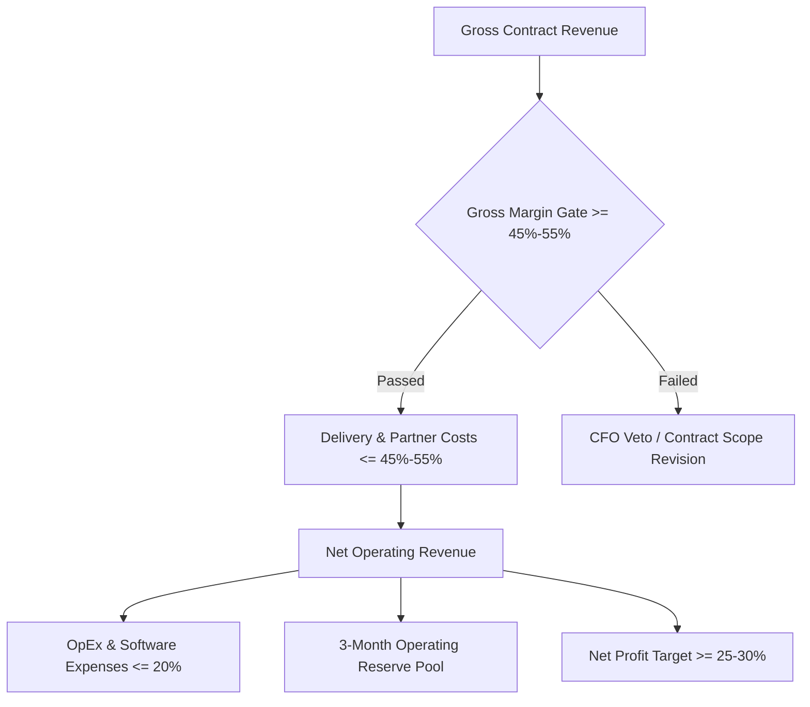
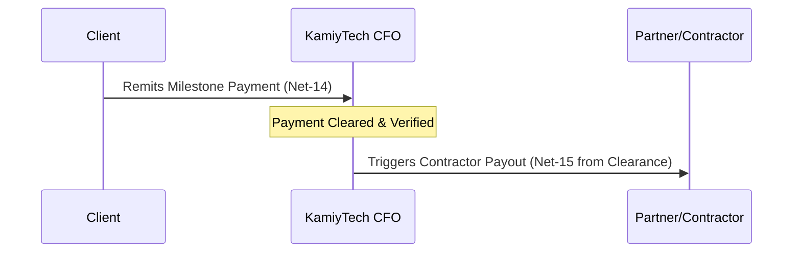

# KAMIYTECH FINANCIAL PLANNING & INVOICING SOP
> **FINANCIAL GOVERNANCE, CASHFLOW MANAGEMENT & INVOICING CONTROLS**

> **DOCUMENT METADATA**
> - **Purpose:** Establish financial operations, invoicing cadences, unit economic standards, cashflow reserves, and contractor payout governance to ensure long-term profitability and capital health.
> - **Owner:** Chief Financial Officer (CFO) / CEO
> - **Version:** 1.1.0
> - **Status:** APPROVED / IN-EFFECT
> - **Dependencies:** Founder Strategic Directives (`v2.0.0`), `P1.2_rate_card_and_pricing_framework.md`, `P1.3_master_legal_framework.md`, `P1.4_service_catalog.md`
> - **Review Schedule:** Monthly Financial Audit
> - **Related Documents:** [index.md](file:///c:/Users/abhis/OneDrive/Desktop/kamiytechAI/knowledge_base/index.md), [P1.2_rate_card_and_pricing_framework.md](file:///c:/Users/abhis/OneDrive/Desktop/kamiytechAI/knowledge_base/P1.2_rate_card_and_pricing_framework.md), [P1.4_service_catalog.md](file:///c:/Users/abhis/OneDrive/Desktop/kamiytechAI/knowledge_base/P1.4_service_catalog.md)

---

## 1. FINANCIAL CONTROLS & UNIT ECONOMICS GOVERNANCE

KamiyTech enforces strict unit economic gates across all client engagements. Every fixed-price contract, hourly engagement, and monthly retainer must be structured to meet or exceed our baseline financial targets.

### 1.1 Baseline Financial Metrics

| Metric | Target Benchmark | Minimum Floor | Governance Action |
| :--- | :---: | :---: | :--- |
| **Gross Profit Margin** | **50% - 60%** | **45.0%** | Requires CFO approval if projected gross margin drops below 45%. |
| **Net Profit Margin** | **30%** | **20.0%** | Triggers cost audit if quarterly net margin drops below 20%. |
| **Operating Cash Reserve** | **3 Months OpEx** | **2 Months OpEx** | Halts non-essential expenditures if reserves drop below 2 months. |
| **Invoice Days Sales Outstanding (DSO)** | **< 14 Days** | **21 Days** | Automatically pauses active project delivery if invoice overdue > 14 days. |

---

## 2. CLIENT INVOICING SCHEDULES & PAYMENT TERMS

### 2.1 Fixed-Price Engagements
Fixed-price projects adhere strictly to milestone-based billing to ensure cashflow positive delivery:

- **Single-Page Landing Websites (₹12,000–₹15,000):** 50% advance deposit upon SOW signing, 50% prior to final live handover.
- **Multi-Page Web, Apps, AI & Custom Systems:**
  - **Milestone 1 (Advance Deposit):** 40% invoice issued upon Statement of Work (SOW) signature. Delivery work commences **only after deposit clearance**.
  - **Milestone 2 (Staging Review):** 30% invoice issued upon completion of Staging Demo & Architecture milestone signoff.
  - **Milestone 3 (Production Launch):** 30% invoice issued prior to deployment to client live production environments.

### 2.2 Retainer & Maintenance Engagements
- Monthly retainers (governed by [P3.1 Retainer SOP](file:///c:/Users/abhis/OneDrive/Desktop/kamiytechAI/knowledge_base/P3.1_maintenance_retainer_and_sla_sop.md)) are billed **100% upfront** on the 1st business day of each calendar month.
- Payment due date: Net-7 days. Failure to remit by the 10th of the month pauses SLA guarantees.

### 2.3 Payment Terms & Statutory Rules
- **Standard Terms:** Net-14 days from invoice issuance date.
- **Statutory Taxes:** 18% GST itemized on official tax invoices.
- **Late Payment Penalty:** 1.5% late fee per month (18% per annum) applied automatically to past-due balances exceeding 14 days.
- **Work Stoppage Rule:** If an invoice remains unpaid 14 calendar days past due, project development and deployment access are automatically suspended until settlement.

---

## 3. CONTRACTOR & VENDOR PAYOUT POLICIES

To prevent cashflow mismatches, contractor and partner payouts are directly aligned with client collections.

### 3.1 Contractor Payment Terms
- **Payment Alignment:** Partner and contractor payouts are scheduled Net-15 days following the clearance of the corresponding client milestone invoice.
- **Invoice Submission:** Contractors must submit detailed itemized invoices by the 25th of each month.
- **Approval Gate:** Invoices require signoff from the Project Manager / Lead Engineer verifying milestone deliverable acceptance prior to CFO processing.

---

## 4. CASHFLOW MANAGEMENT & OPERATING RESERVES

### 4.1 Operating Reserve Allocation
- **Reserve Target:** 3 months of fixed operating overhead (software subscriptions, core retainers, legal/accounting reserves).
- **Allocation Rule:** 15% of all incoming net project profit is automatically swept into the High-Yield Reserve account until the 3-month target is fully satisfied.

### 4.2 Expense Approval Thresholds

| Approval Tier | Spend Limit (INR ₹) | Required Approver |
| :--- | :--- | :--- |
| **Tier 1 (Routine Software/Tools)** | Up to ₹25,000 / month | Department Lead |
| **Tier 2 (Operational Expenses)** | ₹25,000 – ₹2,00,000 | COO / CFO |
| **Tier 3 (Capital Expenditures / Major Retainers)** | Over ₹2,00,000 | CEO & Founder Approval |

---

## 5. MONTHLY FINANCIAL AUDIT CHECKLIST

The CFO conducts a monthly financial audit on the 1st of every month:

- [ ] Reconcile all bank statements, Razorpay/UPI transactions, and client invoice accounts.
- [ ] Calculate actual Gross Margin and Net Margin across all active projects.
- [ ] Audit DSO (Days Sales Outstanding) and issue formal past-due notices for accounts > 7 days late.
- [ ] Verify 3-month operating reserve account balance and calculate required sweep allocation.
- [ ] Review contractor payout queue against verified client receipts.
- [ ] Generate Monthly Executive Financial Summary report for CEO and Founder.

---
*End of Financial Planning & Invoicing SOP (P4.2 v1.1.0). Maintained by CFO & CEO.*
