# KAMIYTECH MASTER KNOWLEDGE BASE INDEX
> **SINGLE SOURCE OF TRUTH (SSOT) REPOSITORY**

> **DOCUMENT METADATA**
> - **Purpose:** Master repository index tracking all active company documentation, SOPs, policies, templates, and architecture guidelines for KamiyTech.
> - **Owner:** Chief Information Officer (CIO) / Knowledge Manager
> - **Version:** 1.5.0
> - **Status:** LIVE / ACTIVE
> - **Dependencies:** Founder Strategic Directives (`v2.0.0`)
> - **Review Schedule:** Continuous / Monthly Verification Audit
> - **Related Documents:** [eos_framework_initiation.md](file:///c:/Users/abhis/OneDrive/Desktop/kamiytechAI/eos_framework_initiation.md), [implementation_plan.md](file:///c:/Users/abhis/OneDrive/Desktop/kamiytechAI/implementation_plan.md)

---

## Knowledge Base Navigation Map

```mermaid
graph TD
    KB[KamiyTech Master Knowledge Base]
    
    KB --> P1[Phase 1: Commercial Core & Risk Governance]
    KB --> P2[Phase 2: Sales & Marketing Engine]
    KB --> P3[Phase 3: Delivery Operations & QA]
    KB --> P4[Phase 4: Scaling & HR Infrastructure]
    
    P1 --> P1_1[P1.1: Positioning & Value Proposition]
    P1 --> P1_2[P1.2: Rate Card & Pricing Framework]
    P1 --> P1_3[P1.3: Master Legal Framework]
    P1 --> P1_4[P1.4: Detailed Service Catalog]
    P1 --> P1_5[P1.5: Client Onboarding & Delivery SOP]
    P1 --> P1_6[P1.6: Engineering Architecture Guidelines]
    
    P2 --> P2_1[P2.1: Sales Playbook & Discovery SOP]
    P2 --> P2_2[P2.2: Proposal & Pitch Deck Templates]
    P2 --> P2_3[P2.3: Brand Identity & Design System]
    P2 --> P2_4[P2.4: Website Copy & Content Strategy]
    
    P3 --> P3_1[P3.1: Maintenance Retainer & Support SLA SOP]
    P3 --> P3_2[P3.2: QA Code Review & Testing SOP]
    P3 --> P3_3[P3.3: Partner Onboarding & Vetting SOP]
    
    P4 --> P4_1[P4.1: HR & People Ops Handbook]
    P4 --> P4_2[P4.2: Financial Planning & Invoicing SOP]
    P4 --> P4_3[P4.3: AI Automation & Knowledge Base SOP]
```

---

## Active Document Directory

### Phase 1: Commercial Core & Risk Governance (LIVE)

| Doc ID | Document Title | Owner | Version | Status | Access Path |
| :--- | :--- | :--- | :---: | :---: | :--- |
| **P1.1** | Strategic Positioning & Niche Value Proposition | CMO / CEO | `v1.0.0` | **APPROVED** | [P1.1_positioning_and_value_prop.md](file:///c:/Users/abhis/OneDrive/Desktop/kamiytechAI/knowledge_base/P1.1_positioning_and_value_prop.md) |
| **P1.2** | Rate Card, Pricing Packages & Quotation Framework | CFO / Sales | `v2.1.0` | **APPROVED** | [P1.2_rate_card_and_pricing_framework.md](file:///c:/Users/abhis/OneDrive/Desktop/kamiytechAI/knowledge_base/P1.2_rate_card_and_pricing_framework.md) |
| **P1.3** | Master Legal Framework (MSA, SOW, NDA, Partner Contract) | Legal / CFO | `v1.0.0` | **APPROVED** | [P1.3_master_legal_framework.md](file:///c:/Users/abhis/OneDrive/Desktop/kamiytechAI/knowledge_base/P1.3_master_legal_framework.md) |
| **P1.4** | Detailed Service Catalog | CEO / CTO / COO | `v1.0.0` | **APPROVED** | [P1.4_service_catalog.md](file:///c:/Users/abhis/OneDrive/Desktop/kamiytechAI/knowledge_base/P1.4_service_catalog.md) |
| **P1.5** | Client Onboarding & Project Delivery SOP | COO / CS | `v1.0.0` | **APPROVED** | [P1.4_client_onboarding_and_delivery_sop.md](file:///c:/Users/abhis/OneDrive/Desktop/kamiytechAI/knowledge_base/P1.4_client_onboarding_and_delivery_sop.md) |
| **P1.6** | Engineering & Technology Architecture Guidelines | CTO / EA | `v1.0.0` | **APPROVED** | [P1.5_engineering_architecture_guidelines.md](file:///c:/Users/abhis/OneDrive/Desktop/kamiytechAI/knowledge_base/P1.5_engineering_architecture_guidelines.md) |

### Phase 2: Sales & Marketing Engine (LIVE)

| Doc ID | Document Title | Owner | Version | Status | Access Path |
| :--- | :--- | :--- | :---: | :---: | :--- |
| **P2.1** | Sales Playbook & Discovery Interview SOP | Head of Sales | `v1.0.0` | **APPROVED** | [P2.1_sales_playbook_and_discovery_sop.md](file:///c:/Users/abhis/OneDrive/Desktop/kamiytechAI/knowledge_base/P2.1_sales_playbook_and_discovery_sop.md) |
| **P2.2** | Proposal & Pitch Deck Master Templates | Creative Dir / Sales | `v1.0.0` | **APPROVED** | [P2.2_proposal_and_pitch_templates.md](file:///c:/Users/abhis/OneDrive/Desktop/kamiytechAI/knowledge_base/P2.2_proposal_and_pitch_templates.md) |
| **P2.3** | Brand Identity System & Design Tokens | Creative Director | `v1.0.0` | **APPROVED** | [P2.3_brand_identity_and_design_system.md](file:///c:/Users/abhis/OneDrive/Desktop/kamiytechAI/knowledge_base/P2.3_brand_identity_and_design_system.md) |
| **P2.4** | Website Copy & Content Marketing Engine | CMO / Sales | `v1.0.0` | **APPROVED** | [P2.4_website_copy_and_content_strategy.md](file:///c:/Users/abhis/OneDrive/Desktop/kamiytechAI/knowledge_base/P2.4_website_copy_and_content_strategy.md) |

### Phase 3: Delivery Operations & Quality Assurance (LIVE)

| Doc ID | Document Title | Owner | Version | Status | Access Path |
| :--- | :--- | :--- | :---: | :---: | :--- |
| **P3.1** | Maintenance Retainer & Support SLA SOP | Customer Success / COO | `v1.0.0` | **APPROVED** | [P3.1_maintenance_retainer_and_sla_sop.md](file:///c:/Users/abhis/OneDrive/Desktop/kamiytechAI/knowledge_base/P3.1_maintenance_retainer_and_sla_sop.md) |
| **P3.2** | QA Code Review & Testing SOP | CTO / QA Lead | `v1.0.0` | **APPROVED** | [P3.2_qa_code_review_and_testing_sop.md](file:///c:/Users/abhis/OneDrive/Desktop/kamiytechAI/knowledge_base/P3.2_qa_code_review_and_testing_sop.md) |
| **P3.3** | Specialist Partner Onboarding & Vetting SOP | COO / HR | `v1.0.0` | **APPROVED** | [P3.3_partner_onboarding_and_vetting_sop.md](file:///c:/Users/abhis/OneDrive/Desktop/kamiytechAI/knowledge_base/P3.3_partner_onboarding_and_vetting_sop.md) |

### Phase 4: Scaling, HR & Knowledge Infrastructure (LIVE)

| Doc ID | Document Title | Owner | Version | Status | Access Path |
| :--- | :--- | :--- | :---: | :---: | :--- |
| **P4.1** | HR & People Operations Handbook | HR Lead / COO | `v1.0.0` | **APPROVED** | [P4.1_hr_and_people_ops_handbook.md](file:///c:/Users/abhis/OneDrive/Desktop/kamiytechAI/knowledge_base/P4.1_hr_and_people_ops_handbook.md) |
| **P4.2** | Financial Planning & Invoicing SOP | CFO / CEO | `v1.0.0` | **APPROVED** | [P4.2_financial_planning_and_invoicing_sop.md](file:///c:/Users/abhis/OneDrive/Desktop/kamiytechAI/knowledge_base/P4.2_financial_planning_and_invoicing_sop.md) |
| **P4.3** | AI Automation & Knowledge Base SOP | CIO / AI Advisor | `v1.0.0` | **APPROVED** | [P4.3_ai_automation_and_knowledge_base_sop.md](file:///c:/Users/abhis/OneDrive/Desktop/kamiytechAI/knowledge_base/P4.3_ai_automation_and_knowledge_base_sop.md) |

---

## Governance & Change Control Rules

1. **Single Source of Truth Mandate:** No informal or unindexed document may be used for quoting clients, drafting contracts, or engineering deployment.
2. **CIO Synchronization Check:** Any modification to pricing, service offerings, tech stack, or legal terms must be audited by the CIO before merging.
3. **Deprecation Policy:** Superceded documents will be marked `STATUS: DEPRECATED` and moved to the `/archive` directory to prevent stale information reuse.
