# KAMIYTECH EOS ALL PHASES (1, 2, 3 & 4) EXECUTION WALKTHROUGH

> **EXECUTIVE SUMMARY**
> Phase 1 (Commercial Core), Phase 2 (Sales & Marketing Engine), Phase 3 (Delivery Operations & Quality Control), and Phase 4 (Scaling, HR & Knowledge Infrastructure) of the KamiyTech Master Implementation Plan have been **100% EXECUTED AND AUDITED**. All 16 core commercial, sales, brand, legal, operational, QA, partner, HR, financial, and AI infrastructure documents have been authored, validated by the Executive Board, and indexed into the Single Source of Truth (SSOT) Master Knowledge Base repository (`v1.5.0`).

---

## Master Architecture Map

```mermaid
graph TD
    Phase1[Phase 1: Commercial Core & Risk] --> P1_1[P1.1 Positioning & Value Prop]
    Phase1 --> P1_2[P1.2 Rate Card & Pricing Framework]
    Phase1 --> P1_3[P1.3 Master Legal Framework]
    Phase1 --> P1_4[P1.4 Detailed Service Catalog]
    Phase1 --> P1_5[P1.5 Client Onboarding & Delivery SOP]
    Phase1 --> P1_6[P1.6 Engineering Architecture Guidelines]
    
    Phase2[Phase 2: Sales & Marketing Engine] --> P2_1[P2.1 Sales Playbook & Discovery SOP]
    Phase2 --> P2_2[P2.2 Proposal & Pitch Deck Templates]
    Phase2 --> P2_3[P2.3 Brand Identity & Design System]
    Phase2 --> P2_4[P2.4 Website Copy & Content Strategy]
    
    Phase3[Phase 3: Delivery Operations & QA] --> P3_1[P3.1 Maintenance Retainer & SLA SOP]
    Phase3 --> P3_2[P3.2 QA Code Review & Testing SOP]
    Phase3 --> P3_3[P3.3 Partner Onboarding & Vetting SOP]
    
    Phase4[Phase 4: Scaling & HR Infrastructure] --> P4_1[P4.1 HR & People Ops Handbook]
    Phase4 --> P4_2[P4.2 Financial Planning & Invoicing SOP]
    Phase4 --> P4_3[P4.3 AI Automation & Knowledge Base SOP]
    
    Phase1 --> Index[Master Knowledge Base Index v1.5.0]
    Phase2 --> Index
    Phase3 --> Index
    Phase4 --> Index
```

---

## Detailed Directory of Active Knowledge Base Documents

### Phase 1 Documents (Commercial & Engineering Foundation)
1. **📄 [P1.1 Strategic Positioning & Niche Value Proposition](file:///c:/Users/abhis/OneDrive/Desktop/kamiytechAI/knowledge_base/P1.1_positioning_and_value_prop.md)**
   - Market positioning, 5 ICP personas, vertical USP matrix, brand tone of voice.
2. **📄 [P1.2 Rate Card, Pricing Packages & Quotation Framework](file:///c:/Users/abhis/OneDrive/Desktop/kamiytechAI/knowledge_base/P1.2_rate_card_and_pricing_framework.md)**
   - Indian Domestic Rate Card (INR ₹), single-page landing site (₹12k–₹15k), multi-page web tiers, mobile app tiers, AI automation, retainers, and GST rules.
3. **📄 [P1.3 Master Legal Framework](file:///c:/Users/abhis/OneDrive/Desktop/kamiytechAI/knowledge_base/P1.3_master_legal_framework.md)**
   - MSA core clauses, SOW standard template, NDA structures, Subcontractor Partner Agreements (IP assignment, 24mo non-solicit).
4. **📄 [P1.4 Detailed Service Catalog](file:///c:/Users/abhis/OneDrive/Desktop/kamiytechAI/knowledge_base/P1.4_service_catalog.md)**
   - Detailed specification of all 12 services: purpose, business problem, scope, deliverables, client responsibilities, executive ownership, dependencies, and out-of-scope items.
5. **📄 [P1.5 Client Onboarding & Project Delivery SOP](file:///c:/Users/abhis/OneDrive/Desktop/kamiytechAI/knowledge_base/P1.5_client_onboarding_and_delivery_sop.md)**
   - Sales-to-Ops handoff, environment setup, 60-min kickoff agenda, bi-weekly demo cadences, QA gate checklists, production launch SOP.
6. **📄 [P1.6 Engineering Architecture & Technology Guidelines](file:///c:/Users/abhis/OneDrive/Desktop/kamiytechAI/knowledge_base/P1.6_engineering_architecture_guidelines.md)**
   - Standard stack specs (Next.js, FastAPI, PostgreSQL, Supabase, React Native, Tailwind, Vercel/AWS), App Router layout, TypeScript rules, AI API integration standards, CI/CD security pipelines.

---

### Phase 2 Documents (Sales & Marketing Engine)
7. **📄 [P2.1 Sales Playbook & Discovery Interview SOP](file:///c:/Users/abhis/OneDrive/Desktop/kamiytechAI/knowledge_base/P2.1_sales_playbook_and_discovery_sop.md)**
   - B2B sales funnel, adapted BANT/MEDDIC lead qualification, 45-min diagnostic discovery script, objection handling matrix, Mutual Action Plan (MAP) closing.
8. **📄 [P2.2 Proposal & Pitch Deck Master Templates](file:///c:/Users/abhis/OneDrive/Desktop/kamiytechAI/knowledge_base/P2.2_proposal_and_pitch_templates.md)**
   - Production proposal markdown layout, SOW attachments, 10-slide executive pitch deck structure.
9. **📄 [P2.3 Brand Identity System & Design Tokens](file:///c:/Users/abhis/OneDrive/Desktop/kamiytechAI/knowledge_base/P2.3_brand_identity_and_design_system.md)**
   - Creative Director's brand guidelines, Obsidian/Cyan/Indigo color tokens, Outfit/Inter typography scales, glassmorphism CSS components, presentation styling.
10. **📄 [P2.4 Website Copy & Content Strategy](file:///c:/Users/abhis/OneDrive/Desktop/kamiytechAI/knowledge_base/P2.4_website_copy_and_content_strategy.md)**
    - Complete page-by-page production copy layout for `KamiyTech.com` (Home, Services, Case Studies, Contact), SEO keyword map, inbound content marketing engine.

---

### Phase 3 Documents (Delivery Operations & Quality Assurance)
11. **📄 [P3.1 Maintenance Retainer & Support SLA SOP](file:///c:/Users/abhis/OneDrive/Desktop/kamiytechAI/knowledge_base/P3.1_maintenance_retainer_and_sla_sop.md)**
    - Post-launch maintenance packages (Essential Care ₹12k/mo, Growth Care ₹35k/mo, Enterprise Managed ₹85k/mo), SLA response time guarantees (2hr emergency for SEV-1), uptime monitoring protocols, RCA requirements.
12. **📄 [P3.2 QA Code Review & Testing SOP](file:///c:/Users/abhis/OneDrive/Desktop/kamiytechAI/knowledge_base/P3.2_qa_code_review_and_testing_sop.md)**
    - Code review PR standards, Vitest/Jest/PyTest unit testing rules (>80% coverage), Playwright E2E testing, 10-point OWASP pre-release security audit checklist.
13. **📄 [P3.3 Specialist Partner Onboarding & Vetting SOP](file:///c:/Users/abhis/OneDrive/Desktop/kamiytechAI/knowledge_base/P3.3_partner_onboarding_and_vetting_sop.md)**
    - Partner Core + Specialist Pod model, 4-step technical vetting rubric (85/100 pass), white-label `@kamiytech.com` setup, rate capping rules to protect margin, quarterly scorecards.

---

### Phase 4 Documents (Scaling, HR & AI Infrastructure)
14. **📄 [P4.1 HR & People Operations Handbook](file:///c:/Users/abhis/OneDrive/Desktop/kamiytechAI/knowledge_base/P4.1_hr_and_people_ops_handbook.md)**
    - Recruitment pipelines, contractor-to-employee conversion rubric, OKR performance evaluation, remote work communication etiquette, onboarding/offboarding checklists.
15. **📄 [P4.2 Financial Planning & Invoicing SOP](file:///c:/Users/abhis/OneDrive/Desktop/kamiytechAI/knowledge_base/P4.2_financial_planning_and_invoicing_sop.md)**
    - Unit economic benchmarks (45%-55% gross margin minimum), 40/30/30 (and 50/50) milestone billing, retainer billing upfront, contractor payout policies (Net-15), 3-month operating reserve sweeping.
16. **📄 [P4.3 AI Automation & Knowledge Base SOP](file:///c:/Users/abhis/OneDrive/Desktop/kamiytechAI/knowledge_base/P4.3_ai_automation_and_knowledge_base_sop.md)**
    - Automated SSOT vector re-indexing, AI knowledge drift detection matrix, executive AI agent library (Sales, Tech Auditor, Legal Verifier), enterprise zero-training data privacy mandates.

---

## Conclusion & System Status

With all 16 executive documents synchronized, **KamiyTech is fully audited, zero-conflict, commercially sound, operationally scalable, and powered by automated AI governance**.

- **Master Knowledge Base Repository:** [index.md](file:///c:/Users/abhis/OneDrive/Desktop/kamiytechAI/knowledge_base/index.md) (`v1.5.0`)
